<div align="center">
<picture>
    <source srcset="https://imgur.com/5bYAzsb.png" media="(prefers-color-scheme: dark)">
    <source srcset="https://imgur.com/Os03JoE.png" media="(prefers-color-scheme: light)">
    
</picture>

<h1>Laboratorio No. 01: Robótica Industrial - Trayectorias, Entradas y Salidas Digitales</h1>
<h2>Profesores: <br>Pedro Fabián Cárdenas Herrera <br> Manuel Felipe Carranza Montenegro</h2>

<br>
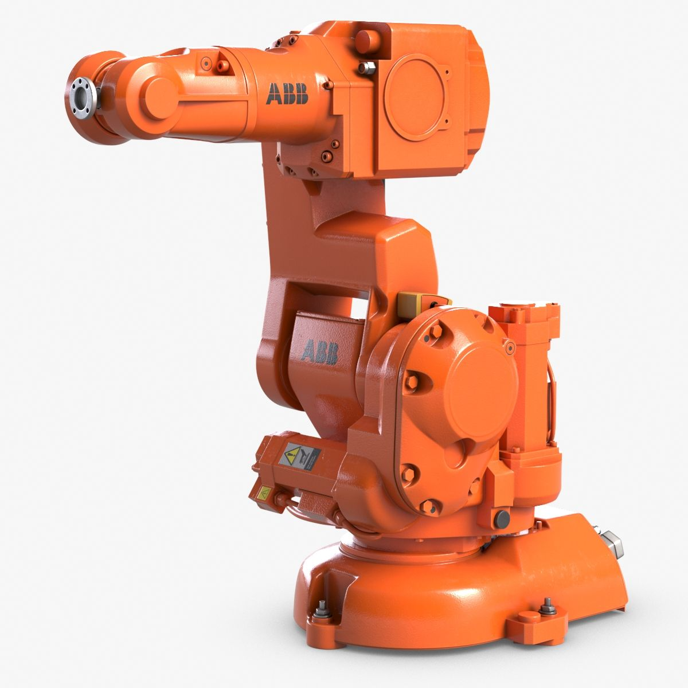<br>
<b>Figura 1. Manipulador ABB IRB 140.</b>
</div>

---

## 1. Introducción

En el presente laboratorio se estudian los principios fundamentales de la robótica industrial mediante la programación de trayectorias, el diseño y calibración de herramientas (ToolData), y la integración de señales de control a través de entradas y salidas digitales (E/S). La práctica se desarrolla sobre un manipulador ABB IRB 140 controlado por la unidad IRC5, operando en conjunto con una banda transportadora. Este entorno físico se replica computacionalmente mediante el uso de gemelos digitales en el software RobotStudio, permitiendo la validación previa de la lógica de control.

El escenario de aplicación se inspira en la automatización de la industria alimentaria, proponiendo la ejecución de una rutina de decoración sobre una superficie virtual (torta). Para la resolución de este problema, se establecieron los siguientes requerimientos técnicos:

* Área de trabajo definida para un volumen equivalente a un pastel de 20 porciones.
* Parámetros de interpolación restringidos a velocidades entre `v100` y `v1000`, con una zona de aproximación máxima de `z10`.
* Movimiento continuo para cada trazo, partiendo y finalizando en una pose de seguridad (Home).
* Independencia en el trazo de cada uno de los nombres.
* Implementación de lógicas de control mediante señales digitales para la gestión de rutinas (decoración y mantenimiento) y el accionamiento de periféricos (banda transportadora).

---

## 2. Solución Planteada

La estrategia de resolución se dividió en dos fases: la preparación del entorno de trabajo (físico y virtual) y la arquitectura de control en lenguaje RAPID.

Inicialmente, se diseñó un actuador final (herramienta) capaz de sujetar un marcador. En el entorno de simulación, se estableció un *WorkObject* con dimensiones de **25×20×7 cm** para representar la superficie de trabajo, **el cual fue posicionado espacialmente sobre la banda transportadora principal de la celda.** Sobre estas coordenadas geométricas se diseñaron las trayectorias correspondientes a la decoración y a la escritura de los nombres.

<div align="center">
  <table>
    <tr>
      <td align="center">
        <br>
        <b>Figura 2. Diseño 3D de la Herramienta</b>
      </td>
      <td align="center">
        <br>
        <b>Figura 3. Planificación de rutas de decoración</b>
      </td>
      <td align="center">
        <br>
        <b>Figura 4. Modelado CAD del Pastel</b>
      </td>
    </tr>
  </table>
</div>

La validación del sistema se realizó primero en RobotStudio. Tras calibrar el `ToolData` y el `WorkObject`, se programaron las secuencias de movimiento con parámetros nominales de `v150` y `z5`, es decir, velocidad de 150mm/s y tolerancia de 5mm, **lo cual garantiza un trazo fluido sin comprometer la precisión requerida en los contornos curvos de las letras y el dibujo.** La lógica de interacción con el entorno se definió mediante el mapeo de las siguientes señales digitales, integrando rutinas de apoyo y seguridad:

* **Rutina de Decoración (DI_01):** Al activarse esta condición, se enciende el **indicador de Luz 1 (DO_01)**. El sistema habilita el avance de la banda, realiza una espera de 3 segundos para el posicionamiento, ejecuta la trayectoria de decoración y finaliza con el retiro del pastel mediante la reactivación de la banda antes de retornar a *Home*.

* **Apoyo Físico / Ubicación (DI_01 y DI_02):** Rutina diseñada para el posicionamiento del manipulador del robot en la posición de decoración donde deberia ir el pastel y así poderlo ubicar apropiadamente. Durante su ejecución, se activan simultáneamente las salidas **Luz 1 y Luz 2 (DO_01 y DO_02)** para indicar la intervención en la celda.

* **Modo Mantenimiento (DI_02):** Traslada el manipulador a una zona segura de mantenimiento y activa la **Luz 2 (DO_02)**. Al finalizar la rutina, se apaga el indicador y el sistema retorna al bucle de ejecución continua.

* **Reinicio Secuencial (DI_03):** Implementación de una lógica de doble estado para la gestión de la banda transportadora: 
  * **1er Accionamiento:** Posicionamiento en zona de decorado.
  * **2do Accionamiento:** Retorno a posición inicial.

  Esta rutina activa el **indicador de Luz 3 (DO_03)** y habilita el retroceso de la banda por 3 segundos, a la par que traslada el manipulador al *Home*.

* **Retorno Directo a Home (DI_02 y DI_03):** Condición de seguridad que permite el traslado inmediato del manipulador a su posición base.

* **Gestión de Indicadores (DO):** Se definieron tres salidas digitales (`DO_01`, `DO_02`, `DO_03`) para señalizar visualmente cada estado de la operación y garantizar la seguridad del operario durante las rutinas de apoyo y mantenimiento.

<br>

<div align="center">
  
  <br>
  <b>Figura 5. Entorno de simulación en RobotStudio.</b>
</div>

<br>

Es pertinente señalar que, dentro del entorno virtual de RobotStudio, la cinemática de la banda transportadora fue emulada mediante el uso de *Smart Components*. Específicamente, se implementó el bloque `LinearMove2` para generar el desplazamiento directo del *WorkObject*. 

Una vez corroborada la lógica computacional, se avanzó a la implementación en la celda física. Este proceso inició con la calibración del TCP del actuador y la definición del sistema de coordenadas del elemento físico emulador del pastel. Al ejecutar el programa en RAPID, se requirió un ajuste iterativo para compensar las leves discrepancias de posicionamiento físico frente al modelo ideal, logrando finalmente la ejecución precisa de la trayectoria de decorado.

<br>

<div align="center">
<table>
  <tr>
    <td align="center">
      <br>
      <b>Figura 6. Herramienta acoplada al manipulador</b>
    </td>
    <td align="center">
      <br>
      <b>Figura 7. Trazado final obtenido</b>
    </td>
    <td align="center">
      <br>
      <b>Figura 8. Objeto de trabajo en estación física</b>
    </td>
  </tr>
</table>
</div>

## 3. Diagrama de Flujo de Acciones

El siguiente diagrama detalla la arquitectura lógica de control implementada en lenguaje RAPID. A diferencia de una secuencia lineal básica, la programación se estructuró sobre un **bucle de ejecución continua** que evalúa de forma jerárquica el estado de las señales digitales para tomar decisiones operativas en tiempo real.

Esta topología permite al controlador gestionar sincrónicamente los movimientos del manipulador, la activación de los actuadores externos (banda transportadora) y la señalización visual, dividiendo el proceso en cinco estados principales:

* **Operación Nominal:** Secuencia principal que coordina el posicionamiento de la banda, la ejecución de la trayectoria de decoración y la evacuación de la pieza.
* **Intervención Manual:** Rutina de apoyo físico que habilita la inserción segura del pastel en la celda de trabajo.
* **Protocolo de Mantenimiento:** Desplazamiento preventivo a una zona segura para facilitar cambios de herramienta o inspecciones.
* **Reinicio Secuencial:** Lógica de recuperación de estados que permite reposicionar la banda de forma controlada en dos tiempos.
* **Retorno a Base:** Condición prioritaria de seguridad para la reubicación inmediata del manipulador en su posición *Home*.

<div align="center">
  <br>
  <b>Figura 5. Diagrama de flujo de la rutina principal y subrutinas.</b>
</div>


## 4. Plano de Planta

El siguiente plano bidimensional detalla la distribución espacial (*layout*) de la celda de manufactura, garantizando la correcta correspondencia de coordenadas entre el entorno físico y el virtual. 

El esquema ilustra el manipulador ABB IRB 140 posicionado respecto a la banda transportadora y acota milimétricamente las tres estaciones operativas del ciclo: **posición inicial, zona de decorado y posición final (evacuación)**. Adicionalmente, se anexa una vista de detalle (escala 1:2) que evidencia el montaje de la herramienta porta-marcador sobre la brida del robot, indicando la compensación de 30° en la articulación 6 requerida para la parametrización en RobotStudio.

<div align="center">
  <br>
  <b>Figura 6. Plano de planta y distribución de elementos.</b>
</div>

## 5. Descripción de las funciones utilizadas

Para el desarrollo de la arquitectura de control de la estación, se implementaron instrucciones de trayectoria y gestión de señales en lenguaje RAPID, complementadas con herramientas de emulación cinemática dentro del entorno virtual de RobotStudio.

<br>

### 5.1. Funciones de movimiento

Estas instrucciones definen el comportamiento cinemático del Centro de Punto de Herramienta (TCP) del manipulador durante el ciclo de trabajo:

**MoveJ (Movimiento Articular):** Ejecuta desplazamientos rápidos interpolando los ejes del robot de forma no lineal. Se empleó para traslados libres en el espacio donde la trayectoria exacta del TCP no es crítica, como el retorno a la posición de reposo o aproximaciones iniciales.

```rapid
MoveJ Target_Home, v150, z5, MyNewTool\WObj:=wobj0;
```
* **Target_Home:** representa el punto (Target) al que se debe dirigir el manipulador.
* **v150:** representa la velocidad programada del TCP en mm/s.
* **z5:** representa la zona de aproximación (incertidumbre) en mm.
* **MyNewTool\WObj:=wobj0:**
  * **MyNewTool:** define la herramienta activa (TCP y orientación).
  * **\:** separador entre la herramienta y el argumento del WorkObject.
  * **WObj:=wobj0:** define el sistema de coordenadas base del entorno.

<br>

**MoveL (Movimiento Lineal):** Fuerza al TCP a desplazarse en una línea recta perfecta desde la posición actual hasta el objetivo. Fue la función más utilizada, siendo fundamental para el trazado geométrico preciso de las letras en la rutina de decoración.

```rapid
MoveL Target_30, v150, z5, MyNewTool\WObj:=Workobject_1;
```
* **Target_30:** representa el punto de destino de la trayectoria lineal.
* **v150:** representa la velocidad del TCP en mm/s.
* **z5:** representa la zona de aproximación en mm.
* **MyNewTool\WObj:=Workobject_1:**
  * **MyNewTool:** define la herramienta utilizada.
  * **WObj:=Workobject_1:** define el sistema de coordenadas de la pieza de trabajo emulando el pastel.

<br>

**MoveC (Movimiento Circular):** Genera una trayectoria curva calculando el arco entre la posición actual, un punto intermedio y un punto final. Se aplicó estrictamente para resolver las geometrías curvas del diseño (como la sonrisa y el contorno de la figura).

```rapid
MoveC Target_9070, Target_9080, v150, z5, MyNewTool\WObj:=Workobject_1;
```
* **Target_9070:** representa el punto intermedio por el que debe pasar el arco.
* **Target_9080:** representa el punto final de la trayectoria circular.
* *(Los parámetros de velocidad, zona, herramienta y WorkObject mantienen la estructura previamente descrita).*

<br>

### 5.2. Funciones de control

El control lógico del flujo de operaciones y la sincronización con los actuadores externos (banda y balizas) se gestionó mediante las siguientes instrucciones booleanas y de temporización:

* **Set:** Fuerza el cambio de estado de una señal de salida digital a nivel alto (1 lógico). En la estación, se utilizó para encender los indicadores de luz y dar la orden de arranque (`Enable`) a la banda transportadora.
  ```rapid
  SET FWD_Conveyor;
  ```

* **Reset:** Fuerza el cambio de estado de una señal de salida digital a nivel bajo (0 lógico). Esencial para apagar las señales luminosas al terminar las rutinas y para detener el avance de la banda.
  ```rapid
  RESET DO_01;
  ```

* **WaitTime:** Detiene la lectura del código y pausa la ejecución de la rutina por un periodo definido en segundos. Esta instrucción fue clave para garantizar el posicionamiento físico del pastel antes de iniciar los descensos de la herramienta.
  ```rapid
  WaitTime 3;
  ```
<br>

### 5.3. Funciones de simulación (Smart Components)

Dado que la banda transportadora física no es un eje acoplado directamente al controlador del robot, su cinemática debió ser emulada en RobotStudio. Para ello, se diseñó una lógica de estación basada en **Smart Components**, utilizando específicamente el bloque funcional `LinearMover2`.

Esta función permite parametrizar el desplazamiento vectorial de un objeto tridimensional en el espacio. En este proyecto, se aplicó sobre el `WorkObject_1` creando dos componentes inteligentes separados para gestionar las direcciones de la banda:

* **SmartComponent_1 (Avance):** Vinculado a la señal de entrada `DI_01`. Al activarse, traslada el objeto de trabajo una distancia de **621.80 mm** en dirección Y negativa (`[0.00, -1.00, 0.00]`) durante 3 segundos, simulando el ingreso de la pieza a la zona de decorado.
* **SmartComponent_2 (Retroceso):** Vinculado a la rutina de reinicio secuencial. Ejecuta un movimiento inverso al desplazar el objeto en dirección Y positiva (`[0.00, 1.00, 0.00]`), devolviendo el pastel a su posición original.
<br>
<div align="center">
  <table>
    <tr>
      <td align="center">
        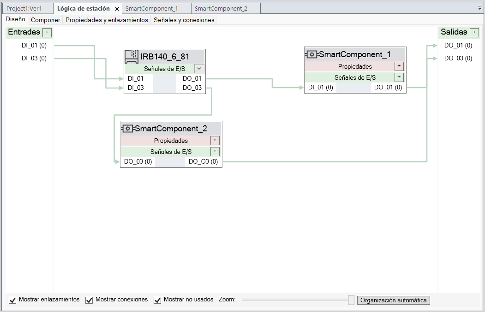<br>
        <b>Figura 9. Diseño lógico de señales en estación</b>
      </td>
      <td align="center">
        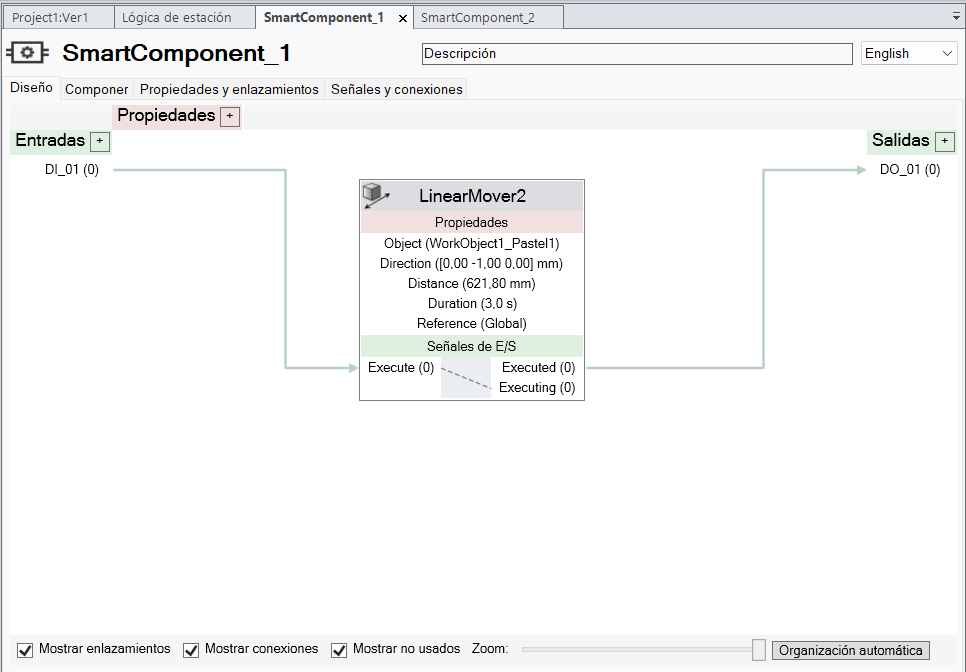<br>
        <b>Figura 10. Bloque LinearMover2 (Avance)</b>
      </td>
      <td align="center">
        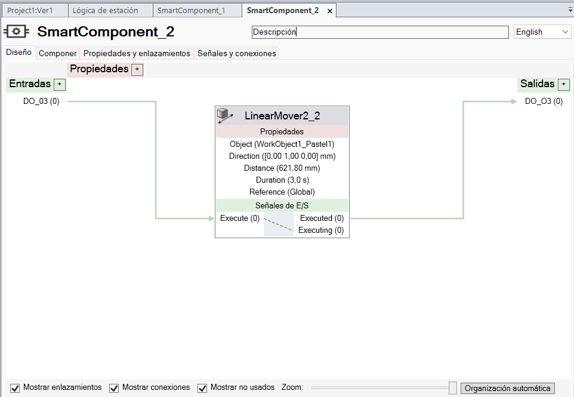<br>
        <b>Figura 11. Bloque LinearMover2 (Retroceso)</b>
      </td>
    </tr>
  </table>
</div>
<br>


## 6. Diseño e Implementación de la Herramienta

Para la ejecución de la trayectoria de decoración, se diseñó e implementó un actuador final (herramienta) a la medida, modelado en Autodesk Inventor y manufacturado mediante impresión 3D por deposición de material fundido (FDM) utilizando **PETG**. Se seleccionó este polímero debido a su excelente equilibrio entre tenacidad, resistencia al impacto y estabilidad térmica, propiedades necesarias para soportar los esfuerzos mecánicos durante el acople y la operación del robot.

### 6.1. Arquitectura del Diseño CAD

La herramienta se dividió en tres componentes principales para facilitar su impresión y ensamblaje:

1. **Acople con Brida:** Pieza base diseñada bajo las especificaciones exactas del manual del robot ABB IRB 140. Cuenta con un patrón de cuatro agujeros para tornillos **M6 (paso 1.25 mm)** y, de manera crucial, se le añadió un orificio guía descentrado. Este orificio concuerda con el pin de posicionamiento de la brida del robot, garantizando que la herramienta se acople de manera unívoca y mantenga su repetibilidad espacial sin desfasarse.
2. **Unión Lisa:** Cuerpo central cilíndrico de la herramienta, que incorpora una base exterior de contorno hexagonal para facilitar su manipulación. Su núcleo es hueco y actúa como "camisa" o guía deslizante para el marcador.
3. **Tapón Liso:** Elemento de cierre posterior encargado de retener los componentes internos dentro de la Unión Lisa.

🔗 **Plano de herramienta:** Plano detallado ensamblaje y acotado se encuentra disponible en formato PDF en el siguiente enlace: [Ver Plano de Herramienta (PDF) aquí](./Anexos/Plano_Herramienta.pdf).

<br>

<div align="center">
  <table>
    <tr>
      <td align="center">
        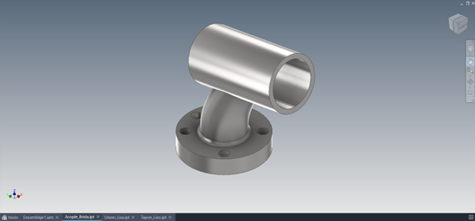<br>
        <b>Figura 12. Acople con Brida</b>
      </td>
      <td align="center">
        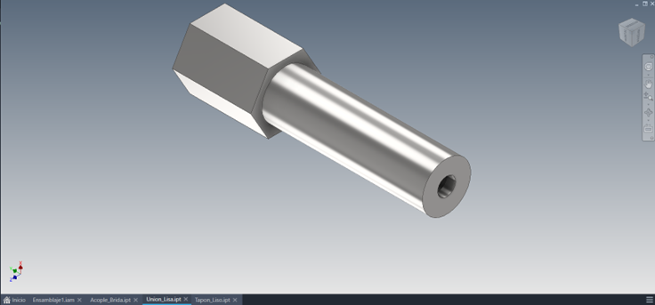<br>
        <b>Figura 13. Unión Lisa</b>
      </td>
    </tr>
  </table>

  <br>

  <table>
    <tr>
      <td align="center">
        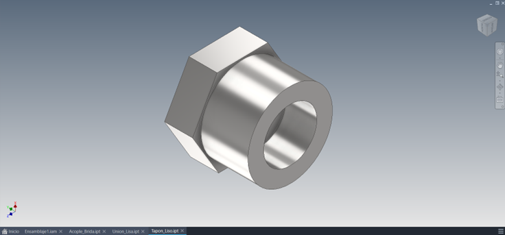<br>
        <b>Figura 14. Tapón Liso</b>
      </td>
      <td align="center">
        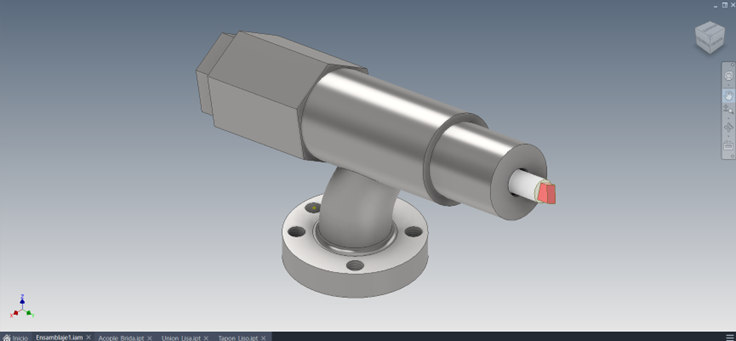<br>
        <b>Figura 15. Ensamblaje Final CAD</b>
      </td>
    </tr>
  </table>
</div>

<br>

### 6.2. Sistema de Amortiguación y Montaje Físico

Uno de los mayores retos al programar trayectorias de contacto rígido es el riesgo de colisión, el cual puede derivar en la fractura estructural de la herramienta impresa (críticamente en la zona de mayor concentración de esfuerzos: el **Acople-Brida**) o en daños irreversibles al elemento físico que emula el pastel. Para mitigar este riesgo, el diseño integra un **sistema de amortiguación longitudinal**.

Se introdujo un **resorte (elemento elástico)** entre el Tapón Liso y el tope del marcador. Esto le otorga al elemento de escritura un grado de libertad lineal, permitiéndole retraerse ligeramente al entrar en contacto con la pieza. Gracias a esta *complianza mecánica*, la herramienta absorbe las posibles discrepancias geométricas del entorno físico, garantizando un trazo de presión constante y salvaguardando la integridad de todo el conjunto.

Para la construcción y puesta a punto de la herramienta física, el ensamblaje se resolvió mediante dos tipos de uniones estratégicas:

* **Unión Fija (Estructural):** Se utilizó adhesivo instantáneo para unir permanentemente el *Acople-Brida* con la *Unión Lisa*, conformando un bloque base sólido y resistente a las vibraciones del robot. Dada la naturaleza del **PETG**, se aseguró una limpieza previa de las superficies para optimizar la adherencia.
* **Unión Desmontable (Mantenimiento):** Dado que el marcador es un elemento consumible, el diseño permite su extracción rápida. Se perforó un orificio pasante a través de la sección hexagonal de la *Unión Lisa* y el *Tapón Liso* para insertar un **pin extraíble** (pasador). Al retirar este pin, el tapón queda libre, permitiendo el reemplazo inmediato del resorte y el marcador.

<br>

<div align="center">
  <table>
    <tr>
      <td align="center">
        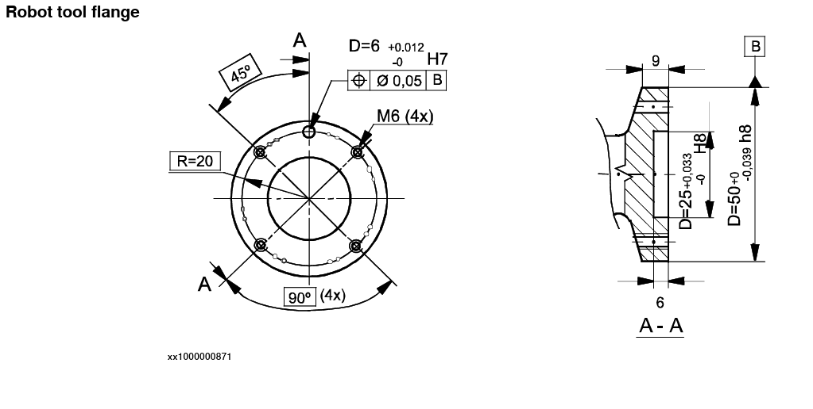<br>
        <b>Figura 16. Especificaciones brida ABB</b>
      </td>
      <td align="center">
        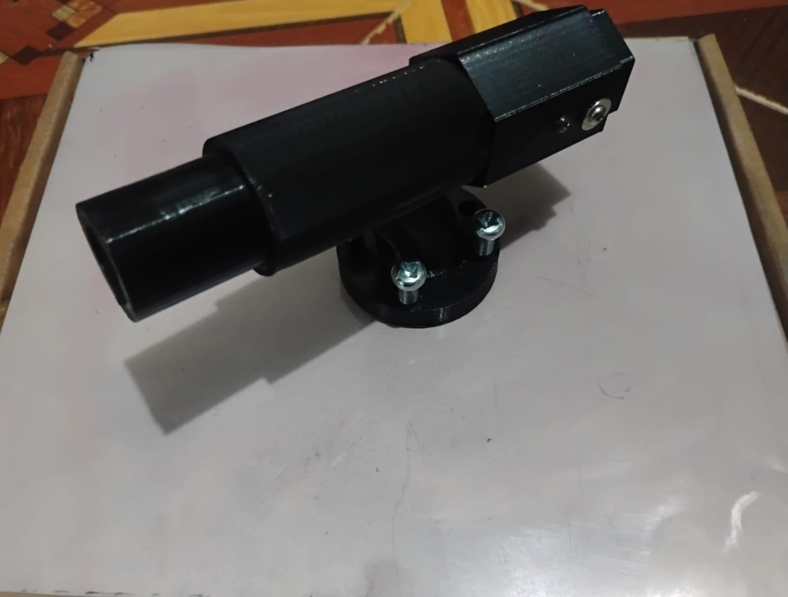<br>
        <b>Figura 17. Herramienta final ensamblada</b>
      </td>
    </tr>
  </table>

  <br>

  <table>
    <tr>
      <td align="center">
        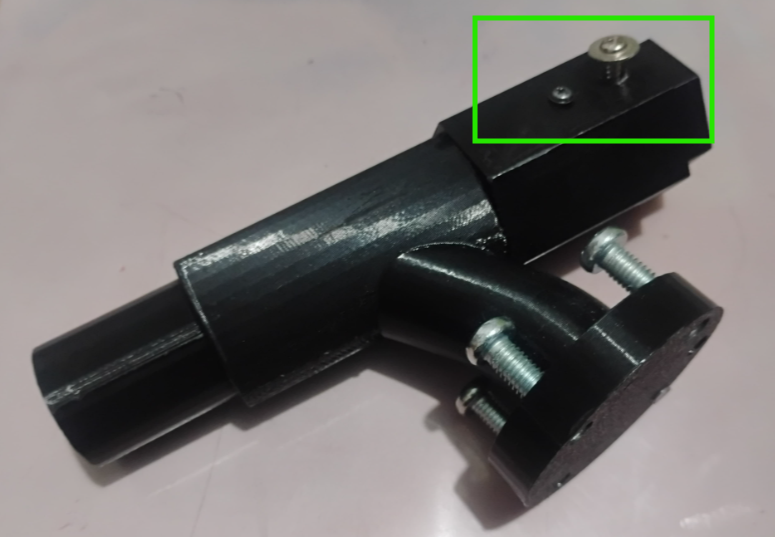<br>
        <b>Figura 18. Sistema de pin extraíble</b>
      </td>
      <td align="center">
        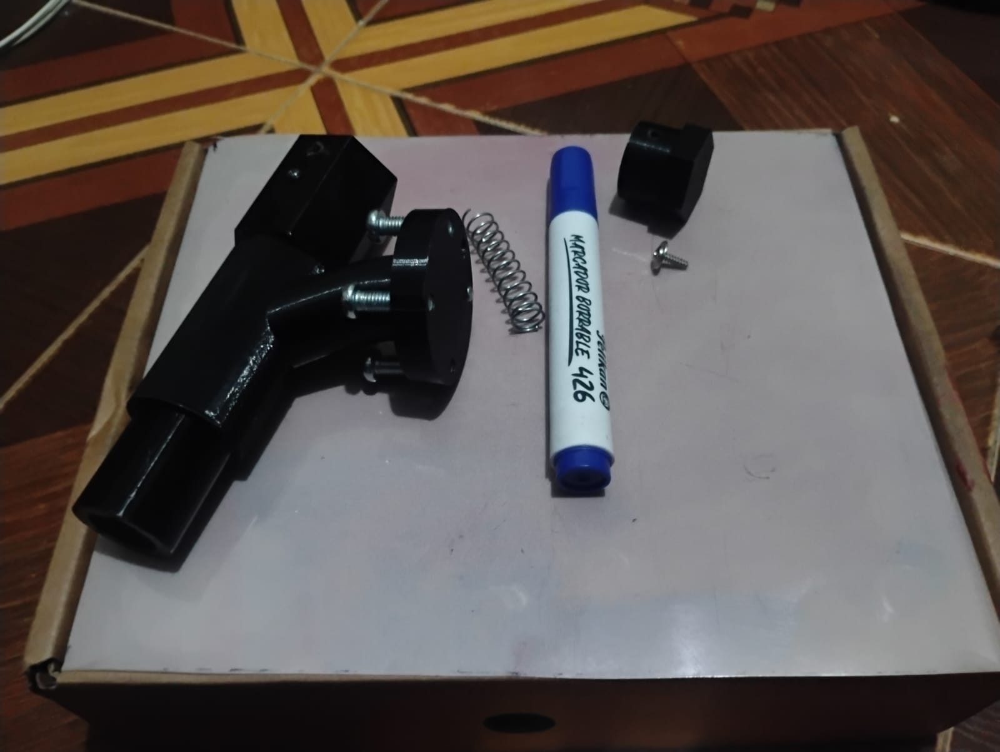<br>
        <b>Figura 19. Despiece físico y marcador</b>
      </td>
      <td align="center">
        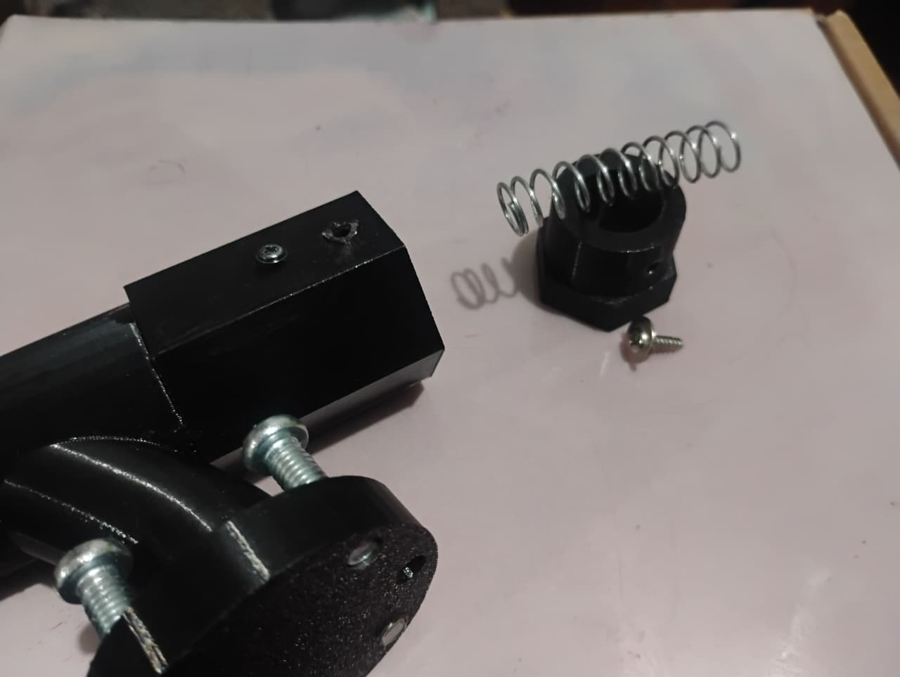<br>
        <b>Figura 20. Detalle del sistema de resorte</b>
      </td>
    </tr>
  </table>
</div>


## 7. Código de RAPID (Estructura y Lógica)

Dada la extensión del código generado para las trayectorias de interpolación, esta sección detalla exclusivamente la arquitectura de la rutina principal de control (`main`). Esta rutina opera como el "cerebro" de la celda, gestionando el *polling* continuo de las señales de entrada y derivando la ejecución a las subrutinas correspondientes.

Para consultar el código completo con todas las posiciones y trayectorias, se comparten los enlaces a los archivos fuente anexos:

📂 **Archivos fuente completos:**
* [Código RAPID implementado en el controlador físico (Robot Real)](./Anexos/CodigoRAPID_Fisico.txt)
* [Código RAPID utilizado en el entorno virtual (RobotStudio)](./Anexos/CodigoRAPID_Simulación.txt)

### 7.1. Desglose de la Rutina Principal (`main`)

El código se estructura sobre un bucle infinito `WHILE TRUE` que evalúa constantemente el estado lógico de las entradas digitales (`DI`). Antes de entrar al bucle, el sistema garantiza un estado seguro apagando todos los indicadores y llevando el robot a su posición base.

**1. Inicialización y Estado Seguro:**
```rapid
PROC main()                ! Declaración del procedimiento principal del programa
    ! Restablecimiento de señales luminosas de salida para asegurar un estado inicial limpio
    RESET DO_01;           ! Apaga el indicador de operación nominal (Luz 1)
    RESET DO_02;           ! Apaga el indicador de mantenimiento/apoyo (Luz 2)
    RESET DO_03;           ! Apaga el indicador de reinicio (Luz 3)
    
    ! Traslado preventivo del manipulador a la posición inicial segura
    Path_10;               ! Llama a la subrutina que mueve el robot a la coordenada Home

    ! Bucle infinito de escaneo de señales (Polling)
    WHILE TRUE DO          ! Inicia el ciclo continuo de evaluación de condiciones lógicas
```

**2. Rutina de Decoración (Operación Nominal):**
Se activa cuando `DI_01` está en alto y `DI_02` en bajo. Primero, sincroniza la banda para ingresar la pieza, luego llama secuencialmente a todas las subrutinas de trazado y, finalmente, evacúa el pastel terminado.
```rapid
        ! Condición 1: Rutina de Decoración (Operación Nominal)
        IF DI_01 = 1 AND DI_02 = 0 THEN  ! Evalúa si solo el botón de inicio está presionado
            SET DO_01;             ! Enciende indicador visual de operación (Luz 1)
            
            ! Secuencia de ingreso del pastel a la zona de trabajo
            SET FWD_Conveyor;      ! Habilita la señal de avance de la banda transportadora
            SET BWD_Conveyor;      ! Define la dirección de avance de la banda (Izquierda a Derecha)
            WaitTime 3;            ! Pausa la ejecución 3s mientras el pastel llega a la posición
            RESET FWD_Conveyor;    ! Deshabilita el avance para detener la banda transportadora
            RESET BWD_Conveyor;    ! Restablece la señal de dirección a su estado de reposo
            
            ! Llamado a las subrutinas de trayectoria geométrica (Trazado de letras y figura)
            Path_20;               ! Ejecuta el primer trazo del diseño (Aproximación)
            Path_30;               ! Ejecuta el siguiente segmento de la trayectoria
            ! ... (Ejecución secuencial de subrutinas intermedias omitidas en el texto por brevedad) ...
            Path_10;               ! Retorna el manipulador a la posición Home tras finalizar el trazado
            
            ! Secuencia de evacuación del pastel terminado
            SET FWD_Conveyor;      ! Rehabilita la señal de avance de la banda transportadora
            SET BWD_Conveyor;      ! Mantiene la dirección de evacuación (Izquierda a Derecha)
            WaitTime 2;            ! Pausa 2s para permitir que la pieza salga de la estación
            RESET FWD_Conveyor;    ! Detiene la banda transportadora definitivamente
            RESET BWD_Conveyor;    ! Restablece la señal de dirección de la banda
            RESET DO_01;           ! Apaga el indicador visual de operación al finalizar el ciclo
        ENDIF                  ! Finaliza el bloque de la rutina de decoración
```

**3. Rutinas de Apoyo y Mantenimiento:**
Estas condicionales manejan la intervención manual del operador. Permiten ubicar una nueva pieza de forma guiada o retirar el manipulador a una zona segura para el cambio del marcador.
```rapid
        ! Condición 2: Modo de Apoyo Físico (Posicionamiento para ubicar la pieza)
        IF DI_01 = 1 AND DI_02 = 1 THEN  ! Evalúa si se solicita ubicar el WorkObject físico
            SET DO_01;             ! Enciende la Luz 1
            SET DO_02;             ! Enciende la Luz 2 simultáneamente (Alerta de intervención manual)
            Path_11;               ! Llama a la subrutina que traslada el robot a coordenadas de setup
            RESET DO_01;           ! Apaga la Luz 1 al terminar la ubicación
            RESET DO_02;           ! Apaga la Luz 2 al terminar la ubicación
        ENDIF                  ! Finaliza el bloque de apoyo físico

        ! Condición 3: Modo Mantenimiento (Retiro del manipulador a zona segura)
        IF DI_02 = 1 AND DI_03 = 0 THEN  ! Evalúa si se solicita espacio para mantenimiento
            SET DO_02;             ! Enciende el indicador de mantenimiento (Luz 2)
            Path_42000;            ! Traslada el manipulador a la posición segura de recambio de marcador
            RESET DO_02;           ! Apaga la Luz 2 tras finalizar el movimiento
        ENDIF                  ! Finaliza el bloque de mantenimiento
```

**4. Protocolos de Reinicio y Seguridad:**
Condiciones prioritarias para recuperar el estado inicial de la celda de manufactura, incluyendo el retroceso de la banda a la posición de origen y el retorno directo del robot a *Home*.
```rapid
        ! Condición 4: Rutina de Reinicio (Retorno del pastel a la posición de inicio)
        IF DI_03 = 1 and DI_02 = 0 THEN  ! Evalúa si se presionó el botón de reinicio/retorno
            RESET BWD_Conveyor;    ! Asegura que la dirección se invierta (Derecha a Izquierda)
            SET FWD_Conveyor;      ! Habilita el movimiento de la banda en reversa
            SET DO_03;             ! Enciende el indicador de reinicio (Luz 3)
            WaitTime 3;            ! Pausa 3s para permitir el retroceso al origen
            RESET DO_03;           ! Apaga la Luz 3 al completarse el retroceso
            RESET FWD_Conveyor;    ! Detiene la banda transportadora en la posición inicial
            Path_10;               ! Asegura que el brazo robótico regrese a la posición Home
        ENDIF                  ! Finaliza el bloque de reinicio

        ! Condición 5: Retorno Directo de Seguridad
        IF DI_02 = 1 and DI_03 = 1 THEN  ! Evalúa una combinación de parada/retorno prioritario
            Path_10;               ! Aborta la posición actual y retorna inmediatamente a Home
        ENDIF                  ! Finaliza el bloque de seguridad
        
    ENDWHILE               ! Cierra el bucle infinito de evaluación (Polling)
ENDPROC                    ! Cierra la declaración del procedimiento principal
```

<br>

### 7.2. Lógica de Variables de Entorno y Rutinas de Trazado

El resto del módulo RAPID (disponible en los archivos anexos) contiene la arquitectura geométrica del proyecto. Para estructurar un código limpio y mantenible, se dividió en dos grandes bloques lógicos:

**Declaración de Variables Globales (Targets):**
El diseño del pastel involucró el cálculo de más de 150 puntos espaciales discretos. Estos se definieron mediante variables `CONST robtarget` en la cabecera del código. Cada *target* almacena una matriz matemática que le indica al controlador no solo las coordenadas tridimensionales (X, Y, Z) en milímetros, sino también la orientación espacial del marcador (mediante cuaterniones) y la configuración de las articulaciones del robot. Asimismo, se parametrizó la herramienta específica diseñada (`tooldata MyNewTool`) y el sistema de coordenadas dinámico referenciado a la banda transportadora (`wobjdata Workobject_1`).

**Modularidad de Trayectorias (Paths):**
En lugar de agrupar todas las instrucciones de movimiento (`MoveL`, `MoveJ`, `MoveC`) en una secuencia ininterrumpida y difícil de depurar, el trazado completo se segmentó en subrutinas lógicas nombradas desde `Path_10` hasta `Path_42000`. Cada *Path* encapsula una geometría específica del diseño (por ejemplo, el contorno de una sola letra, la sonrisa de la figura o un movimiento de aproximación en el eje Z). Esta modularidad es una buena práctica de programación en robótica, ya que previene el desbordamiento de memoria, facilita la depuración aislando secciones del dibujo y permite alterar el orden de ejecución desde el `main` sin reescribir coordenadas.

## 8. Demostración en Video

Para evidenciar el correcto funcionamiento de la arquitectura de control diseñada, se ha documentado la ejecución de la celda de manufactura en video. 

En la demostración se puede observar la sincronización en tiempo real entre el programa principal en RAPID, el manejo de las Entradas/Salidas Digitales (DI/DO) para el control de la banda transportadora y luces indicadoras, así como la actuación física del sistema de amortiguación de la herramienta impresa en 3D durante el trazado de las trayectorias de decoración.

Haga clic en el siguiente enlace para ver el video completo de la implementación simulada y física:

<br>

<div align="center">
  <a href="https://youtu.be/nndRs3jOak0" target="_blank">
    
  </a>
</div>
