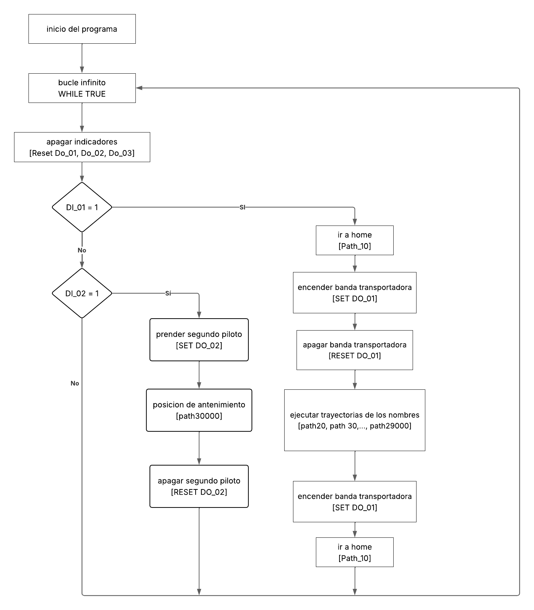

# Laboratorio No. 01 — Robótica Industrial 2026-I
## Trayectorias, Entradas y Salidas Digitales

> **Universidad Nacional de Colombia**  
> Departamento de Ingeniería Mecánica y Mecatrónica

---

## Información del Grupo

| Campo | Detalle |
|---|---|
| **Asignatura** | Robótica |
| **Semestre** | 2026-I |
| **Integrante 1** | David Santiago Pirateque Suarez |
| **Integrante 2** | Jose Daniel Suarez Vasques |
| **Integrante 3** | David Felipe Cardenas Cubides |
| **Grupo** | No. 2D |
| **Docente** | Nombre del docente |
| **Fecha de entrega** | 25/04/2026 |
| **Video de funcionamiento** | https://youtu.be/... |
| **Video de simulacion** | https://youtu.be/... |

## 1. Introducción

En la industria de alimentos, en especial panadería, quieren mejorar su proceso de producción. Ellos consideran que la decoración de las tortas puede ser un punto a ser ejecutado por robots. En los siguientes links se puede observar diferentes automatización de decoración de tortas con robots .
Considerando las limitaciones del laboratorio se propone hacer la decoración de una torta virtual. Es decir. Sobre una superficie plana bien sea redonda o rectangular, escribir los nombres de cada uno de los integrantes del grupo y una decoraci´on a su gusto. En este caso se desea generar los paths o los movimientos de robot necesarios para representar las letras y la decoración. Se deben tener en cuenta las siguientes restricciones:
- El tamaño de la torta es para 20 personas
- Las trayectorias a desarrollar deberán realizarse en un rango de velocidades entre 100 y 1000.
- La zona tolerable de errores máxima debe ser de z10.
- El movimiento debe partir de una posición home especificada (puede ser el home del robot) y realizar la
- trayectoria de cada palabra y decoración con un trazo continuo. El movimiento debe finalizar en la misma
- posición de home en la que se inicío.
- La decoración de la torta debe ser realizada sobre una torta virtual.
- Los nombres deben estar separados


## 2. Descripción detallada de la solución planteada

Para comenzar el laboratorio, se realizó la calibración del workobject y de la herramienta a utilizar. En ambos casos, esta calibración se realizo tanto de forma digital (con el modelo 3D de cada objeto) como de forma manual (usando la herramienta ya impresa en 3D y el workobject físico). Para esta práctica, el workobject consistió en una caja con una lámina sobre la cual el marcador pudiera escribir.

Una vez hecho esto, se realizó la programación de trayectorias desde el software de RobotStudio. Se comenzó definiendo la posición inicial, también conocida en RAPID como target_home. Luego, se procedió con el diseño del pastel, basándose principalmente en el workobject digital, ya que este se diseñó con las formas que se esperaban dibujar utilizando los comandos de movimiento MoveL, MoveJ y MoveC.

Con las trayectorias planteadas en la simulación, se pasó a las pruebas físicas con el manipulador industrial IRB 140. Ahí se probaron ambas calibraciones de la herramienta y se optó por la [___]. Durante la ejecución, se observó que el marcador estaba bajando más de lo necesario; por lo tanto, se elevó el workobject en la simulación para corregir este problema.

Por último, se configuraron las entradas y salidas del controlador IRC5 para la activación de la banda transportadora y de los pilotos indicadores, así como para la lectura de las entradas digitales correspondientes a los pulsadores del tablero. Con esto, se finalizó la configuración de la rutina principal donde taambien se le asigno la posicion de mantenimiento.


## 3. Diagrama de flujo de acciones del robot

el diagrama de flujo del modulo 1 del RAPID  usado durante la practica:




## 4. Plano de planta de la ubicación de cada uno de los elementos

*(Asegúrate de guardar la imagen de tu plano en la misma carpeta que este archivo y cambia el nombre abajo)*


## 5. Diseño de la herramienta detallado

[Describe en este espacio:
* Cómo diseñaron en CAD la herramienta para fijar el marcador al flanche.
* Cuál fue la técnica de calibración que usaron.
* Compara y analiza las diferencias entre el tooldata creado en el robot real versus el importado en RobotStudio.]

## 6. Descripción de las funciones utilizadas

[Lista y explica brevemente qué funciones de programación usaste. Por ejemplo:
* **MoveL / MoveJ:** [Tu explicación de para qué las usaste]
* **SetDO / Reset:** [Tu explicación]
* **IF / FOR / WHILE:** [Tu explicación]
* **WaitTime / TPWrite:** [Tu explicación]]

## 7. Código en RAPID del módulo utilizado

[A continuación se presenta el código desarrollado para la práctica:]

```rapid
! Reemplaza esto con tu código real.
! Recuerda incluir la lógica completa de las trayectorias, 
! las entradas/salidas y los workobjects.

MODULE Module1
    ! Tus variables y constantes aquí
    
    PROC main()
        ! Tu rutina principal aquí
    ENDPROC
ENDMODULE
```


## 8. Análisis y Resultados

## 9. Conclusiones

- **Trayectorias:** ...
- **Herramienta y calibración TCP:** ...
- **Workobject:** ...
- **Programación RAPID:** ...
- **Entradas y Salidas Digitales / Banda transportadora:** ...

---

## 10. Referencias

1. ABB Robotics, *IRB 140 Product Specification*, ABB Group, 2023. [En línea]. Disponible: https://new.abb.com/products/robotics/robots/articulated-robots/irb-140
2. ABB Robotics, *DSQC 652 – 3HAC025917-001/00 Digital I/O Module*, ABB Group.
3. ABB Robotics, *RAPID Reference Manual*, ABB Group. [En línea]. Disponible: https://developercenter.robotstudio.com/
