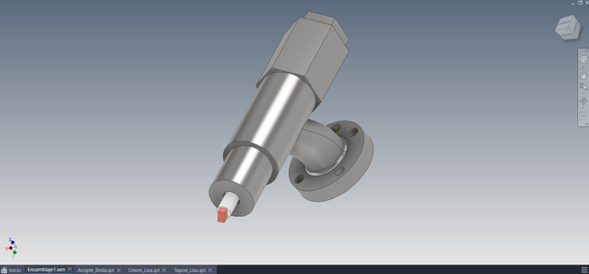
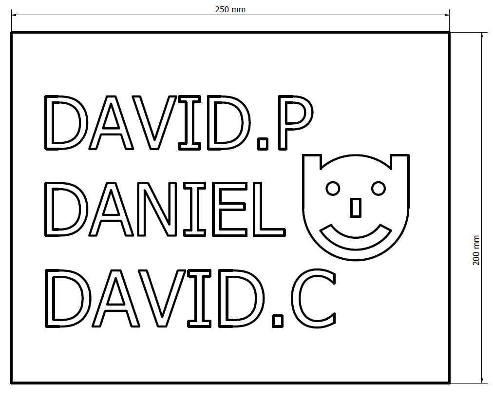
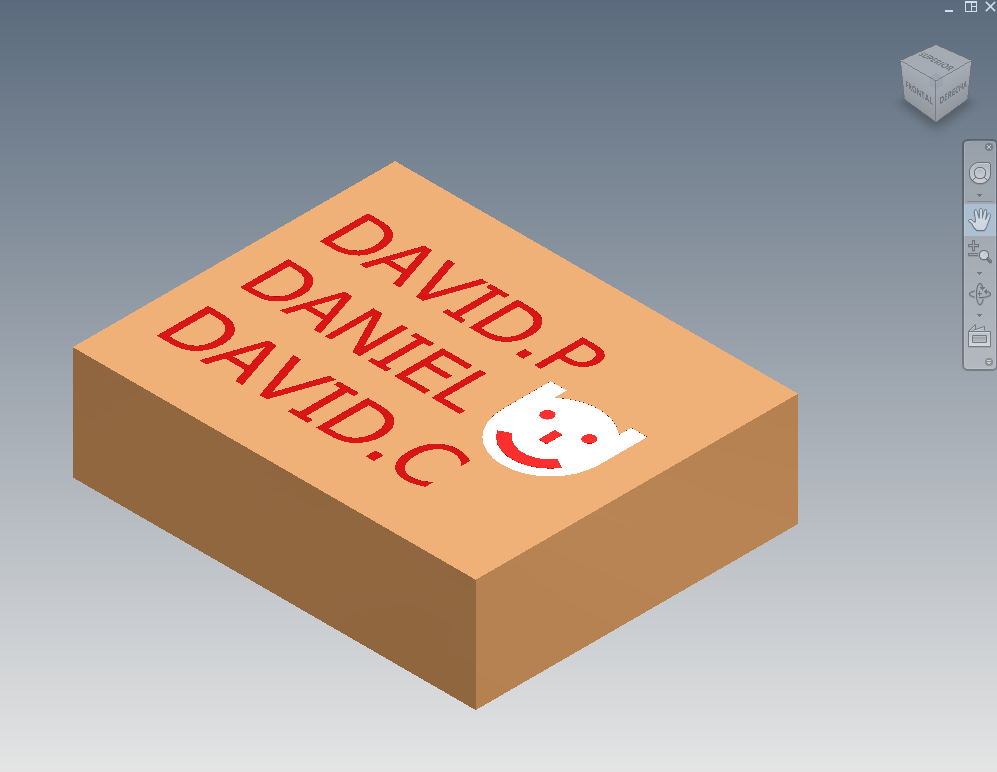
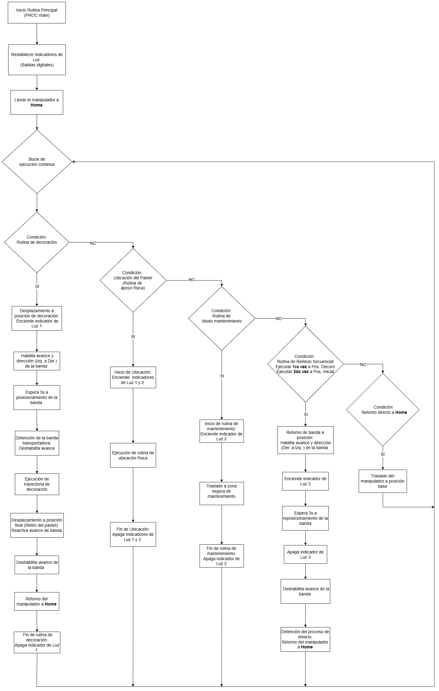

<picture>
    <source srcset="https://imgur.com/5bYAzsb.png" media="(prefers-color-scheme: dark)">
    <source srcset="https://imgur.com/Os03JoE.png" media="(prefers-color-scheme: light)">
    
</picture>

<h1>Laboratorio No. 01: Robótica Industrial - Trayectorias, Entradas y Salidas Digitales</h1>
<h2>Profesores:  Pedro Fabián Cárdenas Herrera   Manuel Felipe Carranza Montenegro</h2>

 
 
<b>Figura 1. Celda de manufactura con manipuladores ABB IRB 140.</b>

---

## 1. Introducción

En el presente laboratorio se estudian los principios fundamentales de la robótica industrial mediante la programación de trayectorias, el diseño y calibración de herramientas (ToolData), y la integración de señales de control a través de entradas y salidas digitales (E/S). La práctica se desarrolla sobre un manipulador ABB IRB 140 controlado por la unidad IRC5, operando en conjunto con una banda transportadora. Este entorno físico se replica computacionalmente mediante el uso de gemelos digitales en el software RobotStudio, permitiendo la validación previa de la lógica de control.

El escenario de aplicación se inspira en la automatización de la industria alimentaria, proponiendo la ejecución de una rutina de decoración sobre una superficie virtual (torta). Para la resolución de este problema, se establecieron los siguientes requerimientos técnicos:

* Área de trabajo definida para un volumen equivalente a un pastel de 20 porciones.
* Parámetros de interpolación restringidos a velocidades entre `v100` y `v1000`, con una zona de aproximación máxima de `z10`.
* Movimiento continuo para cada trazo, partiendo y finalizando en una pose de seguridad (Home).
* Independencia en el trazo de cada uno de los nombres.
* Implementación de lógicas de control mediante señales digitales para la gestión de rutinas (decoración y mantenimiento) y el accionamiento de periféricos (banda transportadora).

---

## 2. Solución Planteada

La estrategia de resolución se dividió en dos fases: la preparación del entorno de trabajo (físico y virtual) y la arquitectura de control en lenguaje RAPID.

Inicialmente, se diseñó un actuador final (herramienta) capaz de sujetar un marcador. En el entorno de simulación, se estableció un *WorkObject* con dimensiones de **25×20×7 cm** para representar la superficie de trabajo, **el cual fue posicionado espacialmente sobre la banda transportadora principal de la celda.** Sobre estas coordenadas geométricas se diseñaron las trayectorias correspondientes a la decoración y a la escritura de los nombres.

  <table>
    <tr>
      <td align="center">
         
        <b>Figura 2. Diseño 3D de la Herramienta</b>
      </td>
      <td align="center">
         
        <b>Figura 3. Planificación de rutas de decoración</b>
      </td>
      <td align="center">
         
        <b>Figura 4. Modelado CAD del Pastel</b>
      </td>
    </tr>
  </table>

La validación del sistema se realizó primero en RobotStudio. Tras calibrar el `ToolData` y el `WorkObject`, se programaron las secuencias de movimiento con parámetros nominales de `v150` y `z5`, es decir, velocidad de 150mm/s y tolerancia de 5mm, **lo cual garantiza un trazo fluido sin comprometer la precisión requerida en los contornos curvos de las letras.** La lógica de interacción con el entorno se definió mediante el mapeo de las siguientes señales digitales, integrando rutinas de apoyo y seguridad:

* **Rutina de Decoración (DI_01):** Al activarse esta condición, se enciende el **indicador de Luz 1 (DO_01)**. El sistema habilita el avance de la banda, realiza una espera de 3 segundos para el posicionamiento, ejecuta la trayectoria de decoración y finaliza con el retiro del pastel mediante la reactivación de la banda antes de retornar a *Home*.

* **Apoyo Físico / Ubicación (DI_01 y DI_02):** Rutina diseñada para el posicionamiento del robot en la posición donde debe ir el pastel. Durante su ejecución, se activan simultáneamente las salidas **Luz 1 y Luz 2 (DO_01 y DO_02)** para indicar la intervención en la celda.

* **Modo Mantenimiento (DI_02):** Traslada el manipulador a una zona segura de mantenimiento y activa la **Luz 2 (DO_02)**. Al finalizar la rutina, se apaga el indicador y el sistema retorna al bucle de ejecución continua.

* **Reinicio Secuencial (DI_03):** Implementación de una lógica de doble estado para la gestión de la banda transportadora: 
  * **1er Accionamiento:** Posicionamiento en zona de decorado.
  * **2do Accionamiento:** Retorno a posición inicial.

  Esta rutina activa el **indicador de Luz 3 (DO_03)** y habilita el retroceso de la banda por 3 segundos, a la par que traslada el manipulador al *Home*.

* **Retorno Directo a Home (DI_02 y DI_03):** Condición de seguridad que permite el traslado inmediato del manipulador a su posición base.

* **Gestión de Indicadores (DO):** Se definieron tres salidas digitales (`DO_01`, `DO_02`, `DO_03`) para señalizar visualmente cada estado de la operación y garantizar la seguridad del operario durante las rutinas de apoyo y mantenimiento.

 

  
   
  <b>Figura 5. Entorno de simulación en RobotStudio.</b>

 

Es pertinente señalar que, dentro del entorno virtual de RobotStudio, la cinemática de la banda transportadora fue emulada mediante el uso de *Smart Components*. Específicamente, se implementó el bloque `LinearMove2` para generar el desplazamiento directo del *WorkObject*. 

Una vez corroborada la lógica computacional, se avanzó a la implementación en la celda física. Este proceso inició con la calibración del TCP del actuador y la definición del sistema de coordenadas del elemento físico emulador del pastel. Al ejecutar el programa en RAPID, se requirió un ajuste iterativo para compensar las leves discrepancias de posicionamiento físico frente al modelo ideal, logrando finalmente la ejecución precisa de la trayectoria de decorado.

 

<table>
  <tr>
    <td align="center">
       
      <b>Figura 6. Herramienta acoplada al manipulador</b>
    </td>
    <td align="center">
       
      <b>Figura 7. Trazado final obtenido</b>
    </td>
    <td align="center">
       
      <b>Figura 8. Objeto de trabajo en estación física</b>
    </td>
  </tr>
</table>

## 3. Diagrama de Flujo de Acciones

El siguiente diagrama ilustra la arquitectura lógica implementada en el controlador, detallando el ciclo de escaneo de señales y las decisiones operativas de la estación.

   
  <b>Figura 5. Diagrama de flujo de la rutina principal y subrutinas.</b>

