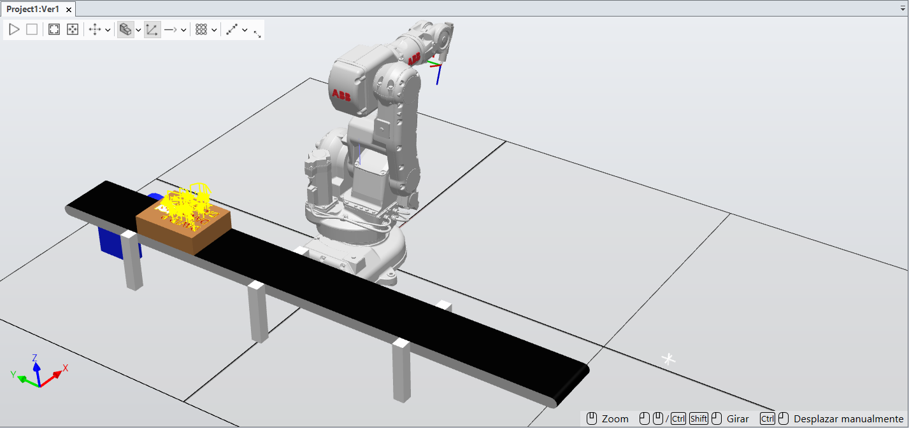
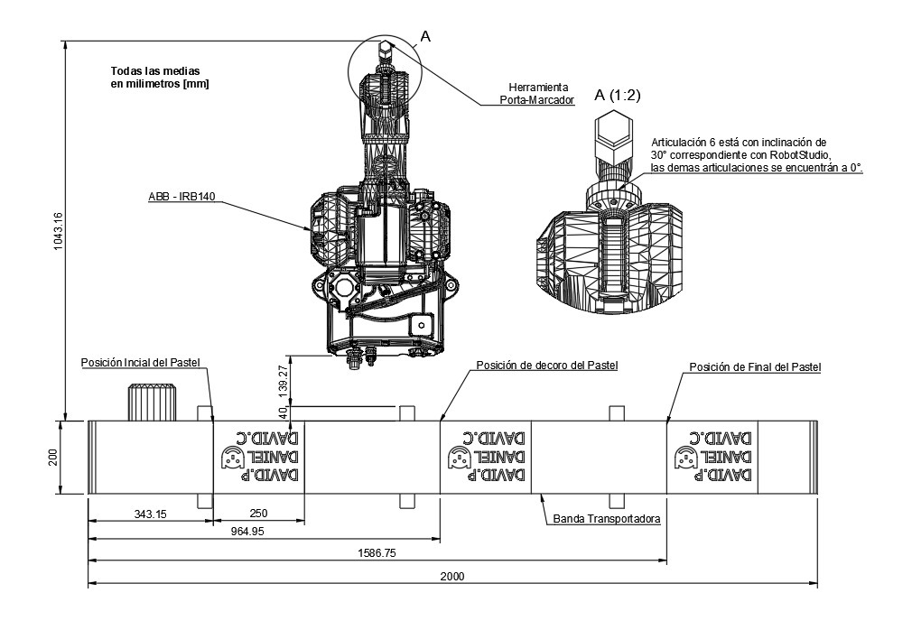

<div align="center">
<picture>
    <source srcset="https://imgur.com/5bYAzsb.png" media="(prefers-color-scheme: dark)">
    <source srcset="https://imgur.com/Os03JoE.png" media="(prefers-color-scheme: light)">
    
</picture>

<h1>Laboratorio No. 01: Robótica Industrial - Trayectorias, Entradas y Salidas Digitales</h1>
<h2>Profesores: <br>Pedro Fabián Cárdenas Herrera <br> Manuel Felipe Carranza Montenegro</h2>

<br>
<br>
<b>Figura 1. Celda de manufactura con manipuladores ABB IRB 140.</b>
</div>

---

## 1. Introducción

En el presente laboratorio se estudian los principios fundamentales de la robótica industrial mediante la programación de trayectorias, el diseño y calibración de herramientas (ToolData), y la integración de señales de control a través de entradas y salidas digitales (E/S). La práctica se desarrolla sobre un manipulador ABB IRB 140 controlado por la unidad IRC5, operando en conjunto con una banda transportadora. Este entorno físico se replica computacionalmente mediante el uso de gemelos digitales en el software RobotStudio, permitiendo la validación previa de la lógica de control.

El escenario de aplicación se inspira en la automatización de la industria alimentaria, proponiendo la ejecución de una rutina de decoración sobre una superficie virtual (torta). Para la resolución de este problema, se establecieron los siguientes requerimientos técnicos:

* Área de trabajo definida para un volumen equivalente a un pastel de 20 porciones.
* Parámetros de interpolación restringidos a velocidades entre `v100` y `v1000`, con una zona de aproximación máxima de `z10`.
* Movimiento continuo para cada trazo, partiendo y finalizando en una pose de seguridad (Home).
* Independencia en el trazo de cada uno de los nombres.
* Implementación de lógicas de control mediante señales digitales para la gestión de rutinas (decoración y mantenimiento) y el accionamiento de periféricos (banda transportadora).

---

## 2. Solución Planteada

La estrategia de resolución se dividió en dos fases: la preparación del entorno de trabajo (físico y virtual) y la arquitectura de control en lenguaje RAPID.

Inicialmente, se diseñó un actuador final (herramienta) capaz de sujetar un marcador. En el entorno de simulación, se estableció un *WorkObject* con dimensiones de **25×20×7 cm** para representar la superficie de trabajo, **el cual fue posicionado espacialmente sobre la banda transportadora principal de la celda.** Sobre estas coordenadas geométricas se diseñaron las trayectorias correspondientes a la decoración y a la escritura de los nombres.

<div align="center">
  <table>
    <tr>
      <td align="center">
        <br>
        <b>Figura 2. Diseño 3D de la Herramienta</b>
      </td>
      <td align="center">
        <br>
        <b>Figura 3. Planificación de rutas de decoración</b>
      </td>
      <td align="center">
        <br>
        <b>Figura 4. Modelado CAD del Pastel</b>
      </td>
    </tr>
  </table>
</div>

La validación del sistema se realizó primero en RobotStudio. Tras calibrar el `ToolData` y el `WorkObject`, se programaron las secuencias de movimiento con parámetros nominales de `v150` y `z5`, es decir, velocidad de 150mm/s y tolerancia de 5mm, **lo cual garantiza un trazo fluido sin comprometer la precisión requerida en los contornos curvos de las letras y el dibujo.** La lógica de interacción con el entorno se definió mediante el mapeo de las siguientes señales digitales, integrando rutinas de apoyo y seguridad:

* **Rutina de Decoración (DI_01):** Al activarse esta condición, se enciende el **indicador de Luz 1 (DO_01)**. El sistema habilita el avance de la banda, realiza una espera de 3 segundos para el posicionamiento, ejecuta la trayectoria de decoración y finaliza con el retiro del pastel mediante la reactivación de la banda antes de retornar a *Home*.

* **Apoyo Físico / Ubicación (DI_01 y DI_02):** Rutina diseñada para el posicionamiento del manipulador del robot en la posición de decoración donde deberia ir el pastel y así poderlo ubicar apropiadamente. Durante su ejecución, se activan simultáneamente las salidas **Luz 1 y Luz 2 (DO_01 y DO_02)** para indicar la intervención en la celda.

* **Modo Mantenimiento (DI_02):** Traslada el manipulador a una zona segura de mantenimiento y activa la **Luz 2 (DO_02)**. Al finalizar la rutina, se apaga el indicador y el sistema retorna al bucle de ejecución continua.

* **Reinicio Secuencial (DI_03):** Implementación de una lógica de doble estado para la gestión de la banda transportadora: 
  * **1er Accionamiento:** Posicionamiento en zona de decorado.
  * **2do Accionamiento:** Retorno a posición inicial.

  Esta rutina activa el **indicador de Luz 3 (DO_03)** y habilita el retroceso de la banda por 3 segundos, a la par que traslada el manipulador al *Home*.

* **Retorno Directo a Home (DI_02 y DI_03):** Condición de seguridad que permite el traslado inmediato del manipulador a su posición base.

* **Gestión de Indicadores (DO):** Se definieron tres salidas digitales (`DO_01`, `DO_02`, `DO_03`) para señalizar visualmente cada estado de la operación y garantizar la seguridad del operario durante las rutinas de apoyo y mantenimiento.

<br>

<div align="center">
  
  <br>
  <b>Figura 5. Entorno de simulación en RobotStudio.</b>
</div>

<br>

Es pertinente señalar que, dentro del entorno virtual de RobotStudio, la cinemática de la banda transportadora fue emulada mediante el uso de *Smart Components*. Específicamente, se implementó el bloque `LinearMove2` para generar el desplazamiento directo del *WorkObject*. 

Una vez corroborada la lógica computacional, se avanzó a la implementación en la celda física. Este proceso inició con la calibración del TCP del actuador y la definición del sistema de coordenadas del elemento físico emulador del pastel. Al ejecutar el programa en RAPID, se requirió un ajuste iterativo para compensar las leves discrepancias de posicionamiento físico frente al modelo ideal, logrando finalmente la ejecución precisa de la trayectoria de decorado.

<br>

<div align="center">
<table>
  <tr>
    <td align="center">
      <br>
      <b>Figura 6. Herramienta acoplada al manipulador</b>
    </td>
    <td align="center">
      <br>
      <b>Figura 7. Trazado final obtenido</b>
    </td>
    <td align="center">
      <br>
      <b>Figura 8. Objeto de trabajo en estación física</b>
    </td>
  </tr>
</table>
</div>


## 3. Diagrama de Flujo de Acciones

## 3. Diagrama de Flujo de Acciones

El siguiente diagrama detalla la arquitectura lógica de control implementada en lenguaje RAPID. A diferencia de una secuencia lineal básica, la programación se estructuró sobre un **bucle de ejecución continua** que evalúa de forma jerárquica el estado de las señales digitales para tomar decisiones operativas en tiempo real.

Esta topología permite al controlador gestionar sincrónicamente los movimientos del manipulador, la activación de los actuadores externos (banda transportadora) y la señalización visual, dividiendo el proceso en cinco estados principales:

* **Operación Nominal:** Secuencia principal que coordina el posicionamiento de la banda, la ejecución de la trayectoria de decoración y la evacuación de la pieza.
* **Intervención Manual:** Rutina de apoyo físico que habilita la inserción segura del pastel en la celda de trabajo.
* **Protocolo de Mantenimiento:** Desplazamiento preventivo a una zona segura para facilitar cambios de herramienta o inspecciones.
* **Reinicio Secuencial:** Lógica de recuperación de estados que permite reposicionar la banda de forma controlada en dos tiempos.
* **Retorno a Base:** Condición prioritaria de seguridad para la reubicación inmediata del manipulador en su posición *Home*.

<div align="center">
  <br>
  <b>Figura 5. Diagrama de flujo de la rutina principal y subrutinas.</b>
</div>


## 4. Plano de planta


<div align="center">
  <br>
  <b>Figura 6. Plano de planta.</b>
</div>

## 5. Codigo en RAPID del modulo utilizado
```rapid
MODULE Module1
    CONST robtarget Target_Home:=[[518.48875071,0.469,561.003995976],[0.172530837,0,-0.985004117,0],[-1,0,-1,0],[9E+09,9E+09,9E+09,9E+09,9E+09,9E+09]];
    PERS tooldata MyNewTool:=[TRUE,[[96.522,0.469,69.811],[0.766773169,0,0.641918146,0]],[1,[0,0,1],[1,0,0,0],0,0,0]];
    TASK PERS wobjdata Workobject_1:=[FALSE,TRUE,"",[[135.439,-499.945,293],[0.000228434,-0.026175952,0.008723545,-0.999619261]],[[787.15,-350,60],[0,0,1,0]]];
    !TASK PERS wobjdata Workobject_1:=[FALSE,TRUE,"",[[135.439,-499.945,293],[0,0,0,1]],[[787.15,-350,70],[0,0,1,0]]];
    CONST robtarget Target_19:=[[36.462,230.391,-50],[1,0,0,0],[-2,0,-1,1],[9E+09,9E+09,9E+09,9E+09,9E+09,9E+09]];
    CONST robtarget Target_20:=[[36.462,230.391,1],[1,0,0,0],[-2,0,-1,1],[9E+09,9E+09,9E+09,9E+09,9E+09,9E+09]];
    CONST robtarget Target_30:=[[66.462,230.391,1],[1,0,0,0],[-2,0,-1,1],[9E+09,9E+09,9E+09,9E+09,9E+09,9E+09]];
    CONST robtarget Target_40:=[[66.462,223.487,1],[1,0,0,0],[-2,0,-1,1],[9E+09,9E+09,9E+09,9E+09,9E+09,9E+09]];
    CONST robtarget Target_50:=[[64.055,212.863,1],[1,0,0,0],[-2,0,-1,1],[9E+09,9E+09,9E+09,9E+09,9E+09,9E+09]];
    CONST robtarget Target_60:=[[51.486,206.736,1],[1,0,0,0],[-2,0,-1,1],[9E+09,9E+09,9E+09,9E+09,9E+09,9E+09]];
    CONST robtarget Target_70:=[[38.844,212.814,1],[1,0,0,0],[-2,0,-1,1],[9E+09,9E+09,9E+09,9E+09,9E+09,9E+09]];   
    CONST robtarget Target_72:=[[36.462,230.391,-100],[1,0,0,0],[-2,0,-1,1],[9E+09,9E+09,9E+09,9E+09,9E+09,9E+09]];
    CONST robtarget Target_78:=[[66.461,180.505,-100],[1,0,0,0],[-2,0,-1,1],[9E+09,9E+09,9E+09,9E+09,9E+09,9E+09]];
    CONST robtarget Target_88:=[[66.461,180.505,1],[1,0,0,0],[-2,0,-1,1],[9E+09,9E+09,9E+09,9E+09,9E+09,9E+09]];
    CONST robtarget Target_98:=[[36.461,190.618,1],[1,0,0,0],[-2,0,-1,1],[9E+09,9E+09,9E+09,9E+09,9E+09,9E+09]];
    CONST robtarget Target_108:=[[36.461,195.529,1],[1,0,0,0],[-2,0,-1,1],[9E+09,9E+09,9E+09,9E+09,9E+09,9E+09]];
    CONST robtarget Target_118:=[[66.461,205.642,1],[1,0,0,0],[-2,0,-1,1],[9E+09,9E+09,9E+09,9E+09,9E+09,9E+09]];
    CONST robtarget Target_128:=[[66.461,201.607,1],[1,0,0,0],[-2,0,-1,1],[9E+09,9E+09,9E+09,9E+09,9E+09,9E+09]];
    CONST robtarget Target_138:=[[58.074,198.884,1],[1,0,0,0],[-2,0,-1,1],[9E+09,9E+09,9E+09,9E+09,9E+09,9E+09]];
    CONST robtarget Target_148:=[[58.074,187.433,1],[1,0,0,0],[-2,0,-1,1],[9E+09,9E+09,9E+09,9E+09,9E+09,9E+09]];
    CONST robtarget Target_158:=[[66.461,184.71,1],[1,0,0,0],[-2,0,-1,1],[9E+09,9E+09,9E+09,9E+09,9E+09,9E+09]];
    CONST robtarget Target_167:=[[66.461,170.537,-100],[1,0,0,0],[-2,0,-1,1],[9E+09,9E+09,9E+09,9E+09,9E+09,9E+09]];
    CONST robtarget Target_168:=[[66.461,170.537,1],[1,0,0,0],[-2,0,-1,1],[9E+09,9E+09,9E+09,9E+09,9E+09,9E+09]];
    CONST robtarget Target_178:=[[36.461,180.869,1],[1,0,0,0],[-2,0,-1,1],[9E+09,9E+09,9E+09,9E+09,9E+09,9E+09]];
    CONST robtarget Target_188:=[[36.461,176.591,1],[1,0,0,0],[-2,0,-1,1],[9E+09,9E+09,9E+09,9E+09,9E+09,9E+09]];
    CONST robtarget Target_198:=[[61.38,168.276,1],[1,0,0,0],[-2,0,-1,1],[9E+09,9E+09,9E+09,9E+09,9E+09,9E+09]];
    CONST robtarget Target_208:=[[36.461,159.962,1],[1,0,0,0],[-2,0,-1,1],[9E+09,9E+09,9E+09,9E+09,9E+09,9E+09]];
    CONST robtarget Target_218:=[[36.461,155.902,1],[1,0,0,0],[-2,0,-1,1],[9E+09,9E+09,9E+09,9E+09,9E+09,9E+09]];
    CONST robtarget Target_228:=[[66.461,166.234,1],[1,0,0,0],[-2,0,-1,1],[9E+09,9E+09,9E+09,9E+09,9E+09,9E+09]];
    CONST robtarget Target_248:=[[63.398,150.383,1],[1,0,0,0],[-2,0,-1,1],[9E+09,9E+09,9E+09,9E+09,9E+09,9E+09]];
    CONST robtarget Target_258:=[[39.525,150.383,1],[1,0,0,0],[-2,0,-1,1],[9E+09,9E+09,9E+09,9E+09,9E+09,9E+09]];
    CONST robtarget Target_268:=[[39.525,154.2,1],[1,0,0,0],[-2,0,-1,1],[9E+09,9E+09,9E+09,9E+09,9E+09,9E+09]];
    CONST robtarget Target_278:=[[36.461,154.2,1],[1,0,0,0],[-2,0,-1,1],[9E+09,9E+09,9E+09,9E+09,9E+09,9E+09]];
    CONST robtarget Target_288:=[[36.461,142.579,1],[1,0,0,0],[-2,0,-1,1],[9E+09,9E+09,9E+09,9E+09,9E+09,9E+09]];
    CONST robtarget Target_298:=[[39.525,142.579,1],[1,0,0,0],[-2,0,-1,1],[9E+09,9E+09,9E+09,9E+09,9E+09,9E+09]];
    CONST robtarget Target_308:=[[39.525,146.396,1],[1,0,0,0],[-2,0,-1,1],[9E+09,9E+09,9E+09,9E+09,9E+09,9E+09]];
    CONST robtarget Target_318:=[[63.398,146.396,1],[1,0,0,0],[-2,0,-1,1],[9E+09,9E+09,9E+09,9E+09,9E+09,9E+09]];
    CONST robtarget Target_328:=[[63.398,142.579,1],[1,0,0,0],[-2,0,-1,1],[9E+09,9E+09,9E+09,9E+09,9E+09,9E+09]];
    CONST robtarget Target_338:=[[66.461,142.579,1],[1,0,0,0],[-2,0,-1,1],[9E+09,9E+09,9E+09,9E+09,9E+09,9E+09]];
    CONST robtarget Target_348:=[[66.461,154.2,1],[1,0,0,0],[-2,0,-1,1],[9E+09,9E+09,9E+09,9E+09,9E+09,9E+09]];
    CONST robtarget Target_238:=[[63.398,154.2,1],[1,0,0,0],[-2,0,-1,1],[9E+09,9E+09,9E+09,9E+09,9E+09,9E+09]];
    CONST robtarget Target_237:=[[63.398,154.2,-100],[1,0,0,0],[-2,0,-1,1],[9E+09,9E+09,9E+09,9E+09,9E+09,9E+09]];
    CONST robtarget Target_357:=[[36.461,137.644,-100],[1,0,0,0],[-2,0,-1,1],[9E+09,9E+09,9E+09,9E+09,9E+09,9E+09]];
    CONST robtarget Target_358:=[[36.461,137.644,1],[1,0,0,0],[-2,0,-1,1],[9E+09,9E+09,9E+09,9E+09,9E+09,9E+09]];
    CONST robtarget Target_368:=[[66.461,137.644,1],[1,0,0,0],[-2,0,-1,1],[9E+09,9E+09,9E+09,9E+09,9E+09,9E+09]];
    CONST robtarget Target_378:=[[66.461,130.74,1],[1,0,0,0],[-2,0,-1,1],[9E+09,9E+09,9E+09,9E+09,9E+09,9E+09]];
    CONST robtarget Target_388:=[[64.054,120.116,1],[1,0,0,0],[-2,0,-1,1],[9E+09,9E+09,9E+09,9E+09,9E+09,9E+09]];
    CONST robtarget Target_398:=[[51.485,113.989,1],[1,0,0,0],[-2,0,-1,1],[9E+09,9E+09,9E+09,9E+09,9E+09,9E+09]];
    CONST robtarget Target_408:=[[38.843,120.067,1],[1,0,0,0],[-2,0,-1,1],[9E+09,9E+09,9E+09,9E+09,9E+09,9E+09]];
    CONST robtarget Target_418:=[[63.593,106.477,4],[1,0,0,0],[-2,0,-1,1],[9E+09,9E+09,9E+09,9E+09,9E+09,9E+09]];
    CONST robtarget Target_419:=[[63.593,106.477,-100],[1,0,0,0],[-2,0,-1,1],[9E+09,9E+09,9E+09,9E+09,9E+09,9E+09]];
    CONST robtarget Target_420:=[[66.461,97.166,-100],[1,0,0,0],[-2,0,-1,1],[9E+09,9E+09,9E+09,9E+09,9E+09,9E+09]];
    CONST robtarget Target_429:=[[66.461,97.166,1],[1,0,0,0],[-2,0,-1,1],[9E+09,9E+09,9E+09,9E+09,9E+09,9E+09]];
    CONST robtarget Target_439:=[[36.461,97.166,1],[1,0,0,0],[-2,0,-1,1],[9E+09,9E+09,9E+09,9E+09,9E+09,9E+09]];
    CONST robtarget Target_449:=[[36.461,89.629,1],[1,0,0,0],[-2,0,-1,1],[9E+09,9E+09,9E+09,9E+09,9E+09,9E+09]];
    CONST robtarget Target_459:=[[38.333,81.777,1],[1,0,0,0],[-2,0,-1,1],[9E+09,9E+09,9E+09,9E+09,9E+09,9E+09]];
    CONST robtarget Target_469:=[[45.505,78.203,1],[1,0,0,0],[-2,0,-1,1],[9E+09,9E+09,9E+09,9E+09,9E+09,9E+09]];
    CONST robtarget Target_479:=[[52.166,80.829,1],[1,0,0,0],[-2,0,-1,1],[9E+09,9E+09,9E+09,9E+09,9E+09,9E+09]];
    CONST robtarget Target_489:=[[55.278,89.8,1],[1,0,0,0],[-2,0,-1,1],[9E+09,9E+09,9E+09,9E+09,9E+09,9E+09]];
    CONST robtarget Target_499:=[[55.278,93.179,1],[1,0,0,0],[-2,0,-1,1],[9E+09,9E+09,9E+09,9E+09,9E+09,9E+09]];
    CONST robtarget Target_509:=[[66.461,93.179,1],[1,0,0,0],[-2,0,-1,1],[9E+09,9E+09,9E+09,9E+09,9E+09,9E+09]];
    CONST robtarget Target_520:=[[85.857,230.391,1],[1,0,0,0],[-2,0,-1,1],[9E+09,9E+09,9E+09,9E+09,9E+09,9E+09]];
    CONST robtarget Target_519:=[[85.856,230.391,-100],[1,0,0,0],[-2,0,-1,1],[9E+09,9E+09,9E+09,9E+09,9E+09,9E+09]];
    CONST robtarget Target_530:=[[115.857,230.391,1],[1,0,0,0],[-2,0,-1,1],[9E+09,9E+09,9E+09,9E+09,9E+09,9E+09]];
    CONST robtarget Target_540:=[[115.857,223.487,1],[1,0,0,0],[-2,0,-1,1],[9E+09,9E+09,9E+09,9E+09,9E+09,9E+09]];
    CONST robtarget Target_550:=[[113.45,212.863,1],[1,0,0,0],[-2,0,-1,1],[9E+09,9E+09,9E+09,9E+09,9E+09,9E+09]];
    CONST robtarget Target_560:=[[100.881,206.736,1],[1,0,0,0],[-2,0,-1,1],[9E+09,9E+09,9E+09,9E+09,9E+09,9E+09]];
    CONST robtarget Target_570:=[[88.239,212.814,1],[1,0,0,0],[-2,0,-1,1],[9E+09,9E+09,9E+09,9E+09,9E+09,9E+09]];
    CONST robtarget Target_579:=[[115.856,203.625,-100],[1,0,0,0],[-2,0,-1,1],[9E+09,9E+09,9E+09,9E+09,9E+09,9E+09]];
    CONST robtarget Target_580:=[[115.856,203.625,1],[1,0,0,0],[-2,0,-1,1],[9E+09,9E+09,9E+09,9E+09,9E+09,9E+09]];
    CONST robtarget Target_590:=[[85.856,193.074,1],[1,0,0,0],[-2,0,-1,1],[9E+09,9E+09,9E+09,9E+09,9E+09,9E+09]];
    CONST robtarget Target_600:=[[115.856,182.608,1],[1,0,0,0],[-2,0,-1,1],[9E+09,9E+09,9E+09,9E+09,9E+09,9E+09]];
    CONST robtarget Target_601:=[[115.856,182.608,-50],[1,0,0,0],[-2,0,-1,1],[9E+09,9E+09,9E+09,9E+09,9E+09,9E+09]];
    CONST robtarget Target_609:=[[104.065,197.79,-50],[1,0,0,0],[-2,0,-1,1],[9E+09,9E+09,9E+09,9E+09,9E+09,9E+09]];
    CONST robtarget Target_610:=[[104.065,197.79,1],[1,0,0,0],[-2,0,-1,1],[9E+09,9E+09,9E+09,9E+09,9E+09,9E+09]];
    CONST robtarget Target_620:=[[104.065,188.527,1],[1,0,0,0],[-2,0,-1,1],[9E+09,9E+09,9E+09,9E+09,9E+09,9E+09]];
    CONST robtarget Target_621:=[[104.065,188.527,-100],[1,0,0,0],[-2,0,-1,1],[9E+09,9E+09,9E+09,9E+09,9E+09,9E+09]];
    CONST robtarget Target_629:=[[115.856,175.8,-100],[1,0,0,0],[-2,0,-1,1],[9E+09,9E+09,9E+09,9E+09,9E+09,9E+09]];
    CONST robtarget Target_630:=[[115.856,175.8,1],[1,0,0,0],[-2,0,-1,1],[9E+09,9E+09,9E+09,9E+09,9E+09,9E+09]];
    CONST robtarget Target_640:=[[85.856,175.8,1],[1,0,0,0],[-2,0,-1,1],[9E+09,9E+09,9E+09,9E+09,9E+09,9E+09]];
    CONST robtarget Target_650:=[[115.856,158.053,1],[1,0,0,0],[-2,0,-1,1],[9E+09,9E+09,9E+09,9E+09,9E+09,9E+09]];
    CONST robtarget Target_660:=[[85.856,158.053,1],[1,0,0,0],[-2,0,-1,1],[9E+09,9E+09,9E+09,9E+09,9E+09,9E+09]];
    CONST robtarget Target_661:=[[85.856,158.053,-100],[1,0,0,0],[-2,0,-1,1],[9E+09,9E+09,9E+09,9E+09,9E+09,9E+09]];
    CONST robtarget Target_710:=[[85.856,145.472,1],[1,0,0,0],[-2,0,-1,1],[9E+09,9E+09,9E+09,9E+09,9E+09,9E+09]];
    CONST robtarget Target_720:=[[115.856,145.472,1],[1,0,0,0],[-2,0,-1,1],[9E+09,9E+09,9E+09,9E+09,9E+09,9E+09]];
    CONST robtarget Target_730:=[[100.856,145.472,1],[1,0,0,0],[-2,0,-1,1],[9E+09,9E+09,9E+09,9E+09,9E+09,9E+09]];
    CONST robtarget Target_731:=[[100.856,145.472,-50],[1,0,0,0],[-2,0,-1,1],[9E+09,9E+09,9E+09,9E+09,9E+09,9E+09]];
    CONST robtarget Target_680:=[[85.856,139.662,1],[1,0,0,0],[-2,0,-1,1],[9E+09,9E+09,9E+09,9E+09,9E+09,9E+09]];
    CONST robtarget Target_670:=[[85.856,151.283,1],[1,0,0,0],[-2,0,-1,1],[9E+09,9E+09,9E+09,9E+09,9E+09,9E+09]];
    CONST robtarget Target_690:=[[115.856,151.283,1],[1,0,0,0],[-2,0,-1,1],[9E+09,9E+09,9E+09,9E+09,9E+09,9E+09]];
    CONST robtarget Target_700:=[[115.856,139.662,1],[1,0,0,0],[-2,0,-1,1],[9E+09,9E+09,9E+09,9E+09,9E+09,9E+09]];
    CONST robtarget Target_750:=[[85.856,134.727,1],[1,0,0,0],[-2,0,-1,1],[9E+09,9E+09,9E+09,9E+09,9E+09,9E+09]];
    CONST robtarget Target_760:=[[99.397,134.727,1],[1,0,0,0],[-2,0,-1,1],[9E+09,9E+09,9E+09,9E+09,9E+09,9E+09]];
    CONST robtarget Target_770:=[[115.856,134.727,1],[1,0,0,0],[-2,0,-1,1],[9E+09,9E+09,9E+09,9E+09,9E+09,9E+09]];
    CONST robtarget Target_780:=[[85.856,115.958,1],[1,0,0,0],[-2,0,-1,1],[9E+09,9E+09,9E+09,9E+09,9E+09,9E+09]];
    CONST robtarget Target_809:=[[99.397,123.859,-50],[1,0,0,0],[-2,0,-1,1],[9E+09,9E+09,9E+09,9E+09,9E+09,9E+09]];
    CONST robtarget Target_810:=[[99.397,123.859,1],[1,0,0,0],[-2,0,-1,1],[9E+09,9E+09,9E+09,9E+09,9E+09,9E+09]];
    CONST robtarget Target_790:=[[99.397,116.955,1],[1,0,0,0],[-2,0,-1,1],[9E+09,9E+09,9E+09,9E+09,9E+09,9E+09]];
    CONST robtarget Target_800:=[[115.856,115.958,1],[1,0,0,0],[-2,0,-1,1],[9E+09,9E+09,9E+09,9E+09,9E+09,9E+09]];
    CONST robtarget Target_841:=[[99.397,103.859,-50],[1,0,0,0],[-2,0,-1,1],[9E+09,9E+09,9E+09,9E+09,9E+09,9E+09]];
    CONST robtarget Target_820:=[[85.856,109.589,1],[1,0,0,0],[-2,0,-1,1],[9E+09,9E+09,9E+09,9E+09,9E+09,9E+09]];
    CONST robtarget Target_840:=[[114.081,109.589,1],[1,0,0,0],[-2,0,-1,1],[9E+09,9E+09,9E+09,9E+09,9E+09,9E+09]];
    CONST robtarget Target_830:=[[114.081,94.2,1],[1,0,0,0],[-2,0,-1,1],[9E+09,9E+09,9E+09,9E+09,9E+09,9E+09]];
    CONST robtarget Target_849:=[[135.772,230.189,-50],[1,0,0,0],[-2,0,-1,1],[9E+09,9E+09,9E+09,9E+09,9E+09,9E+09]];
    CONST robtarget Target_850:=[[135.772,230.189,1],[1,0,0,0],[-2,0,-1,1],[9E+09,9E+09,9E+09,9E+09,9E+09,9E+09]];
    CONST robtarget Target_860:=[[165.772,230.189,1],[1,0,0,0],[-2,0,-1,1],[9E+09,9E+09,9E+09,9E+09,9E+09,9E+09]];
    CONST robtarget Target_870:=[[165.772,223.285,1],[1,0,0,0],[-2,0,-1,1],[9E+09,9E+09,9E+09,9E+09,9E+09,9E+09]];
    CONST robtarget Target_880:=[[163.365,212.661,1],[1,0,0,0],[-2,0,-1,1],[9E+09,9E+09,9E+09,9E+09,9E+09,9E+09]];
    CONST robtarget Target_890:=[[150.796,206.534,1],[1,0,0,0],[-2,0,-1,1],[9E+09,9E+09,9E+09,9E+09,9E+09,9E+09]];
    CONST robtarget Target_900:=[[138.154,212.612,1],[1,0,0,0],[-2,0,-1,1],[9E+09,9E+09,9E+09,9E+09,9E+09,9E+09]];
    CONST robtarget Target_851:=[[135.772,230.189,-100],[1,0,0,0],[-2,0,-1,1],[9E+09,9E+09,9E+09,9E+09,9E+09,9E+09]];
    CONST robtarget Target_852:=[[165.771,180.303,-100],[1,0,0,0],[-2,0,-1,1],[9E+09,9E+09,9E+09,9E+09,9E+09,9E+09]];
    CONST robtarget Target_952:=[[135.771,137.442,-100],[1,0,0,0],[-2,0,-1,1],[9E+09,9E+09,9E+09,9E+09,9E+09,9E+09]];
    CONST robtarget Target_10010:=[[162.903,106.275,1],[1,0,0,0],[-2,0,-1,1],[9E+09,9E+09,9E+09,9E+09,9E+09,9E+09]];
    CONST robtarget Target_9000:=[[165.771,137.442,1],[1,0,0,0],[-2,0,-1,1],[9E+09,9E+09,9E+09,9E+09,9E+09,9E+09]];
    CONST robtarget Target_9001:=[[165.771,137.442,-50],[1,0,0,0],[-2,0,-1,1],[9E+09,9E+09,9E+09,9E+09,9E+09,9E+09]];
    CONST robtarget Target_9010:=[[165.771,130.538,1],[1,0,0,0],[-2,0,-1,1],[9E+09,9E+09,9E+09,9E+09,9E+09,9E+09]];
    CONST robtarget Target_9020:=[[163.364,119.914,1],[1,0,0,0],[-2,0,-1,1],[9E+09,9E+09,9E+09,9E+09,9E+09,9E+09]];
    CONST robtarget Target_9030:=[[150.795,113.787,1],[1,0,0,0],[-2,0,-1,1],[9E+09,9E+09,9E+09,9E+09,9E+09,9E+09]];
    CONST robtarget Target_9040:=[[138.153,119.865,1],[1,0,0,0],[-2,0,-1,1],[9E+09,9E+09,9E+09,9E+09,9E+09,9E+09]];
    CONST robtarget Target_962:=[[135.771,137.442,1],[1,0,0,0],[-2,0,-1,1],[9E+09,9E+09,9E+09,9E+09,9E+09,9E+09]];
    CONST robtarget Target_963:=[[135.771,137.442,-50],[1,0,0,0],[-2,0,-1,1],[9E+09,9E+09,9E+09,9E+09,9E+09,9E+09]];
    CONST robtarget Target_8050:=[[162.708,142.377,1],[1,0,0,0],[-2,0,-1,1],[9E+09,9E+09,9E+09,9E+09,9E+09,9E+09]];
    CONST robtarget Target_912:=[[165.771,142.377,1],[1,0,0,0],[-2,0,-1,1],[9E+09,9E+09,9E+09,9E+09,9E+09,9E+09]];
    CONST robtarget Target_922:=[[165.771,153.998,1],[1,0,0,0],[-2,0,-1,1],[9E+09,9E+09,9E+09,9E+09,9E+09,9E+09]];
    CONST robtarget Target_5010:=[[162.708,153.998,1],[1,0,0,0],[-2,0,-1,1],[9E+09,9E+09,9E+09,9E+09,9E+09,9E+09]];
    CONST robtarget Target_5000:=[[162.708,153.998,-100],[1,0,0,0],[-2,0,-1,1],[9E+09,9E+09,9E+09,9E+09,9E+09,9E+09]];
    CONST robtarget Target_8020:=[[162.708,142.377,1],[1,0,0,0],[-2,0,-1,1],[9E+09,9E+09,9E+09,9E+09,9E+09,9E+09]];
    CONST robtarget Target_8030:=[[138.835,146.194,-1],[1,0,0,0],[-2,0,-1,1],[9E+09,9E+09,9E+09,9E+09,9E+09,9E+09]];
    CONST robtarget Target_8040:=[[162.708,146.194,-1],[1,0,0,0],[-2,0,-1,1],[9E+09,9E+09,9E+09,9E+09,9E+09,9E+09]];
    CONST robtarget Target_6020:=[[138.835,153.998,1],[1,0,0,0],[-2,0,-1,1],[9E+09,9E+09,9E+09,9E+09,9E+09,9E+09]];
    CONST robtarget Target_8000:=[[138.835,146.194,1],[1,0,0,0],[-2,0,-1,1],[9E+09,9E+09,9E+09,9E+09,9E+09,9E+09]];
    CONST robtarget Target_8010:=[[162.708,146.194,1],[1,0,0,0],[-2,0,-1,1],[9E+09,9E+09,9E+09,9E+09,9E+09,9E+09]];
    CONST robtarget Target_6000:=[[162.708,150.181,1],[1,0,0,0],[-2,0,-1,1],[9E+09,9E+09,9E+09,9E+09,9E+09,9E+09]];
    CONST robtarget Target_6010:=[[138.835,150.181,1],[1,0,0,0],[-2,0,-1,1],[9E+09,9E+09,9E+09,9E+09,9E+09,9E+09]];
    CONST robtarget Target_2000:=[[165.771,170.335,-100],[1,0,0,0],[-2,0,-1,1],[9E+09,9E+09,9E+09,9E+09,9E+09,9E+09]];
    CONST robtarget Target_3020:=[[160.69,168.074,1],[1,0,0,0],[-2,0,-1,1],[9E+09,9E+09,9E+09,9E+09,9E+09,9E+09]];
    CONST robtarget Target_4000:=[[135.771,159.76,1],[1,0,0,0],[-2,0,-1,1],[9E+09,9E+09,9E+09,9E+09,9E+09,9E+09]];
    CONST robtarget Target_4010:=[[135.771,155.7,1],[1,0,0,0],[-2,0,-1,1],[9E+09,9E+09,9E+09,9E+09,9E+09,9E+09]];
    CONST robtarget Target_4020:=[[165.771,166.032,0],[1,0,0,0],[-2,0,-1,1],[9E+09,9E+09,9E+09,9E+09,9E+09,9E+09]];
    CONST robtarget Target_2010:=[[165.771,170.335,1],[1,0,0,0],[-2,0,-1,1],[9E+09,9E+09,9E+09,9E+09,9E+09,9E+09]];
    CONST robtarget Target_3000:=[[135.771,180.667,1],[1,0,0,0],[-2,0,-1,1],[9E+09,9E+09,9E+09,9E+09,9E+09,9E+09]];
    CONST robtarget Target_3010:=[[135.771,176.389,0],[1,0,0,0],[-2,0,-1,1],[9E+09,9E+09,9E+09,9E+09,9E+09,9E+09]];
    CONST robtarget Target_892:=[[165.771,205.44,1],[1,0,0,0],[-2,0,-1,1],[9E+09,9E+09,9E+09,9E+09,9E+09,9E+09]];
    CONST robtarget Target_1000:=[[165.771,201.405,1],[1,0,0,0],[-2,0,-1,1],[9E+09,9E+09,9E+09,9E+09,9E+09,9E+09]];
    CONST robtarget Target_1010:=[[157.384,198.682,1],[1,0,0,0],[-2,0,-1,1],[9E+09,9E+09,9E+09,9E+09,9E+09,9E+09]];
    CONST robtarget Target_1020:=[[157.384,187.231,1],[1,0,0,0],[-2,0,-1,1],[9E+09,9E+09,9E+09,9E+09,9E+09,9E+09]];
    CONST robtarget Target_1030:=[[165.771,184.508,1],[1,0,0,0],[-2,0,-1,1],[9E+09,9E+09,9E+09,9E+09,9E+09,9E+09]];
    CONST robtarget Target_862:=[[165.771,180.303,1],[1,0,0,0],[-2,0,-1,1],[9E+09,9E+09,9E+09,9E+09,9E+09,9E+09]];
    CONST robtarget Target_872:=[[135.771,190.416,1],[1,0,0,0],[-2,0,-1,1],[9E+09,9E+09,9E+09,9E+09,9E+09,9E+09]];
    CONST robtarget Target_882:=[[135.771,195.327,1],[1,0,0,0],[-2,0,-1,1],[9E+09,9E+09,9E+09,9E+09,9E+09,9E+09]];
    CONST robtarget Target_91:=[[63.593,106.477,1],[1,0,0,0],[-2,0,-1,1],[9E+09,9E+09,9E+09,9E+09,9E+09,9E+09]];
    CONST robtarget Target_7020:=[[138.835,142.377,1],[1,0,0,0],[-2,0,-1,1],[9E+09,9E+09,9E+09,9E+09,9E+09,9E+09]];
    CONST robtarget Target_7010:=[[135.771,142.377,1],[1,0,0,0],[-2,0,-1,1],[9E+09,9E+09,9E+09,9E+09,9E+09,9E+09]];
    CONST robtarget Target_7000:=[[135.771,153.998,1],[1,0,0,0],[-2,0,-1,1],[9E+09,9E+09,9E+09,9E+09,9E+09,9E+09]];
    CONST robtarget Target_6029:=[[153.98,197.588,-50],[1,0,0,0],[-2,0,-1,1],[9E+09,9E+09,9E+09,9E+09,9E+09,9E+09]];
    CONST robtarget Target_6030:=[[153.98,197.588,1],[1,0,0,0],[-2,0,-1,1],[9E+09,9E+09,9E+09,9E+09,9E+09,9E+09]];
    CONST robtarget Target_6040:=[[139.856,192.969,1],[1,0,0,0],[-2,0,-1,1],[9E+09,9E+09,9E+09,9E+09,9E+09,9E+09]];
    CONST robtarget Target_6050:=[[153.98,188.325,1],[1,0,0,0],[-2,0,-1,1],[9E+09,9E+09,9E+09,9E+09,9E+09,9E+09]];
    CONST robtarget Target_6059:=[[54.67,197.79,-50],[1,0,0,0],[-2,0,-1,1],[9E+09,9E+09,9E+09,9E+09,9E+09,9E+09]];
    CONST robtarget Target_6060:=[[54.67,197.79,1],[1,0,0,0],[-2,0,-1,1],[9E+09,9E+09,9E+09,9E+09,9E+09,9E+09]];
    CONST robtarget Target_6070:=[[40.546,193.171,1],[1,0,0,0],[-2,0,-1,1],[9E+09,9E+09,9E+09,9E+09,9E+09,9E+09]];
    CONST robtarget Target_6080:=[[54.67,188.527,1],[1,0,0,0],[-2,0,-1,1],[9E+09,9E+09,9E+09,9E+09,9E+09,9E+09]];
    CONST robtarget Target_9049:=[[70,83.5,-50],[1,0,0,0],[-2,0,-1,1],[9E+09,9E+09,9E+09,9E+09,9E+09,9E+09]];
    CONST robtarget Target_9050:=[[70,83.5,1],[1,0,0,0],[-2,0,-1,1],[9E+09,9E+09,9E+09,9E+09,9E+09,9E+09]];
    CONST robtarget Target_9060:=[[100,83.5,1],[1,0,0,0],[-2,0,-1,1],[9E+09,9E+09,9E+09,9E+09,9E+09,9E+09]];
    CONST robtarget Target_9070:=[[130,53.5,1],[1,0,0,0],[-2,0,-1,1],[9E+09,9E+09,9E+09,9E+09,9E+09,9E+09]];
    CONST robtarget Target_9080:=[[100,23.5,1],[1,0,0,0],[-2,0,-1,1],[9E+09,9E+09,9E+09,9E+09,9E+09,9E+09]];
    CONST robtarget Target_9090:=[[70,23.5,1],[1,0,0,0],[-2,0,-1,1],[9E+09,9E+09,9E+09,9E+09,9E+09,9E+09]];
    CONST robtarget Target_9100:=[[70,33.5,1],[1,0,0,0],[-2,0,-1,1],[9E+09,9E+09,9E+09,9E+09,9E+09,9E+09]];
    CONST robtarget Target_9110:=[[77.639,33.5,1],[1,0,0,0],[-2,0,-1,1],[9E+09,9E+09,9E+09,9E+09,9E+09,9E+09]];
    CONST robtarget Target_9120:=[[70,53.5,1],[1,0,0,0],[-2,0,-1,1],[9E+09,9E+09,9E+09,9E+09,9E+09,9E+09]];
    CONST robtarget Target_9130:=[[77.639,73.5,1],[1,0,0,0],[-2,0,-1,1],[9E+09,9E+09,9E+09,9E+09,9E+09,9E+09]];
    CONST robtarget Target_9140:=[[70,73.5,1],[1,0,0,0],[-2,0,-1,1],[9E+09,9E+09,9E+09,9E+09,9E+09,9E+09]];
    CONST robtarget Target_9150:=[[89,66.5,4],[1,0,0,0],[-2,0,-1,1],[9E+09,9E+09,9E+09,9E+09,9E+09,9E+09]];
    CONST robtarget Target_9170:=[[95,53.5,1],[1,0,0,0],[-2,0,-1,1],[9E+09,9E+09,9E+09,9E+09,9E+09,9E+09]];
    CONST robtarget Target_9220:=[[100,53.5,-50],[1,0,0,0],[-2,0,-1,1],[9E+09,9E+09,9E+09,9E+09,9E+09,9E+09]];
    CONST robtarget Target_9180:=[[105,53.5,4],[1,0,0,0],[-2,0,-1,1],[9E+09,9E+09,9E+09,9E+09,9E+09,9E+09]];
    CONST robtarget Target_9160:=[[89,40.5,0.5],[1,0,0,0],[-2,0,-1,1],[9E+09,9E+09,9E+09,9E+09,9E+09,9E+09]];
    CONST robtarget Target_9190:=[[113,73.674,1],[1,0,0,0],[-2,0,-1,1],[9E+09,9E+09,9E+09,9E+09,9E+09,9E+09]];
    CONST robtarget Target_9210:=[[124,53.5,1],[1,0,0,0],[-2,0,-1,1],[9E+09,9E+09,9E+09,9E+09,9E+09,9E+09]];
    CONST robtarget Target_9200:=[[113,33.326,1],[1,0,0,0],[-2,0,-1,1],[9E+09,9E+09,9E+09,9E+09,9E+09,9E+09]];
    CONST robtarget Target_9230:=[[142.71668588,398.363904464,-575.135433581],[0.771659322,-121151614,-0.477261603,-0.357568478],[-2,-1,0,1],[9E+09,9E+09,9E+09,9E+09,9E+09,9E+09]];
    CONST robtarget Target_9250:=[[0,0,-40],[1,0,0,0],[-2,0,-1,1],[9E+09,9E+09,9E+09,9E+09,9E+09,9E+09]];
    CONST robtarget Target_9260:=[[39.914,226.404,1],[1,0,0,0],[-2,0,-1,1],[9E+09,9E+09,9E+09,9E+09,9E+09,9E+09]];
    CONST robtarget Target_9270:=[[63.009,226.404,1],[1,0,0,0],[-2,0,-1,1],[9E+09,9E+09,9E+09,9E+09,9E+09,9E+09]];
    CONST robtarget Target_9280:=[[51.437,210.894,1],[1,0,0,0],[-2,0,-1,1],[9E+09,9E+09,9E+09,9E+09,9E+09,9E+09]];
    CONST robtarget Target_9290:=[[39.914,133.657,1],[1,0,0,0],[-2,0,-1,1],[9E+09,9E+09,9E+09,9E+09,9E+09,9E+09]];
    CONST robtarget Target_9300:=[[63.009,133.657,1],[1,0,0,0],[-2,0,-1,1],[9E+09,9E+09,9E+09,9E+09,9E+09,9E+09]];
    CONST robtarget Target_9310:=[[51.437,118.147,1],[1,0,0,0],[-2,0,-1,1],[9E+09,9E+09,9E+09,9E+09,9E+09,9E+09]];
    CONST robtarget Target_9320:=[[139.453,225.936,1],[1,0,0,0],[-2,0,-1,1],[9E+09,9E+09,9E+09,9E+09,9E+09,9E+09]];
    CONST robtarget Target_9330:=[[162.548,225.936,1],[1,0,0,0],[-2,0,-1,1],[9E+09,9E+09,9E+09,9E+09,9E+09,9E+09]];
    CONST robtarget Target_9340:=[[150.976,210.426,1],[1,0,0,0],[-2,0,-1,1],[9E+09,9E+09,9E+09,9E+09,9E+09,9E+09]];
    CONST robtarget Target_9350:=[[139.453,133.189,1],[1,0,0,0],[-2,0,-1,1],[9E+09,9E+09,9E+09,9E+09,9E+09,9E+09]];
    CONST robtarget Target_9360:=[[162.548,133.189,1],[1,0,0,0],[-2,0,-1,1],[9E+09,9E+09,9E+09,9E+09,9E+09,9E+09]];
    CONST robtarget Target_9370:=[[150.976,117.679,1],[1,0,0,0],[-2,0,-1,1],[9E+09,9E+09,9E+09,9E+09,9E+09,9E+09]];
    CONST robtarget Target_9380:=[[39.914,93.179,1],[1,0,0,0],[-2,0,-1,1],[9E+09,9E+09,9E+09,9E+09,9E+09,9E+09]];
    CONST robtarget Target_9390:=[[51.875,93.179,1],[1,0,0,0],[-2,0,-1,1],[9E+09,9E+09,9E+09,9E+09,9E+09,9E+09]];
    CONST robtarget Target_9400:=[[45.627,82.36,1],[1,0,0,0],[-2,0,-1,1],[9E+09,9E+09,9E+09,9E+09,9E+09,9E+09]];
    CONST robtarget Target_9410:=[[51.45,86.397,1],[1,0,0,0],[-2,0,-1,1],[9E+09,9E+09,9E+09,9E+09,9E+09,9E+09]];
    CONST robtarget Target_9420:=[[40.379,85.936,1],[1,0,0,0],[-2,0,-1,1],[9E+09,9E+09,9E+09,9E+09,9E+09,9E+09]];
    CONST robtarget Target_9430:=[[1124.61603294,152.663564782,-543.397159258],[0.257500144,-0.298340236,-0.211102859,-0.894495591],[-1,-1,0,1],[9E+09,9E+09,9E+09,9E+09,9E+09,9E+09]];
    CONST robtarget Target_9450:=[[161.51,62.48,1],[1,0,0,0],[-2,0,-1,1],[9E+09,9E+09,9E+09,9E+09,9E+09,9E+09]];
    CONST robtarget Target_9455:=[[161.51,62.48,-50],[1,0,0,0],[-2,0,-1,1],[9E+09,9E+09,9E+09,9E+09,9E+09,9E+09]];
    CONST robtarget Target_9460:=[[166.593,62.48,1],[1,0,0,0],[-2,0,-1,1],[9E+09,9E+09,9E+09,9E+09,9E+09,9E+09]];
    CONST robtarget Target_9470:=[[168.408,66.732,1],[1,0,0,0],[-2,0,-1,1],[9E+09,9E+09,9E+09,9E+09,9E+09,9E+09]];
    CONST robtarget Target_9480:=[[169.341,72.437,1],[1,0,0,0],[-2,0,-1,1],[9E+09,9E+09,9E+09,9E+09,9E+09,9E+09]];
    CONST robtarget Target_9490:=[[165.14,82.732,1],[1,0,0,0],[-2,0,-1,1],[9E+09,9E+09,9E+09,9E+09,9E+09,9E+09]];
    CONST robtarget Target_9500:=[[152.797,86.752,1],[1,0,0,0],[-2,0,-1,1],[9E+09,9E+09,9E+09,9E+09,9E+09,9E+09]];
    CONST robtarget Target_9510:=[[140.609,82.758,1],[1,0,0,0],[-2,0,-1,1],[9E+09,9E+09,9E+09,9E+09,9E+09,9E+09]];
    CONST robtarget Target_9520:=[[136.2,72.36,1],[1,0,0,0],[-2,0,-1,1],[9E+09,9E+09,9E+09,9E+09,9E+09,9E+09]];
    CONST robtarget Target_9530:=[[137.03,66.732,1],[1,0,0,0],[-2,0,-1,1],[9E+09,9E+09,9E+09,9E+09,9E+09,9E+09]];
    CONST robtarget Target_9540:=[[138.897,62.48,1],[1,0,0,0],[-2,0,-1,1],[9E+09,9E+09,9E+09,9E+09,9E+09,9E+09]];
    CONST robtarget Target_9550:=[[144.032,62.817,1],[1,0,0,0],[-2,0,-1,1],[9E+09,9E+09,9E+09,9E+09,9E+09,9E+09]];
    CONST robtarget Target_9560:=[[141.361,66.421,1],[1,0,0,0],[-2,0,-1,1],[9E+09,9E+09,9E+09,9E+09,9E+09,9E+09]];
    CONST robtarget Target_9570:=[[139.831,72.386,1],[1,0,0,0],[-2,0,-1,1],[9E+09,9E+09,9E+09,9E+09,9E+09,9E+09]];
    CONST robtarget Target_9580:=[[143.124,79.465,1],[1,0,0,0],[-2,0,-1,1],[9E+09,9E+09,9E+09,9E+09,9E+09,9E+09]];
    CONST robtarget Target_9590:=[[152.797,82.318,1],[1,0,0,0],[-2,0,-1,1],[9E+09,9E+09,9E+09,9E+09,9E+09,9E+09]];
    CONST robtarget Target_9600:=[[162.469,79.361,1],[1,0,0,0],[-2,0,-1,1],[9E+09,9E+09,9E+09,9E+09,9E+09,9E+09]];
    CONST robtarget Target_9610:=[[165.659,72.386,1],[1,0,0,0],[-2,0,-1,1],[9E+09,9E+09,9E+09,9E+09,9E+09,9E+09]];
    CONST robtarget Target_9620:=[[164.077,66.188,1],[1,0,0,0],[-2,0,-1,1],[9E+09,9E+09,9E+09,9E+09,9E+09,9E+09]];
    CONST robtarget Target_9440:=[[165.711,94.869,4],[1,0,0,0],[-2,0,-1,1],[9E+09,9E+09,9E+09,9E+09,9E+09,9E+09]];
    CONST robtarget Target_9445:=[[165.711,94.869,-50],[1,0,0,0],[-2,0,-1,1],[9E+09,9E+09,9E+09,9E+09,9E+09,9E+09]];
    CONST robtarget Target_9630:=[[1003.825277854,279.661289772,-242.64438306],[0.385265028,-0.026768611,-0.173587494,-0.905936908],[-1,-1,0,0],[9E+09,9E+09,9E+09,9E+09,9E+09,9E+09]];
    TASK PERS tooldata tool1:=[TRUE,[[0,0,0],[1,0,0,0]],[1,[0,0,0],[1,0,0,0],0,0,0]];
    
    PROC main()
        RESET DO_01;
        RESET DO_02;
        RESET DO_03;
        !RESET BWD_Conveyor;
        !SET FWD_Conveyor;
        !RESET FWD_Conveyor;
        WHILE TRUE DO
            IF DI_01 = 1 AND DI_02 = 0 THEN
                Set DO_01;
                SET FWD_Conveyor;
                SET BWD_Conveyor;
                WaitTime 3;
                RESET FWD_Conveyor;
                RESET BWD_Conveyor;
                !RESET DO_01;
                Path_20;
                Path_30;
                Path_40;
                Path_50;
                Path_60;
                Path_70;
                Path_80;
                Path_90;
                Path_100;
                Path_101;
                Path_110;
                Path_120;
                Path_130;
                Path_140;
                Path_150;
                Path_160;
                Path_170;
                Path_180;
                Path_190;
                Path_200;
                Path_210;
                Path_220;
                Path_230;
                Path_240;
                Path_250;
                Path_260;
                Path_270;
                Path_280;
                Path_290;
                Path_300;
                Path_310;
                Path_320;
                Path_340;
                Path_350;
                Path_360;
                Path_370;
                Path_380;
                Path_390;
                Path_400;
                Path_500;
                Path_600;
                Path_700;
                Path_800;
                Path_900;
                Path_1000;
                Path_2000;
                Path_3000;
                Path_4000;
                Path_5000;
                Path_6000;
                Path_7000;
                Path_8000;
                Path_9000;
                Path_10000;
                Path_11000;
                Path_12000;
                Path_13000;
                Path_14000;
                Path_15000;
                Path_16000;
                Path_17000;
                Path_18000;
                Path_19000;
                Path_20000;
                Path_21000;
                Path_22000;
                Path_23000;
                Path_24000;
                Path_25000;
                Path_26000;
                Path_27000;
                Path_28000;
                Path_29000;
                Path_30000;
                Path_31000;
                Path_32000;
                Path_33000;
                Path_34000;
                Path_35000;
                Path_36000;
                Path_37000; 
                Path_38000;
                Path_39000;
                Path_40000;
                Path_41000;
                Path_10;
                !SET DO_01;
                SET FWD_Conveyor;
                SET BWD_Conveyor;
                WaitTime 2;
                RESET FWD_Conveyor;
                RESET BWD_Conveyor;
                RESET DO_01;
            ENDIF
            IF DI_01 = 1 AND DI_02 = 1 THEN
                SET DO_01;
                SET DO_02;
                Path_11;
                RESET DO_01;
                RESET DO_02;
            ENDIF
            IF DI_02 = 1 AND DI_03 = 0 THEN
                SET DO_02;
                Path_42000;
                RESET DO_02;
            ENDIF
            IF DI_03 = 1 and DI_02 = 0 THEN
                RESET BWD_Conveyor;
                SET FWD_Conveyor;
                Set DO_03;
                WaitTime 3;
                Reset DO_03;
                RESET FWD_Conveyor;
                Path_10;
            ENDIF
            IF DI_02 = 1 and DI_03 = 1 THEN
                Path_10;
            ENDIF
        ENDWHILE
    ENDPROC

    PROC Path_10()
        MoveJ Target_Home,v150,z5,MyNewTool\WObj:=wobj0;
    ENDPROC
    PROC Path_11()
        MoveJ Target_9250,v150,z5,MyNewTool\WObj:=Workobject_1;
    ENDPROC
    PROC Path_20()
        MoveJ Target_19,v150,z5,MyNewTool\WObj:=Workobject_1;
        MoveJ Target_20,v150,z5,MyNewTool\WObj:=Workobject_1;
        MoveL Target_30,v150,z5,MyNewTool\WObj:=Workobject_1;
    ENDPROC
    PROC Path_30()
        MoveL Target_30,v150,z5,MyNewTool\WObj:=Workobject_1;
        MoveL Target_40,v150,z5,MyNewTool\WObj:=Workobject_1;
        MoveL Target_50,v150,z5,MyNewTool\WObj:=Workobject_1;
        MoveL Target_60,v150,z5,MyNewTool\WObj:=Workobject_1;
        MoveL Target_70,v150,z5,MyNewTool\WObj:=Workobject_1;
        MoveL Target_20,v150,z5,MyNewTool\WObj:=Workobject_1;
    ENDPROC
    PROC Path_40()
        MoveL Target_72,v150,z5,MyNewTool\WObj:=Workobject_1;
        MoveL Target_78,v150,z5,MyNewTool\WObj:=Workobject_1;
    ENDPROC
    PROC Path_50()
        MoveL Target_78,v150,z5,MyNewTool\WObj:=Workobject_1;
        MoveL Target_88,v150,z5,MyNewTool\WObj:=Workobject_1;
    ENDPROC
    PROC Path_60()
        MoveL Target_88,v150,z5,MyNewTool\WObj:=Workobject_1;
        MoveL Target_98,v150,z5,MyNewTool\WObj:=Workobject_1;
        MoveL Target_108,v150,z5,MyNewTool\WObj:=Workobject_1;
        MoveL Target_118,v150,z5,MyNewTool\WObj:=Workobject_1;
    ENDPROC
    PROC Path_70()
        MoveL Target_118,v150,z5,MyNewTool\WObj:=Workobject_1;
        MoveL Target_128,v150,z5,MyNewTool\WObj:=Workobject_1;
        MoveL Target_138,v150,z5,MyNewTool\WObj:=Workobject_1;
        MoveL Target_148,v150,z5,MyNewTool\WObj:=Workobject_1;
        MoveL Target_158,v150,z5,MyNewTool\WObj:=Workobject_1;
        MoveL Target_88,v150,z5,MyNewTool\WObj:=Workobject_1;
        MoveL Target_78,v150,z5,MyNewTool\WObj:=Workobject_1;
    ENDPROC
    PROC Path_80()
        MoveL Target_78,v150,z5,MyNewTool\WObj:=Workobject_1;
        MoveL Target_167,v150,z5,MyNewTool\WObj:=Workobject_1;
        MoveL Target_168,v150,z5,MyNewTool\WObj:=Workobject_1;
    ENDPROC
    PROC Path_90()
        MoveL Target_168,v150,z5,MyNewTool\WObj:=Workobject_1;
        MoveL Target_178,v150,z5,MyNewTool\WObj:=Workobject_1;
        MoveL Target_188,v150,z5,MyNewTool\WObj:=Workobject_1;
        MoveL Target_198,v150,z5,MyNewTool\WObj:=Workobject_1;
    ENDPROC
    PROC Path_100()
        MoveL Target_198,v150,z5,MyNewTool\WObj:=Workobject_1;
        MoveL Target_208,v150,z5,MyNewTool\WObj:=Workobject_1;
        MoveL Target_218,v150,z5,MyNewTool\WObj:=Workobject_1;
        MoveL Target_228,v150,z5,MyNewTool\WObj:=Workobject_1;
        MoveL Target_168,v150,z5,MyNewTool\WObj:=Workobject_1;
    ENDPROC
    PROC Path_110()
        MoveL Target_248,v150,z5,MyNewTool\WObj:=Workobject_1;
        MoveL Target_258,v150,z5,MyNewTool\WObj:=Workobject_1;
        MoveL Target_268,v150,z5,MyNewTool\WObj:=Workobject_1;
    ENDPROC
    PROC Path_120()
        MoveL Target_268,v150,z5,MyNewTool\WObj:=Workobject_1;
        MoveL Target_278,v150,z5,MyNewTool\WObj:=Workobject_1;
        MoveL Target_288,v150,z5,MyNewTool\WObj:=Workobject_1;
        MoveL Target_298,v150,z5,MyNewTool\WObj:=Workobject_1;
    ENDPROC
    PROC Path_130()
        MoveL Target_298,v150,z5,MyNewTool\WObj:=Workobject_1;
        MoveL Target_308,v150,z5,MyNewTool\WObj:=Workobject_1;
        MoveL Target_318,v150,z5,MyNewTool\WObj:=Workobject_1;
        MoveL Target_328,v150,z5,MyNewTool\WObj:=Workobject_1;
    ENDPROC
    PROC Path_140()
        MoveL Target_328,v150,z5,MyNewTool\WObj:=Workobject_1;
        MoveL Target_338,v150,z5,MyNewTool\WObj:=Workobject_1;
        MoveL Target_348,v150,z5,MyNewTool\WObj:=Workobject_1;
        MoveL Target_238,v150,z5,MyNewTool\WObj:=Workobject_1;
        MoveL Target_248,v150,z5,MyNewTool\WObj:=Workobject_1;
        MoveL Target_237,v150,z5,MyNewTool\WObj:=Workobject_1;
        MoveL Target_357,v150,z5,MyNewTool\WObj:=Workobject_1;
        MoveL Target_358,v150,z5,MyNewTool\WObj:=Workobject_1;
    ENDPROC
    PROC Path_101()
        MoveL Target_167,v150,z5,MyNewTool\WObj:=Workobject_1;
        MoveL Target_237,v150,z5,MyNewTool\WObj:=Workobject_1;
        MoveL Target_248,v150,z5,MyNewTool\WObj:=Workobject_1;
    ENDPROC
    PROC Path_160()
        MoveL Target_368,v150,z5,MyNewTool\WObj:=Workobject_1;
        MoveL Target_378,v150,z5,MyNewTool\WObj:=Workobject_1;
        MoveL Target_388,v150,z5,MyNewTool\WObj:=Workobject_1;
        MoveL Target_398,v150,z5,MyNewTool\WObj:=Workobject_1;
        MoveL Target_408,v150,z5,MyNewTool\WObj:=Workobject_1;
        MoveL Target_358,v150,z5,MyNewTool\WObj:=Workobject_1;
    ENDPROC
    PROC Path_150()
        MoveL Target_358,v150,z5,MyNewTool\WObj:=Workobject_1;
        MoveL Target_368,v150,z5,MyNewTool\WObj:=Workobject_1;
    ENDPROC
    PROC Path_170()
        MoveL Target_357,v150,z5,MyNewTool\WObj:=Workobject_1;
        MoveL Target_418,v150,z5,MyNewTool\WObj:=Workobject_1;
    ENDPROC
    PROC Path_180()
        MoveL Target_419,v150,z5,MyNewTool\WObj:=Workobject_1;
        MoveL Target_420,v150,z5,MyNewTool\WObj:=Workobject_1;
        MoveL Target_429,v150,z5,MyNewTool\WObj:=Workobject_1;
    ENDPROC
    PROC Path_190()
        MoveL Target_429,v150,z5,MyNewTool\WObj:=Workobject_1;
        MoveL Target_439,v150,z5,MyNewTool\WObj:=Workobject_1;
    ENDPROC
    PROC Path_200()
        MoveL Target_439,v150,z5,MyNewTool\WObj:=Workobject_1;
        MoveL Target_449,v150,z5,MyNewTool\WObj:=Workobject_1;
        MoveL Target_459,v150,z5,MyNewTool\WObj:=Workobject_1;
        MoveL Target_469,v150,z5,MyNewTool\WObj:=Workobject_1;
        MoveL Target_479,v150,z5,MyNewTool\WObj:=Workobject_1;
        MoveL Target_489,v150,z5,MyNewTool\WObj:=Workobject_1;
        MoveL Target_499,v150,z5,MyNewTool\WObj:=Workobject_1;
        MoveL Target_509,v150,z5,MyNewTool\WObj:=Workobject_1;
        MoveL Target_429,v150,z5,MyNewTool\WObj:=Workobject_1;
    ENDPROC
    PROC Path_210()
        MoveJ Target_420,v150,z5,MyNewTool\WObj:=Workobject_1;
        MoveL Target_519,v150,z5,MyNewTool\WObj:=Workobject_1;
    ENDPROC
    PROC Path_220()
        MoveL Target_520,v150,z5,MyNewTool\WObj:=Workobject_1;
        MoveL Target_530,v150,z5,MyNewTool\WObj:=Workobject_1;
    ENDPROC
    PROC Path_230()
        MoveL Target_530,v150,z5,MyNewTool\WObj:=Workobject_1;
        MoveL Target_540,v150,z5,MyNewTool\WObj:=Workobject_1;
        MoveL Target_550,v150,z5,MyNewTool\WObj:=Workobject_1;
        MoveL Target_560,v150,z5,MyNewTool\WObj:=Workobject_1;
        MoveL Target_570,v150,z5,MyNewTool\WObj:=Workobject_1;
        MoveL Target_520,v150,z5,MyNewTool\WObj:=Workobject_1;
    ENDPROC
    PROC Path_240()
        MoveL Target_519,v150,z5,MyNewTool\WObj:=Workobject_1;
        MoveL Target_579,v150,z5,MyNewTool\WObj:=Workobject_1;
        MoveL Target_580,v150,z5,MyNewTool\WObj:=Workobject_1;
    ENDPROC 
    PROC Path_250()
        MoveL Target_580,v150,z5,MyNewTool\WObj:=Workobject_1;
        MoveL Target_590,v150,z5,MyNewTool\WObj:=Workobject_1;
    ENDPROC
    PROC Path_260()
        MoveL Target_590,v150,z5,MyNewTool\WObj:=Workobject_1;
        MoveL Target_600,v150,z5,MyNewTool\WObj:=Workobject_1;
        MoveJ Target_601,v150,z5,MyNewTool\WObj:=Workobject_1;
        MoveJ Target_609,v150,z5,MyNewTool\WObj:=Workobject_1;
    ENDPROC
    PROC Path_270()
        MoveL Target_610,v150,z5,MyNewTool\WObj:=Workobject_1;
        MoveL Target_620,v150,z5,MyNewTool\WObj:=Workobject_1;
    ENDPROC
     PROC Path_280()
        MoveL Target_621,v150,z5,MyNewTool\WObj:=Workobject_1;
        MoveL Target_629,v150,z5,MyNewTool\WObj:=Workobject_1;
    ENDPROC
    PROC Path_290()
        MoveL Target_630,v150,z5,MyNewTool\WObj:=Workobject_1;
        MoveL Target_640,v150,z5,MyNewTool\WObj:=Workobject_1;
    ENDPROC
    PROC Path_300()
        MoveL Target_640,v150,z5,MyNewTool\WObj:=Workobject_1;
        MoveL Target_650,v150,z5,MyNewTool\WObj:=Workobject_1;
        MoveJ Target_731,v150,z5,MyNewTool\WObj:=Workobject_1;
    ENDPROC
    PROC Path_310()
        MoveL Target_650,v150,z5,MyNewTool\WObj:=Workobject_1;
        MoveL Target_660,v150,z5,MyNewTool\WObj:=Workobject_1;
        MoveJ Target_731,v150,z5,MyNewTool\WObj:=Workobject_1;
    ENDPROC
    PROC Path_320()
        MoveL Target_710,v150,z5,MyNewTool\WObj:=Workobject_1;
        MoveL Target_730,v150,z5,MyNewTool\WObj:=Workobject_1;
        MoveL Target_720,v150,z5,MyNewTool\WObj:=Workobject_1;
        MoveJ Target_731,v150,z5,MyNewTool\WObj:=Workobject_1;
        MoveJ Target_670,v150,z5,MyNewTool\WObj:=Workobject_1;
    ENDPROC
    
    PROC Path_330()
        MoveL Target_670,v150,z5,MyNewTool\WObj:=Workobject_1;
        MoveL Target_680,v150,z5,MyNewTool\WObj:=Workobject_1;
        MoveJ Target_731,v150,z5,MyNewTool\WObj:=Workobject_1;
    ENDPROC
    PROC Path_340()
        MoveJ Target_731,v150,z5,MyNewTool\WObj:=Workobject_1;
        MoveJ Target_690,v150,z5,MyNewTool\WObj:=Workobject_1;
        MoveL Target_700,v150,z5,MyNewTool\WObj:=Workobject_1;
        MoveJ Target_731,v150,z5,MyNewTool\WObj:=Workobject_1;
    ENDPROC
    PROC Path_350()
        MoveL Target_750,v150,z5,MyNewTool\WObj:=Workobject_1;
        MoveL Target_760,v150,z5,MyNewTool\WObj:=Workobject_1;
        MoveL Target_770,v150,z5,MyNewTool\WObj:=Workobject_1;
    ENDPROC
    PROC Path_360()
        MoveL Target_770,v150,z5,MyNewTool\WObj:=Workobject_1;
        MoveL Target_800,v150,z5,MyNewTool\WObj:=Workobject_1;
        MoveJ Target_809,v150,z5,MyNewTool\WObj:=Workobject_1;
        MoveL Target_841,v150,z5,MyNewTool\WObj:=Workobject_1;
    ENDPROC
    PROC Path_370()
        MoveJ Target_809,v150,z5,MyNewTool\WObj:=Workobject_1;
        MoveJ Target_760,v150,z5,MyNewTool\WObj:=Workobject_1;
        MoveL Target_810,v150,z5,MyNewTool\WObj:=Workobject_1;
        MoveL Target_790,v150,z5,MyNewTool\WObj:=Workobject_1;
        MoveJ Target_809,v150,z5,MyNewTool\WObj:=Workobject_1;
    ENDPROC
    PROC Path_380()
        MoveJ Target_809,v150,z5,MyNewTool\WObj:=Workobject_1;
        MoveJ Target_750,v150,z5,MyNewTool\WObj:=Workobject_1;
        MoveL Target_780,v150,z5,MyNewTool\WObj:=Workobject_1;
        MoveJ Target_809,v150,z5,MyNewTool\WObj:=Workobject_1;
    ENDPROC
    PROC Path_390()
    
        MoveL Target_820,v150,z5,MyNewTool\WObj:=Workobject_1;
        MoveL Target_840,v150,z5,MyNewTool\WObj:=Workobject_1;
    ENDPROC
    PROC Path_400()
        MoveL Target_840,v150,z5,MyNewTool\WObj:=Workobject_1;
        MoveL Target_830,v150,z5,MyNewTool\WObj:=Workobject_1;
        MoveJ Target_841,v150,z5,MyNewTool\WObj:=Workobject_1;
        MoveL Target_849,v150,z5,MyNewTool\WObj:=Workobject_1;
    ENDPROC
    PROC Path_500()
        MoveJ Target_850,v150,z5,MyNewTool\WObj:=Workobject_1;
        MoveL Target_860,v150,z5,MyNewTool\WObj:=Workobject_1;
    ENDPROC
    PROC Path_600()
        MoveL Target_860,v150,z5,MyNewTool\WObj:=Workobject_1;
        MoveL Target_870,v150,z5,MyNewTool\WObj:=Workobject_1;
        MoveL Target_880,v150,z5,MyNewTool\WObj:=Workobject_1;
        MoveL Target_890,v150,z5,MyNewTool\WObj:=Workobject_1;
        MoveL Target_900,v150,z5,MyNewTool\WObj:=Workobject_1;
        MoveL Target_850,v150,z5,MyNewTool\WObj:=Workobject_1;
    ENDPROC
    PROC Path_700()
        MoveL Target_851,v150,z5,MyNewTool\WObj:=Workobject_1;
        MoveL Target_852,v150,z5,MyNewTool\WObj:=Workobject_1;
    ENDPROC
      PROC Path_800()
        MoveL Target_852,v150,z5,MyNewTool\WObj:=Workobject_1;
        MoveL Target_862,v150,z5,MyNewTool\WObj:=Workobject_1;
    ENDPROC
    PROC Path_900()
        MoveL Target_862,v150,z5,MyNewTool\WObj:=Workobject_1;
        MoveL Target_872,v150,z5,MyNewTool\WObj:=Workobject_1;
        MoveL Target_882,v150,z5,MyNewTool\WObj:=Workobject_1;
        MoveL Target_892,v150,z5,MyNewTool\WObj:=Workobject_1;
    ENDPROC
    PROC Path_1000()
        MoveL Target_892,v150,z5,MyNewTool\WObj:=Workobject_1;
        MoveL Target_1000,v150,z5,MyNewTool\WObj:=Workobject_1;
        MoveL Target_1010,v150,z5,MyNewTool\WObj:=Workobject_1;
        MoveL Target_1020,v150,z5,MyNewTool\WObj:=Workobject_1;
        MoveL Target_1030,v150,z5,MyNewTool\WObj:=Workobject_1;
        MoveL Target_862,v150,z5,MyNewTool\WObj:=Workobject_1;
        MoveL Target_852,v150,z5,MyNewTool\WObj:=Workobject_1;
    ENDPROC
    PROC Path_2000()
        MoveL Target_852,v150,z5,MyNewTool\WObj:=Workobject_1;
        MoveL Target_2000,v150,z5,MyNewTool\WObj:=Workobject_1;
        MoveL Target_2010,v150,z5,MyNewTool\WObj:=Workobject_1;
    ENDPROC
    PROC Path_3000()
        MoveL Target_2010,v150,z5,MyNewTool\WObj:=Workobject_1;
        MoveL Target_3000,v150,z5,MyNewTool\WObj:=Workobject_1;
        MoveL Target_3010,v150,z5,MyNewTool\WObj:=Workobject_1;
        MoveL Target_3020,v150,z5,MyNewTool\WObj:=Workobject_1;
    ENDPROC
    PROC Path_4000()
        MoveL Target_3020,v150,z5,MyNewTool\WObj:=Workobject_1;
        MoveL Target_4000,v150,z5,MyNewTool\WObj:=Workobject_1;
        MoveL Target_4010,v150,z5,MyNewTool\WObj:=Workobject_1;
        MoveL Target_4020,v150,z5,MyNewTool\WObj:=Workobject_1;
        MoveL Target_2010,v150,z5,MyNewTool\WObj:=Workobject_1;
    ENDPROC
        
    PROC Path_5000()
        MoveL Target_2000,v150,z5,MyNewTool\WObj:=Workobject_1;
        MoveL Target_5000,v150,z5,MyNewTool\WObj:=Workobject_1;
        MoveL Target_5010,v150,z5,MyNewTool\WObj:=Workobject_1;
        MoveL Target_6000,v150,z5,MyNewTool\WObj:=Workobject_1;
    ENDPROC
    PROC Path_6000()
        MoveL Target_6000,v150,z5,MyNewTool\WObj:=Workobject_1;
        MoveL Target_6010,v150,z5,MyNewTool\WObj:=Workobject_1;
        MoveL Target_6020,v150,z5,MyNewTool\WObj:=Workobject_1;
    ENDPROC
    PROC Path_7000()
        MoveL Target_6020,v150,z5,MyNewTool\WObj:=Workobject_1;
        MoveL Target_7000,v150,z5,MyNewTool\WObj:=Workobject_1;
        MoveL Target_7010,v150,z5,MyNewTool\WObj:=Workobject_1;
        MoveL Target_7020,v150,z5,MyNewTool\WObj:=Workobject_1;
    ENDPROC
    PROC Path_8000()
        MoveL Target_7020,v150,z5,MyNewTool\WObj:=Workobject_1;
        MoveL Target_8000,v150,z5,MyNewTool\WObj:=Workobject_1;
        MoveL Target_8010,v150,z5,MyNewTool\WObj:=Workobject_1;
        MoveL Target_8020,v150,z5,MyNewTool\WObj:=Workobject_1;
    ENDPROC
    PROC Path_9000()
        MoveL Target_8020,v150,z5,MyNewTool\WObj:=Workobject_1;
        MoveL Target_912,v150,z5,MyNewTool\WObj:=Workobject_1;
        MoveL Target_922,v150,z5,MyNewTool\WObj:=Workobject_1;
        MoveL Target_5010,v150,z5,MyNewTool\WObj:=Workobject_1;
        MoveL Target_5000,v150,z5,MyNewTool\WObj:=Workobject_1;
        MoveL Target_952,v150,z5,MyNewTool\WObj:=Workobject_1;
        MoveL Target_962,v150,z5,MyNewTool\WObj:=Workobject_1;
    ENDPROC
    
  
    PROC Path_10000()
        MoveL Target_962,v150,z5,MyNewTool\WObj:=Workobject_1;
        MoveL Target_9000,v150,z5,MyNewTool\WObj:=Workobject_1;
    ENDPROC
    

    PROC Path_11000()
        MoveL Target_9000,v150,z5,MyNewTool\WObj:=Workobject_1;
        MoveL Target_9010,v150,z5,MyNewTool\WObj:=Workobject_1;
        MoveL Target_9020,v150,z5,MyNewTool\WObj:=Workobject_1;
        MoveL Target_9030,v150,z5,MyNewTool\WObj:=Workobject_1;
        MoveL Target_9040,v150,z5,MyNewTool\WObj:=Workobject_1;
        MoveL Target_962,v150,z5,MyNewTool\WObj:=Workobject_1;
        MoveJ Target_963,v150,z5,MyNewTool\WObj:=Workobject_1;
        MoveJ Target_6029,v150,z5,MyNewTool\WObj:=Workobject_1;
    ENDPROC
    


    PROC Path_12000()
        MoveL Target_6030,v150,z5,MyNewTool\WObj:=Workobject_1;
        MoveL Target_6040,v150,z5,MyNewTool\WObj:=Workobject_1;
    ENDPROC
    PROC Path_13000()
        MoveL Target_6040,v150,z5,MyNewTool\WObj:=Workobject_1;
        MoveL Target_6050,v150,z5,MyNewTool\WObj:=Workobject_1;
    ENDPROC
    PROC Path_14000()
        MoveL Target_6050,v150,z5,MyNewTool\WObj:=Workobject_1;
        MoveL Target_6030,v150,z5,MyNewTool\WObj:=Workobject_1;
        MoveJ Target_6029,v150,z5,MyNewTool\WObj:=Workobject_1;
        MoveJ Target_6059,v150,z5,MyNewTool\WObj:=Workobject_1;
    ENDPROC
    PROC Path_15000()
        MoveL Target_6060,v150,z5,MyNewTool\WObj:=Workobject_1;
        MoveL Target_6070,v150,z5,MyNewTool\WObj:=Workobject_1;
    ENDPROC
    PROC Path_16000()
        MoveL Target_6070,v150,z5,MyNewTool\WObj:=Workobject_1;
        MoveL Target_6080,v150,z5,MyNewTool\WObj:=Workobject_1;
    ENDPROC
    PROC Path_17000()
        MoveL Target_6080,v150,z5,MyNewTool\WObj:=Workobject_1;
        MoveL Target_6060,v150,z5,MyNewTool\WObj:=Workobject_1;
        MoveJ Target_6059,v150,z5,MyNewTool\WObj:=Workobject_1;
        MoveJ Target_9049,v150,z5,MyNewTool\WObj:=Workobject_1;
    ENDPROC
    PROC Path_18000()
        MoveL Target_9050,v150,z5,MyNewTool\WObj:=Workobject_1;
        MoveL Target_9060,v150,z5,MyNewTool\WObj:=Workobject_1;
    ENDPROC
    PROC Path_19000()
        MoveL Target_9060,v150,z5,MyNewTool\WObj:=Workobject_1;
        MoveC Target_9070,Target_9080,v150,z5,MyNewTool\WObj:=Workobject_1;
    ENDPROC
    PROC Path_20000()
        MoveL Target_9080,v150,z5,MyNewTool\WObj:=Workobject_1;
        MoveL Target_9090,v150,z5,MyNewTool\WObj:=Workobject_1;
    ENDPROC
    PROC Path_21000()
        MoveL Target_9090,v150,z5,MyNewTool\WObj:=Workobject_1;
        MoveL Target_9100,v150,z5,MyNewTool\WObj:=Workobject_1;
    ENDPROC
    PROC Path_22000()
        MoveL Target_9100,v150,z5,MyNewTool\WObj:=Workobject_1;
        MoveL Target_9110,v150,z5,MyNewTool\WObj:=Workobject_1;
    ENDPROC
    PROC Path_23000()
        MoveL Target_9110,v150,z5,MyNewTool\WObj:=Workobject_1;
        MoveC Target_9120,Target_9130,v150,z5,MyNewTool\WObj:=Workobject_1;
    ENDPROC
    PROC Path_24000()
        MoveL Target_9130,v150,z5,MyNewTool\WObj:=Workobject_1;
        MoveL Target_9140,v150,z5,MyNewTool\WObj:=Workobject_1;
    ENDPROC
    PROC Path_25000()
        MoveL Target_9140,v150,z5,MyNewTool\WObj:=Workobject_1;
        MoveL Target_9050,v150,z5,MyNewTool\WObj:=Workobject_1;
    ENDPROC
    PROC Path_26000()
        MoveL Target_9049,v150,z5,MyNewTool\WObj:=Workobject_1;
        MoveL Target_9150,v150,z5,MyNewTool\WObj:=Workobject_1;
        MoveJ Target_9220,v150,z5,MyNewTool\WObj:=Workobject_1;
    ENDPROC
    PROC Path_27000()
        MoveL Target_9170,v150,z5,MyNewTool\WObj:=Workobject_1;
        MoveL Target_9180,v150,z5,MyNewTool\WObj:=Workobject_1;
        MoveJ Target_9220,v150,z5,MyNewTool\WObj:=Workobject_1;
    ENDPROC
    PROC Path_28000()
        MoveL Target_9160,v150,z5,MyNewTool\WObj:=Workobject_1;
        MoveJ Target_9220,v150,z5,MyNewTool\WObj:=Workobject_1;
    ENDPROC
    PROC Path_29000()
        MoveL Target_9190,v150,z5,MyNewTool\WObj:=Workobject_1;
        MoveC Target_9210,Target_9200,v150,z5,MyNewTool\WObj:=Workobject_1;
        MoveJ Target_9220,v150,z5,MyNewTool\WObj:=Workobject_1;
        MoveJ Target_731,v150,z5,MyNewTool\WObj:=Workobject_1;
    ENDPROC
    PROC Path_30000()
        MoveL Target_9260,v150,z5,MyNewTool\WObj:=Workobject_1;
        MoveL Target_9270,v150,z5,MyNewTool\WObj:=Workobject_1;
    ENDPROC
    PROC Path_31000()
        MoveL Target_9270,v150,z5,MyNewTool\WObj:=Workobject_1;
        MoveC Target_9280,Target_9260,v150,z5,MyNewTool\WObj:=Workobject_1;
        MoveJ Target_731,v150,z5,MyNewTool\WObj:=Workobject_1;
    ENDPROC
    PROC Path_32000()
        MoveL Target_9290,v150,z5,MyNewTool\WObj:=Workobject_1;
        MoveL Target_9300,v150,z5,MyNewTool\WObj:=Workobject_1;
    ENDPROC
    PROC Path_33000()
        MoveL Target_9300,v150,z5,MyNewTool\WObj:=Workobject_1;
        MoveC Target_9310,Target_9290,v150,z5,MyNewTool\WObj:=Workobject_1;
        MoveJ Target_731,v150,z5,MyNewTool\WObj:=Workobject_1;
    ENDPROC
    PROC Path_34000()
        MoveL Target_9320,v150,z5,MyNewTool\WObj:=Workobject_1;
        MoveL Target_9330,v150,z5,MyNewTool\WObj:=Workobject_1;
    ENDPROC
    PROC Path_35000()
        MoveL Target_9330,v150,z5,MyNewTool\WObj:=Workobject_1;
        MoveC Target_9340,Target_9320,v150,z5,MyNewTool\WObj:=Workobject_1;
        MoveJ Target_731,v150,z5,MyNewTool\WObj:=Workobject_1;
    ENDPROC
    PROC Path_36000()
        MoveL Target_9350,v150,z5,MyNewTool\WObj:=Workobject_1;
        MoveL Target_9360,v150,z5,MyNewTool\WObj:=Workobject_1;
    ENDPROC
    PROC Path_37000()
        MoveL Target_9360,v150,z5,MyNewTool\WObj:=Workobject_1;
        MoveC Target_9370,Target_9350,v150,z5,MyNewTool\WObj:=Workobject_1;
        MoveJ Target_731,v150,z5,MyNewTool\WObj:=Workobject_1;
    ENDPROC
    PROC Path_38000()
        MoveL Target_9380,v150,z5,MyNewTool\WObj:=Workobject_1;
        MoveL Target_9390,v150,z5,MyNewTool\WObj:=Workobject_1;
    ENDPROC
    PROC Path_39000()
        MoveL Target_9390,v150,z5,MyNewTool\WObj:=Workobject_1;
        MoveL Target_9410,v150,z5,MyNewTool\WObj:=Workobject_1;
        MoveL Target_9400,v150,z5,MyNewTool\WObj:=Workobject_1;
        MoveL Target_9420,v150,z5,MyNewTool\WObj:=Workobject_1;
        MoveL Target_9380,v150,z5,MyNewTool\WObj:=Workobject_1;
        MoveJ Target_731,v150,z5,MyNewTool\WObj:=Workobject_1;
    ENDPROC
    PROC Path_40000()
        MoveL Target_731,v150,z5,MyNewTool\WObj:=Workobject_1;
        MoveJ Target_9445,v150,z5,MyNewTool\WObj:=Workobject_1;
        MoveL Target_9440,v150,z5,MyNewTool\WObj:=Workobject_1;
        MoveJ Target_9445,v150,z5,MyNewTool\WObj:=Workobject_1;
    ENDPROC
    PROC Path_41000()
        MoveL Target_9445,v150,z5,MyNewTool\WObj:=Workobject_1;
        MoveJ Target_9455,v150,z5,MyNewTool\WObj:=Workobject_1;
        MoveJ Target_9450,v150,z5,MyNewTool\WObj:=Workobject_1;
        MoveL Target_9460,v150,z5,MyNewTool\WObj:=Workobject_1;
        MoveL Target_9470,v150,z5,MyNewTool\WObj:=Workobject_1;
        MoveL Target_9480,v150,z5,MyNewTool\WObj:=Workobject_1;
        MoveL Target_9490,v150,z5,MyNewTool\WObj:=Workobject_1;
        MoveL Target_9500,v150,z5,MyNewTool\WObj:=Workobject_1;
        MoveL Target_9510,v150,z5,MyNewTool\WObj:=Workobject_1;
        MoveL Target_9520,v150,z5,MyNewTool\WObj:=Workobject_1;
        MoveL Target_9530,v150,z5,MyNewTool\WObj:=Workobject_1;
        MoveL Target_9540,v150,z5,MyNewTool\WObj:=Workobject_1;
        MoveL Target_9550,v150,z5,MyNewTool\WObj:=Workobject_1;
        MoveL Target_9560,v150,z5,MyNewTool\WObj:=Workobject_1;
        MoveL Target_9570,v150,z5,MyNewTool\WObj:=Workobject_1;
        MoveL Target_9580,v150,z5,MyNewTool\WObj:=Workobject_1;
        MoveL Target_9590,v150,z5,MyNewTool\WObj:=Workobject_1;
        MoveL Target_9600,v150,z5,MyNewTool\WObj:=Workobject_1;
        MoveL Target_9610,v150,z5,MyNewTool\WObj:=Workobject_1;
        MoveL Target_9620,v150,z5,MyNewTool\WObj:=Workobject_1;
        MoveL Target_9450,v150,z5,MyNewTool\WObj:=Workobject_1;
        MoveL Target_9455,v150,z5,MyNewTool\WObj:=Workobject_1;
    ENDPROC
    PROC Path_42000()
        MoveJ Target_9630,v100,z10,MyNewTool\WObj:=Workobject_1;
    ENDPROC
ENDMODULE


```
