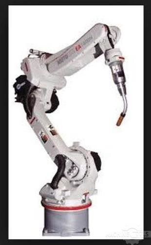
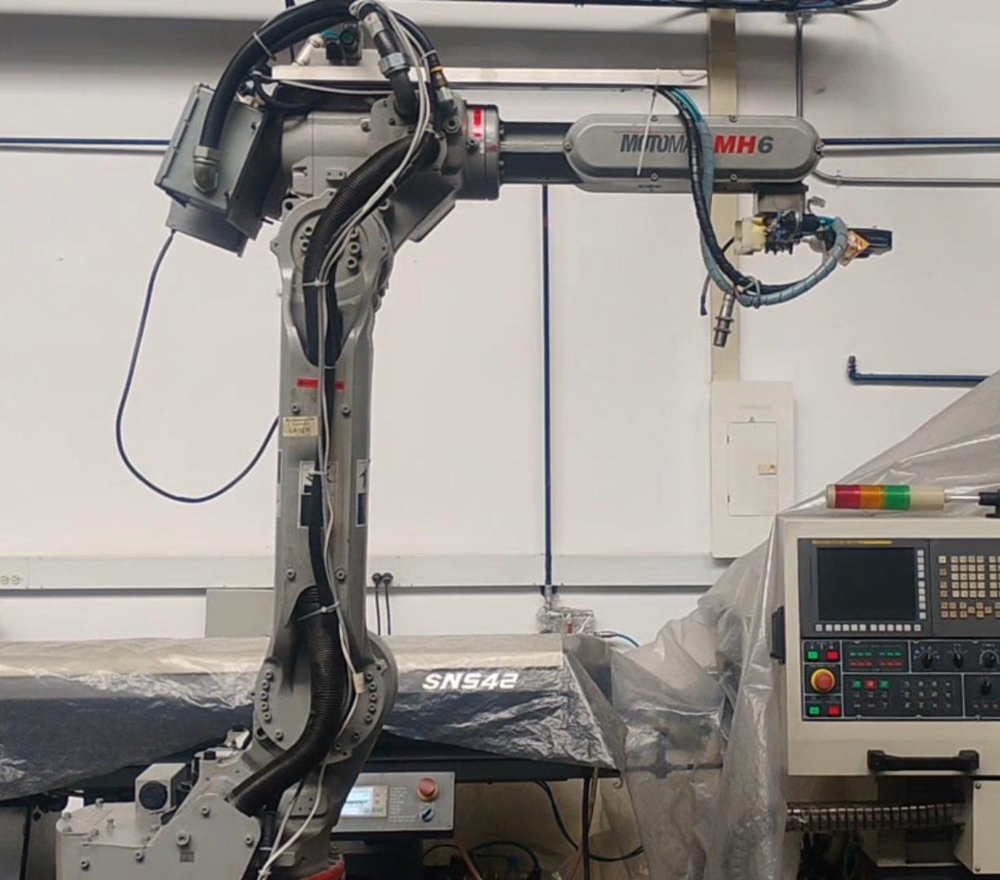
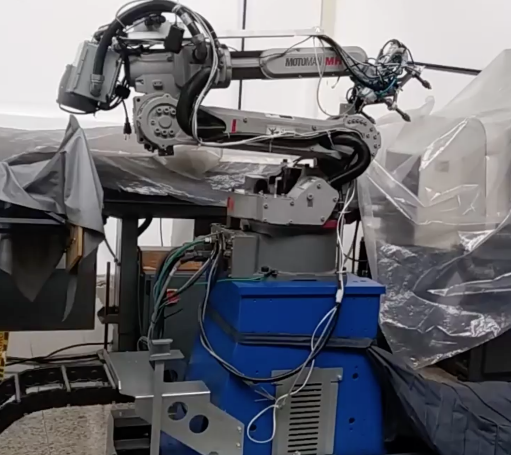
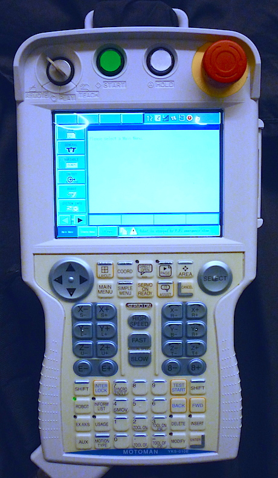
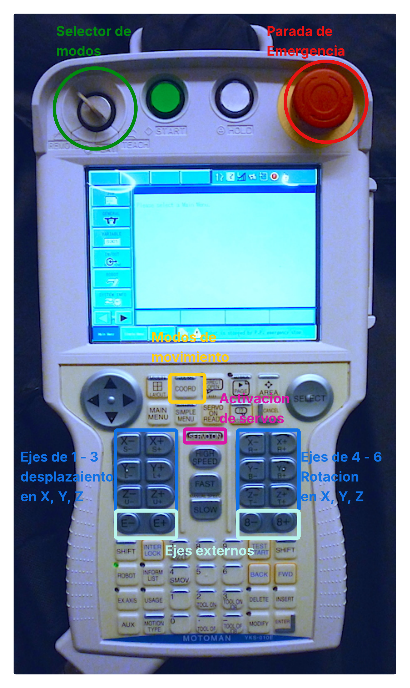

<div align="center">
<picture>
    <source srcset="https://imgur.com/5bYAzsb.png" media="(prefers-color-scheme: dark)">
    <source srcset="https://imgur.com/Os03JoE.png" media="(prefers-color-scheme: light)">
    
</picture>

<h1>Laboratorio No. 02 - Robótica Industrial - Análisis y Operación del Manipulador Motoman MH6.</h1>
<h2>Profesores: <br>Pedro Fabián Cárdenas Herrera <br> Manuel Felipe Carranza Montenegro</h2>

<br>
<br>
<b>Figura 1. Manipulador Motoman MH6.</b>
</div>

---

## 1. Introducción

Los manipuladores industriales son herramientas clave en la automatización industrial. Cada modelo tiene sus propias características técnicas y configuraciones iniciales que los hacen ideales para diferentes aplicaciones. En este taller, se busca realizar una comparación técnica entre el manipulador Motoman MH6 y el ABB IRB140, comprender las configuraciones iniciales del Motoman MH6, explorar los diferentes modos de operación manual, y realizar simulaciones y ejecuciones reales de trayectorias usando RoboDK.

## 2. Comparación: Motoman MH6 vs ABB IRB140

En el desarrollo de competencias en robótica industrial, es esencial familiarizarse con diversas arquitecturas y entornos de programación. Puesto que a lo largo del curso se han utilizado los manipuladores ABB IRB140 y Yaskawa Motoman MH6, resulta importante identificar las diferencias entre ambos. A pesar de que los dos equipos pertenecen a la clasificación de brazos antropomórficos, presentan variaciones técnicas significativas entre sí, tal como se puede apreciar a continuación:

<br>
<div align="center">

| Característica | **Motoman MH6** | **ABB IRB140** |
|---|---|---|
| **Fabricante** | Yaskawa Motoman | ABB Robotics |
| **Estructura** | Articulada | Articulada |
| **Grados de Libertad** | 6 + 2 externos | 6 |
| **Masa del robot** | 130 kg | 98 kg |
| **Alcance** | 1422 mm | 810 mm |
| **Repetibilidad** | 0.08 mm | 0.08 mm |
| **Software de simulación** | MotoSim EG-VRC / RoboDK | RobotStudio / RoboDK |

</div>
<br>

A partir de esta tabla, destacan diferencias clave como los entornos de simulación nativos de cada fabricante, el alcance máximo y el peso del manipulador. Esto demuestra que, a pesar de sus similitudes estructurales, cada equipo posee características cinemáticas y físicas que lo hacen idóneo para satisfacer distintas necesidades operativas y de espacio dentro de la industria.

## 3. Configuraciones Home1 y Home2 del Motoman MH6

En la programación y operación de manipuladores industriales, las posiciones de *Home* son configuraciones articulares predefinidas que sirven como puntos de referencia clave para el controlador y el operador. En el entorno del Motoman MH6 usado a lo largo del laboratorio, se manejan dos configuraciones principales (Home 1 y Home 2), cada una con un propósito técnico distinto dentro de la celda de manufactura.


<div align="center">
  <table>
    <tr>
      <td align="center">
        <br>
        <b>Figura 2. Home 1</b>
      </td>
      <td align="center">
        <br>
        <b>Figura 3. Home 2</b>
      </td>
    </tr>
  </table>
</div>


Tal como se observa en las imagenes de referencia, estas posturas difieren tanto en su apariencia física como en su función:

* **Home 1 (Cero Mecánico o Posición de Calibración):** Es la posición n donde todos sus ejes se encuentran en cero grados (cero pulsos). Físicamente es una postura erguida y muy similar al home de otras marcas como ABB. Usada como punto de referencia cinemática absoluta para el controlador, siendo indispensable para procesos de calibración.

* **Home 2 (Posición de transporte o *Safe Home*):** Es una posición personalizable en algunos modelos de Yaskawa, usada principalmente en este caso para transporte del manipulador y almacenamiento. Esta tiene una forma más compacta o plegada, como se ve en la imagen.


## 4. Movimientos Manuales, modos, traslaciones y rotaciones 

Para manipular manualmente el robot Motoman MH6, es necesario hace uso del Teach Pendant. 


<br>
<div align="center">
  
  <br>
  <b>Figura 4. Teach Pendant.</b>
</div>
<br>


El procedimiento estándar para habilitar el movimiento y navegar entre los distintos modos de operación es el siguiente:
### 4.1. Posicionar la llave en modo manual (Modo TEACH)

El *Teach Pendant* cuenta con un selector de modo físico que dispone de tres posiciones distintas, las cuales determinan el tipo de control sobre el manipulador:

* **Posición TEACH (Manual):** Activa el modo de operación manual. Permite mover el brazo robótico directamente desde el *Teach Pendant*, ya sea mediante movimientos articulares o cartesianos. Por medidas de seguridad, la velocidad de los motores se encuentra limitada en este modo.

* **Posición PLAY (Automático):** Permite al robot ejecutar de forma continua y automática los programas previamente guardados en su memoria.

* **Posición REMOTE (Remoto):** Se utiliza para cederle el control del robot a un dispositivo externo al *Teach Pendant*. Generalmente, se trata de un equipo maestro conectado a través de la red, como lo es un computador operando con el software **RoboDK**.


### 4.2. Desactivar la parada de emergencia
Antes de iniciar cualquier operación, se debe verificar y desactivar el botón de parada de emergencia (E-Stop), el cual se encuentra ubicado en la parte superior derecha del *Teach Pendant* (generalmente se desactiva girándolo levemente en el sentido de las flechas).

### 4.3. Habilitar la potencia de los motores (SERVO ON)
Posterior a la selección del modo *Teach* y la liberación del paro de emergencia, se procede a energizar los motores. Para esto, el operador debe presionar a la mitad el interruptor de hombre muerto (*Deadman switch*), ubicado en la parte posterior del *Teach Pendant* y, sin soltarlo, presionar el botón **[SERVO ON]**. 

### 4.4. Realizar el movimiento
Una vez que el robot tiene potencia, se utiliza el botón **[COORD]** para alternar entre los distintos modos de movimiento y las teclas de los ejes para desplazar el manipulador. Los modos principales son:

* **Movimiento articular (Joint):** Permite mover el robot controlando el ángulo de cada una de sus articulaciones (S, L, U, R, B, T) de forma independiente.
* **Movimiento cartesiano con respecto a la base (World/Base):** Realiza desplazamientos lineales y rotaciones tomando como referencia el sistema de coordenadas absoluto situado en la base del robot (no afecta a los ejes externos).
* **Movimiento cartesiano con respecto a la herramienta (Tool):** Realiza desplazamientos y rotaciones tomando como referencia el sistema de coordenadas del Punto Central de la Herramienta (TCP) seleccionada, facilitando aproximaciones precisas en la dirección en la que apunta el efector final.

<br>
<div align="center">
  
  <br>
  <b>Figura 5. Botones de Teach Pendant.</b>
</div>
<br>

## 5. Niveles de Velocidad para Movimientos Manuales

Durante la operación manual del manipulador Motoman MH6 desde el *Teach Pendant*, es fundamental controlar la velocidad de los movimientos por razones de precisión y seguridad. A continuación, se detallan sus características:

**5.1. Niveles de velocidad**
El sistema cuenta con cuatro niveles de velocidad preestablecidos para el movimiento manual (jogging), los cuales limitan la velocidad máxima a la que se moverán los motores al presionar las teclas de los ejes:
* **INCH (Micromovimiento / Paso a paso):** Es la velocidad más baja. El robot se mueve una distancia minúscula por cada pulsación de la tecla, independientemente de cuánto tiempo se mantenga presionada. Es ideal para aproximaciones muy finas y calibración.
* **SLOW (Lenta):** Movimiento continuo pero a una velocidad muy reducida. Útil para acercarse a la pieza de trabajo de forma segura.
* **MED (Media):** Velocidad moderada, utilizada para desplazamientos generales dentro de la celda de trabajo de forma controlada.
* **FAST (Rápida):** Es la velocidad máxima permitida en el modo manual (limitada por seguridad frente a la velocidad real del modo automático). Se usa para realizar desplazamientos largos y rápidos en zonas libres de obstáculos.

Para cambiar entre velocidades se hace uso de los botones de [SLOW] y [FAST] del teach pendant, además del de [HIGH SPEED], ubicados entre los botones para mover el manipulador, y se muestra en la pantalla la velocidad a la que está operando mediante un indicador de barras en la parte superior.


## 6. Software RoboDK – Aplicaciones y Comunicación

RoboDK es un potente software de simulación y programación de robots industriales diseñado para ser compatible con más de 40 fabricantes de robots incluyendo Yaskawa/Motoman, ABB, KUKA, Universal Robots, entre otros. Sus aplicaciones principales en el entorno industrial y académico incluyen:

- Programación Fuera de Línea (Offline Programming - OLP): Permite diseñar, simular y programar el robot en un entorno virtual tridimensional sin necesidad de detener la máquina física en la línea de producción.

- Simulación de trayectorias y validación: Sirve para verificar alcances, detectar posibles colisiones entre el brazo, la herramienta y el entorno, y evitar singularidades articulares antes de ejecutar el movimiento real.

- Manufactura avanzada: Es ampliamente utilizado para generar trayectorias complejas a partir de modelos CAD/CAM para aplicaciones como fresado robótico, impresión 3D, soldadura, pintura, y operaciones de pick and place (recoger y colocar).

Para que el manipulador físico realice los movimientos simulados, RoboDK actúa como un "traductor". A nivel interno, el software calcula la cinemática inversa para transformar las coordenadas cartesianas y trayectorias del entorno virtual en los ángulos específicos requeridos por las articulaciones del robot.

El elemento clave que hace posible el movimiento es el Post-procesador. Dado que cada fabricante de robots tiene su propio lenguaje de programación (por ejemplo, código INFORM para Yaskawa/Motoman o RAPID para ABB), el post-procesador de RoboDK toma las instrucciones genéricas de la simulación y genera automáticamente un archivo de código en el lenguaje nativo del controlador del robot específico que se está utilizando.

La comunicación entre el software en el PC y el controlador del robot se puede realizar mediante dos métodos principales:

 **Comunicación Fuera de Línea (Generación de programas):** RoboDK compila el programa a través de su post-procesador y genera un archivo de código. Este archivo se transfiere al controlador del manipulador de forma manual mediante una memoria USB o a través de una red local usando un protocolo FTP. Una vez cargado, el robot lo ejecuta de forma autónoma.

 **Comunicación en Línea (Robot Drivers / Modo Online):** Este es el método utilizado durante el desarrollo del laboratoio en donde se controlar el robot en tiempo real desde el PC. El computador se conecta a la red donde esta conectado físicamente el controlador del robot mediante un cable de red (Ethernet) utilizando protocolos TCP/IP. Para que esto funcione, la llave del *Teach Pendant* debe estar en la posición **REMOTE**. A través de sus "Drivers", RoboDK establece una conexión servidor-cliente y envía las instrucciones de la trayectoria (como la polar) paso a paso directamente a los motores, sin necesidad de descargar un archivo completo en la memoria del robot.

## 7. Comparación: RoboDK vs RobotStudio


| Característica | **RoboDK** | **RobotStudio** |
|---|---|---|
| **Fabricante** | RoboDK Inc. (spin-off CoRo Lab, Canadá) | ABB Robotics |
| **Compatibilidad** | +40 fabricantes (Yaskawa, KUKA, FANUC, ABB, UR, etc.) | Exclusivo para robots ABB |
| **Fidelidad de simulación** | Alta (cinemática correcta), pero sin controlador virtual real | Máxima fidelidad: usa el controlador virtual ABB (VRC) idéntico al real |
| **Lenguaje de robot** | Genera código nativo vía post-procesadores (no ejecuta INFORM/RAPID directamente) | Ejecuta y depura RAPID directamente |
| **Multi-robot** | Sí, múltiples marcas en la misma simulación | Solo robots ABB |
| **API / Programación** | Python, C#, .NET, C++ | Visual Basic, RAPID, C# |

## 8. Diagrama de Flujo del Robot

## 9. Plano de Planta del Laboratorio

## 10. Código RoboDK 

### 🐍 Código Python para RoboDK

```python


```

## 11. Demostración en Video

Para evidenciar el correcto funcionamiento de la arquitectura de control diseñada, se ha documentado la ejecución de la celda de manufactura en video. 

En la demostración se puede observar 

Haga clic en el siguiente enlace para ver el video completo de la implementación simulada y física:

<br>

<div align="center">
  <a href="youtube.com" target="_blank">
    
  </a>
</div>


