<div align="center">
<picture>
    <source srcset="https://imgur.com/5bYAzsb.png" media="(prefers-color-scheme: dark)">
    <source srcset="https://imgur.com/Os03JoE.png" media="(prefers-color-scheme: light)">
    
</picture>

<h3>Curso de Robótica 2026-I</h3>
<h1>Laboratorio No. 03</h1>
<h2> Robótica Industrial - Análisis y Operación del Manipulador EPSON T3-401S</h2>
<h3>EPSON T3-401S · EPSON RC+ 7.5.2</h3>
<h4>Profesores: Pedro Fabián Cárdenas Herrera · Manuel Felipe Carranza Montenegro</h4>
<h4>Estudiantes: David Felipe Cardenas Cubides · David Santiago Pirateque Suarez </h4>

<p>
  
  
  
  
</p>

<br>
<br>
<b>Figura 1. Manipulador industrial EPSON T3-401S.</b>
</div>


## 1. Introducción
Los manipuladores industriales son herramientas clave en la automatización industrial. Cada modelo tiene sus propias características técnicas y configuraciones iniciales que los hacen ideales para diferentes aplicaciones. En este taller, se busca realizar una comparación técnica entre el manipulador EPSON T3-401S, el Motoman MH6 y el ABB IRB140, comprender las configuraciones iniciales del EPSON T3-401S, explorar los diferentes modos de operación manual, diseñar un gripper neumático y realizar simulaciones y ejecuciones reales de trayectorias usando EPSON RC+ 7.0.

## 2. Comparación Técnica: Motoman MH6, ABB IRB140 y EPSON T3-401S

En el desarrollo de competencias en robótica industrial, es esencial familiarizarse con diversas arquitecturas y entornos de programación. Puesto que a lo largo del curso se han utilizado los manipuladores ABB IRB140, Yaskawa Motoman MH6 y Epson T3 401S, resulta importante identificar las diferencias entre estos. Sobre todo, al incluir el último, que forma parte de la categoría de robots SCARA, se evidencian múltiples diferencias en sus características y aplicaciones, tal como se detalla a continuación en el siguiente análisis estructurado.

### 2.1 Datos Generales y Alcance

<br>
<div align="center">

| Característica | Motoman MH6 | ABB IRB140 | EPSON T3-401S |
| :--- | :--- | :--- | :--- |
| **Fabricante** | Yaskawa Motoman | ABB | EPSON |
| **Modelo Oficial** | YR-MH00006-A00 | IRB 140-6/0.8 | T3-401S |
| **Estructura** | Articulada vertical | Articulada vertical | SCARA (Horizontal) |
| **Grados de libertad** | **6 + 2 externos** | 6 | 4 |
| **Carga máxima (payload)**| 6 kg | 6 kg | 3 kg (Nominal: 1 kg) |
| **Alcance horizontal máx.**| 1.422 mm | 810 mm | 400 mm |
| **Alcance vertical máx.** | 2.486 mm | 1.243 mm (aprox.) | 150 mm (Carrera del eje Z) |
| **Repetibilidad** | ±0,08 mm | ±0,03 mm | ±0,02 mm |
| **Peso del manipulador** | ~130 kg | 98 kg | 16 kg |
| **Controlador** | DX100 | IRC5 | Integrado en la base |
| **Montajes disponibles** | Suelo, pared, techo | Suelo, invertido, cualquier ángulo | Mesa / Suelo |
| **Temperatura de operación**| 0°C a +45°C | +5°C a +45°C | +5°C a +40°C |
| **Nivel de protección** | IP54 | IP67 (todas las variantes) | IP20 (Estándar) |
| **Consumo de potencia** | 1.5 kVA (promedio) | 0.44 kW a 1000 mm/s | 0.48 kVA |
| **Software de programación**| MotoSim EG, RoboDK | RobotStudio, RoboDK | EPSON RC+ 7.0 |
| **Lenguaje de programación**| INFORM III / Python | RAPID | SPEL+ |

</div>
<br>

**Análisis:** La diferencia de escala es evidente. El EPSON T3-401S no solo posee menos articulaciones que los otros dos sino tambien tiene un alcance mucho menor, aunque tambien es el más precisión (repetibilidad de ±0.08mm/±0.03mm vs ±0.02mm) y teniendo tambien el menor peso entre los tres (16 kg) siendo este ultimo el detalle más importante.

### 2.2 Rangos de Movimiento por Eje

<br>
<div align="center">

| Eje | Motoman MH6 | ABB IRB140 | EPSON T3-401S (SCARA) |
| :--- | :--- | :--- | :--- |
| **Eje 1 (S / Giro base)** | ±170° | +180° / -180° | ±132° (Articulación 1) |
| **Eje 2 (L / Brazo inf.)** | +155° / -90° | +110° / -90° | ±141° (Articulación 2) |
| **Eje 3 (U / Brazo sup.)** | +250° / -175° | +50° / -230° | **150 mm** (Desplazamiento Z) |
| **Eje 4 (R / Rot. muñeca)**| ±180° | ±200° (por defecto) | ±360° (Giro de muñeca - U) |
| **Eje 5 (B / Pitch-Yaw)** | +225° / -45° | ±115° | *No aplica* |
| **Eje 6 (T / Giro muñeca)**| ±360° | ±400° (por defecto) | *No aplica* |

</div>
<br>

**Análisis:** aqui se puede apreciar una de las principales diferencias siendo el numero de ejes de libertad donde el EPSON cuanta directamente con dos menos, y siendo uno de estos uno prismatico a diferencia de los otros que solo cuentan con angulares, ademas de esto es curioso como ver que apesar de ser mas pequeño y compacto el EPSON cuenta con algunos ejes con mayor lobertad que los otros dos robots.

### 2.3 Velocidades Máximas por Eje

<br>
<div align="center">

| Eje | Motoman MH6 | ABB IRB140 | EPSON T3-401S |
| :--- | :--- | :--- | :--- |
| **Eje 1** | 220 °/s | 200 °/s | ~3700 mm/s (Combinada J1 + J2) |
| **Eje 2** | 200 °/s | 200 °/s | ~3700 mm/s (Combinada J1 + J2) |
| **Eje 3** | 220 °/s | 260 °/s | ~1100 mm/s (Lineal) |
| **Eje 4** | 410 °/s | 360 °/s | ~2600 °/s (Rotacional) |
| **Eje 5** | 410 °/s | 360 °/s | *No aplica* |
| **Eje 6** | 610 °/s | 450 °/s | *No aplica* |

</div>
<br>


### 2.4 Aplicaciones Típicas

<br>
<div align="center">

| Motoman MH6 | ABB IRB140 | EPSON T3-401S |
| :--- | :--- | :--- |
| Soldadura por arco y láser | Soldadura por arco | *Pick and Place* a alta velocidad |
| Ensamble general | Ensamble de piezas | Ensamble de electrónica (PCBs) |
| Paletizado y empaque | Mecanizado ligero | Dispensado de pegamento / resinas |
| Alimentación de máquinas CNC | Manipulación de piezas | Empaque de componentes pequeños |
| Manejo de materiales | Dispensado / pegamento | Inspección óptica automatizada |
| Aplicaciones multipropósito | Sala limpia (variante *Clean Room*) | Alimentación de cintas / *Kitting* |
| — | Fundición (variante *Foundry Plus 2*) | — |

</div>
<br>

**Análisis final:** Al observar las aplicaciones ideales, el ABB IRB140 sobresale en entornos que demandan control minucioso o ambientes especializados (Clean Room, Foundry), donde su alta precisión y tamaño compacto son vitales. En contraposición, la robustez, el extenso alcance y la velocidad en la muñeca del Motoman MH6 lo consolidan como un manipulador versátil (multipropósito) ideal para operaciones a mayor escala como paletizado, empaque y soldadura láser. Por otro lado el EPSON es mas especializados en tareas sobre elementos pequeños como la electronica o rapidas con elementos de poco peso.

## 3. Descripción de las configuraciones home del EPSON T3-401S

La posición de Home es ciertamente la mas importante a la hora de programar siendo esta definida de muchas maneras dependiendo de cosas como la marca del Robot o el modelo, esta puede ser desde una posicion con lo todos los motores en 0 grados, una posción de mantenimiento o una posición definida por el usuario.

en este caso el controlador nos permite definir el Home atravez de dos metodos.

 **1. configuracion desde gestion de robot** desde el mismo  EPSON RC+ 7.0 permite configurar la posición con pulsos por articulacion:

<br>

<div align="center">
  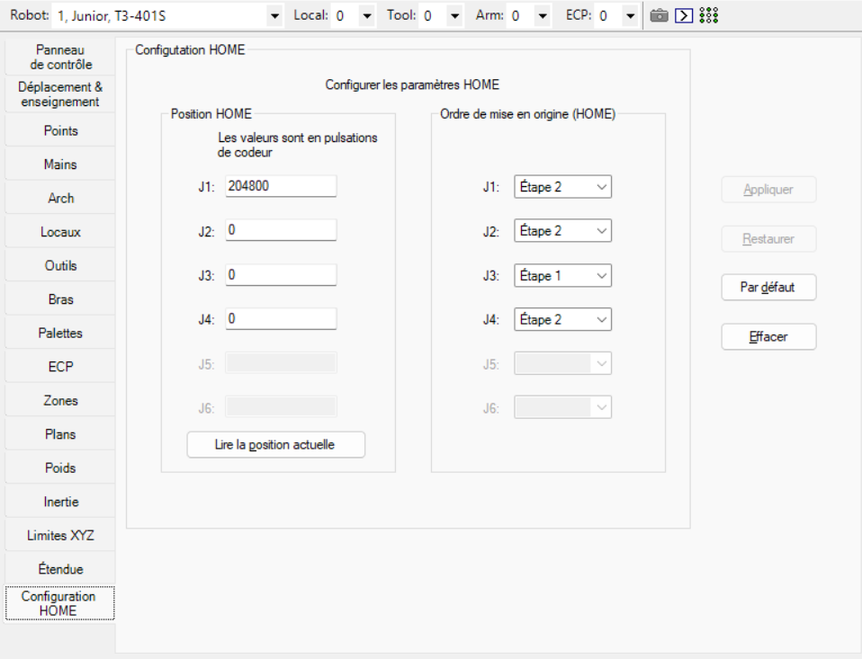
  <br>
  <b>Figura 2. Interfaz de Home.</b>
</div>

<br>

 **2. configuracion desde codigo** cuando se realiza el codigo se puede ingrezar comando que define el home de la siguiente forma:

```spel
    ' Configurar el Home en pulsos (J1 = 204800, el resto en 0)
    HomeSet 204800, 0, 0, 0
```

Durante el desarrollo del laboratorio se opto principalmente por la segunda opción que resulta mas sencilla a la hora de cambiar de computador. con esto de posiciono el home sobre el eje Y y teniendo el robot total mente extendido de la siguiente forma:

<br>

<div align="center">
  
  <br>
  <b>Figura 3. Posicion de Home.</b>
</div>

<br>

## 4. Operación y Modos de Movimiento Manual

Dentro de los robots industriales, el uso de un *Teach Pendant* suele ser la herramienta usada para poder realizar diferentes movimientos con el manipulador. Aunque el EPSON T3-401S cuenta con uno, en esta práctica se recurrió más al uso de la interfaz que nos otorga el EPSON RC+ 7.0, específicamente desde la ventana **Administrador de Robot** en la pestaña **Mover y enseñar**.

**Configuración Previa:** Según sea el caso, el operador debe realizar una configuración adecuada del controlador en el apartado "Conexión", donde podrá hacerlo de dos maneras:
1. Si se trata del robot físico, mediante conexión USB (debe seleccionarse **USB**).
2. Si se trata de una simulación del Robot, es necesario crear un controlador virtual.

Además, para que el robot tenga la capacidad de ejecutar los movimientos, es necesario encender los motores. Para esto, presionamos el botón **MOTOR ON** en la pestaña **Panel de control**. Téngase en cuenta que con la opción de potencia **POWER LOW** la potencia de los motores será menor, algo más apropiado y seguro para calibración y *teach*.

<br>
<div align="center">
  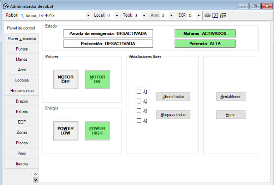
  <br>
  <b>Figura 4. Botón Motor ON.</b>
</div>
<br>

Los modos de movimiento disponibles son:
- Mundo
- Herramienta
- Local
- Articular
- ECP

En donde todos los modos, a excepción del articular, manejan un sistema cartesiano usando la misma interfaz que se puede ver a continuación. Para realizar movimientos de traslación y rotación en los ejes X, Y, Z y U, el operador debe hacer clic en las teclas en pantalla **(+) o (-)** correspondientes a cada eje.

<br>
<div align="center">
  
  <br>
  <b>Figura 5. Operación Manual Cartesiana.</b>
</div>
<br>

Estos modos tienen de diferencia el punto de referencia que utiliza cada uno, siendo:

- **Mundo:** tiene el origen (0,0,0) en la base del robot.
- **Herramienta:** tiene el origen (0,0,0) en el TCP del robot.
- **Local:** tiene el origen (0,0,0) en un punto personalizable definido por el usuario.
- **ECP:** tiene el origen (0,0,0) en una herramienta externa al robot.

Además de esto, como es de costumbre, también se cuenta con el modo articular que permite movilizar articulación por articulación usando las teclas en pantalla **J1, J2, J3 y J4**, cambiando la interfaz a:

<br>
<div align="center">
  
  <br>
  <b>Figura 6. Operación Manual Articular.</b>
</div>
<br>

Cabe aclarar que la articulación **J4** siempre opera en **grados**, ya que corresponde al eje rotacional del efector final. Por su parte, **J3** trabaja exclusivamente en **milímetros**, debido a que es el eje lineal del robot SCARA. Las demás articulaciones pueden configurarse directamente en coordenadas angulares o determinarse automáticamente mediante la cinemática inversa.

El software también permite modificar la distancia de movimiento (salto) cada vez que se ejecuta una instrucción de movimiento manual o se presiona una tecla:

<br>
<div align="center">
  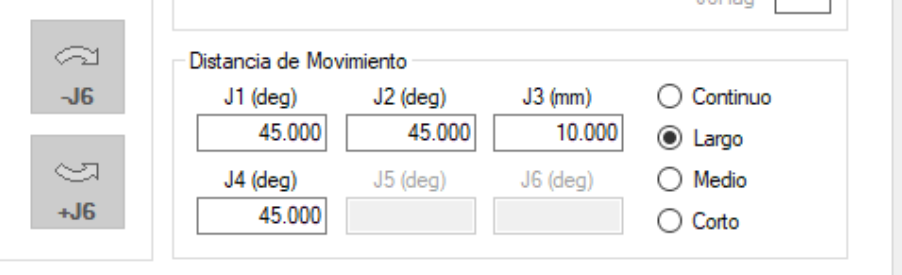
  <br>
  <b>Figura 7. Configuración de distancia de salto.</b>
</div>
<br>

En resumen, el procedimiento para el movimiento manual es:
1. Activar servo (**MOTOR ON**) verificando la potencia baja.
2. Seleccionar la pestaña **Mover y enseñar**. 
3. Elegir entre los Modos en el espacio de configuración (Articular) o en el espacio de trabajo (Mundo, Local, etc.).
4. Ajustar velocidad (Alta/Baja) de jogging y la magnitud de cada salto.
5. Ejecutar movimientos de traslación o rotación pulsando las teclas `+` o `-` en la interfaz.

## 5. Gestión de Velocidades y Potencia en Operación Manual

Para operar el manipulador EPSON T3-401S de forma manual y segura desde el software EPSON RC+ 7.0, es fundamental comprender y configurar dos parámetros independientes pero complementarios: **la velocidad (Speed)** y **la potencia (Power)**.

### 5.1. Niveles de Velocidad (Speed)
La velocidad determina exclusivamente qué tan rápido se desplaza el manipulador en su espacio de trabajo, sin afectar la fuerza que sus motores pueden ejercer. En la pestaña **Mover y enseñar** (Jog & Teach), el operador puede alternar entre dos modos principales:

* **Velocidad Baja (Low):** El robot se desplaza de manera cautelosa debido a una limitación interna en el parámetro de velocidad. Es el modo recomendado para configuraciones iniciales, acercamientos precisos (como la aproximación del *gripper* a la cubeta) y pruebas de rutinas nuevas.
* **Velocidad Alta (High):** Permite alcanzar valores mayores en el parámetro *Speed*, lo que se traduce en movimientos mucho más rápidos. Se utiliza cuando la trayectoria ya ha sido validada y se busca evaluar el tiempo de ciclo real.

El cambio entre estos niveles y su identificación visual se realiza directamente en la interfaz de **Mover y enseñar**, marcando la opción deseada en el panel de control manual:

<br>
<div align="center">
  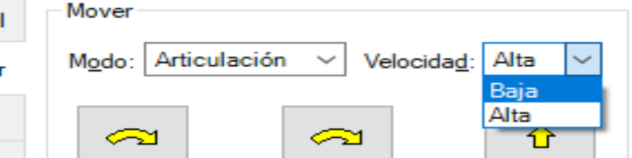
  <br>
  <b>Figura 8. Interfaz de selección de velocidad.</b>
</div>
<br>

### 5.2. Niveles de Potencia (Power)
A diferencia de la velocidad, el ajuste de potencia modifica la capacidad de esfuerzo, fuerza o torque disponible en los motores. Según el manual del EPSON T3-401S, este parámetro se gestiona desde el menú principal en el **Panel de control**:

* **Power LOW (Potencia Baja):** El robot trabaja con un torque reducido, limitando la fuerza física de los motores. Es una medida de seguridad crucial para evitar daños mecánicos severos en caso de colisiones inesperadas durante la programación.
* **Power HIGH (Potencia Alta):** Habilita la capacidad completa de los motores, permitiendo al manipulador cargar y mover elementos utilizando su torque nominal completo.

<br>
<div align="center">
  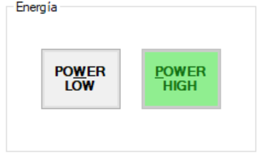
  <br>
  <b>Figura 9. Selección de modo de potencia alta y baja.</b>
</div>
<br>

Para comprobar el nivel establecido actualmente, el operador debe revisar los indicadores visuales en la sección **Estado** dentro del Panel de control.

Estado con **Potencia Alta** (indicador iluminado y habilitado):

<br>
<div align="center">
  
  <br>
  <b>Figura 10. Estado de interfaz en potencia alta.</b>
</div>
<br>

Estado con **Potencia Baja**:

<br>
<div align="center">
  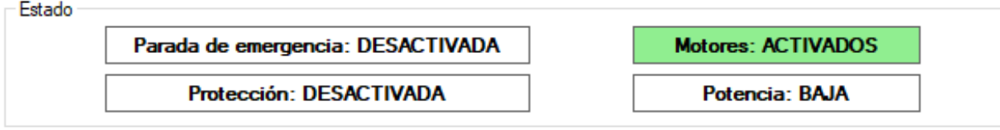
  <br>
  <b>Figura 11. Estado de interfaz en potencia baja.</b>
</div>
<br>

### 5.3. Relación Operativa entre Velocidad y Potencia
Aunque se configuran por aparte, ambos parámetros interactúan físicamente durante la ejecución de las tareas. Comprender esta relación es vital para una correcta operación:

* **Velocidad Alta + Potencia Baja:** El robot intentará moverse rápido, pero al no tener el torque suficiente para vencer la inercia del movimiento o de la herramienta, el controlador podría autolimitar la velocidad real o arrojar un error de seguridad para evitar sobreesfuerzos.
* **Velocidad Baja + Potencia Alta:** Es la combinación ideal para manipular cargas pesadas de manera controlada y estable, garantizando que los motores tengan la fuerza necesaria sin generar inercias peligrosas o movimientos bruscos.

## 6. Entorno de Programación y Comunicación: EPSON RC+ 7.0

El software EPSON RC+ 7.0 es el entorno de desarrollo oficial para la configuración, programación y operación del manipulador EPSON T3-401S. Actúa como la interfaz central entre el ingeniero y el hardware físico, integrando múltiples herramientas en una sola plataforma.

<br>
<div align="center">
  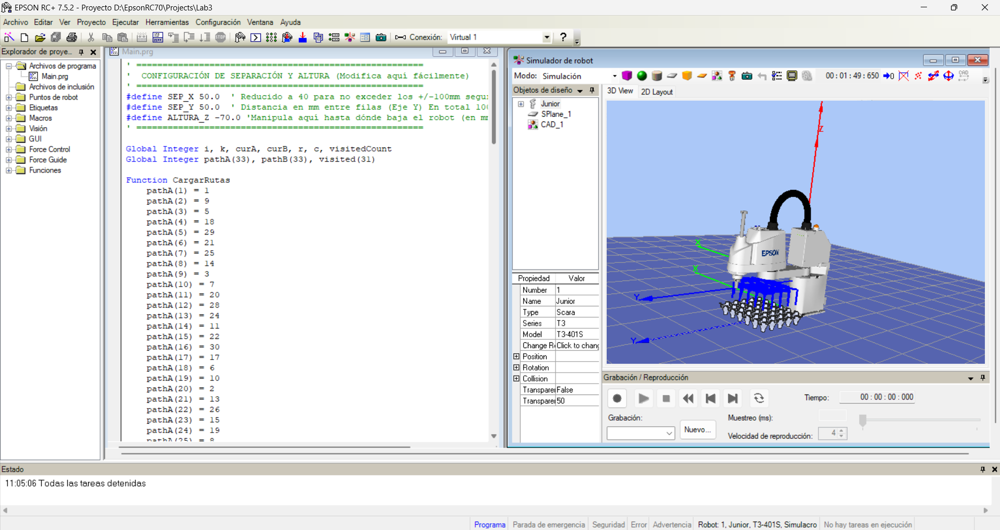
  <br>
  <b>Figura 12. Interfaz Principal de EPSON RC+ 7.0.</b>
</div>
<br>

### 6.1. Principales Aplicaciones y Funcionalidades
Dentro del flujo de trabajo de automatización, este software es el encargado de gestionar todo el ciclo de vida del proyecto robótico:

* **Control directo de movimiento:** A través de la interfaz de operación manual (*Jog & Teach*), el operador puede mover el robot en tiempo real por articulaciones o de forma cartesiana, definir puntos clave en el espacio de trabajo y establecer posiciones de referencia.
* **Creación de proyectos y programación en SPEL+:** Funciona como un Entorno de Desarrollo Integrado (IDE) que permite escribir, estructurar, compilar y depurar la lógica de las trayectorias utilizando SPEL+, el lenguaje de programación nativo de EPSON.
* **Simulación 3D:** Proporciona un entorno virtual de alta fidelidad que simula la cinemática del robot. Esto permite verificar alcances, prevenir colisiones y validar trayectorias de forma segura antes de realizar la implementación física en el manipulador.
* **Gestión de E/S (I/O) Digitales:** Integra monitores y paneles de control para las entradas y salidas digitales del robot. Esta función es indispensable para coordinar acciones con herramientas externas, como la activación de electroválvulas para el gripper neumático diseñado en la práctica.

### 6.2. Comunicación con el Manipulador
Para que el robot ejecute físicamente las tareas programadas, el software establece un proceso de comunicación estructurado y directo:

1. **Enlace físico:** La comunicación primaria entre el equipo de cómputo y el robot se establece a través de una conexión física mediante un cable USB (o Ethernet). El controlador del EPSON T3-401S se encuentra integrado directamente en la base del brazo mecánico, lo que simplifica el cableado.
2. **Envío de instrucciones:** EPSON RC+ 7.0 no procesa el movimiento en tiempo real desde la computadora; en su lugar, el software compila el código escrito y transfiere los comandos SPEL+ directamente a la memoria del controlador interno del robot.
3. **Ejecución del movimiento:** Una vez cargadas las instrucciones, es el controlador interno del robot el que asume el mando. EPSON RC+ envía las órdenes maestras de trayectoria, y el controlador se encarga de calcular los perfiles de velocidad y aceleración, traduciendo estos datos en señales de potencia hacia los servomotores de las articulaciones para efectuar el movimiento físico.

## 7. Análisis Comparativo de Software Robótico: RC+, RoboDK y RobotStudio

Gracias al acercamiento que se ha llevado a cabo a lo largo del desarrollo de la asignatura a robots de distintas marcas, hemos podido desenvolvernos en diferentes entornos de desarrollo. Al realizar un análisis de los 3 principales (RoboDK, RobotStudio y EPSON RC+ 7.0), encontramos la siguiente comparativa:

<br>
<div align="center">

| Característica | RoboDK | RobotStudio | EPSON RC+ 7.0 |
| :--- | :--- | :--- | :--- |
| **Fabricante** | RoboDK Inc. (spin-off CoRo Lab, Canadá) | ABB Robotics | EPSON |
| **Compatibilidad** | +40 fabricantes (Yaskawa, KUKA, FANUC, ABB, UR, etc.) | Exclusivo para robots ABB | Exclusivo para robots EPSON |
| **Fidelidad de simulación** | Alta (cinemática correcta), pero sin controlador virtual real | Máxima fidelidad: usa el controlador virtual ABB (VRC) idéntico al real | Muy alta para EPSON: simulador 3D integrado con cálculo exacto de tiempos de ciclo |
| **Lenguaje de robot** | Genera código nativo vía post-procesadores (no ejecuta INFORM/RAPID directamente) | Ejecuta y depura RAPID directamente | Ejecuta y depura SPEL+ directamente |
| **Multi-robot** | Sí, múltiples marcas en la misma simulación | Solo robots ABB | Sí, múltiples robots EPSON operando en la misma celda |
| **API / Programación** | Python, C#, .NET, C++ | Visual Basic, RAPID, C# | SPEL+, .NET (C#, VB.NET) vía RC+ API, LabVIEW |

</div>
<br>

A partir de esta comparación, se destacan las ventajas, limitaciones y aplicaciones específicas de cada herramienta[cite: 1]:

### RoboDK
* **Ventajas:** Su mayor fortaleza es la universalidad. Permite programar y simular celdas con robots de decenas de marcas distintas simultáneamente, siendo muy intuitivo y fácil de integrar con lenguajes como Python.
* **Limitaciones:** Al no contar con los controladores virtuales originales de los fabricantes, los tiempos de ciclo simulados son aproximados. Además, la generación de código depende de post-procesadores que, en ocasiones, requieren ajustes manuales antes de pasarlos al controlador real.
* **Aplicaciones:** Prototipado rápido, entornos académicos, y programación offline (*Offline Programming* - OLP) para celdas multi-marca o procesos de trayectorias complejas como impresión 3D y mecanizado.

### RobotStudio (ABB)
* **Ventajas:** Ofrece una fidelidad perfecta (gemelo digital) gracias a su Controlador Virtual ABB (VRC). Lo que ocurre en la simulación es exactamente lo que ocurrirá en la realidad, permitiendo una depuración impecable del código RAPID y un cálculo exacto de colisiones y tiempos.
* **Limitaciones:** Está estrictamente limitado al ecosistema de ABB. Es un software exigente en recursos computacionales y muchas de sus funciones avanzadas (como los *PowerPacs*) requieren licencias comerciales costosas.
* **Aplicaciones:** Puesta en marcha virtual (*Virtual Commissioning*), optimización precisa de tiempos de ciclo y despliegue industrial avanzado exclusivo de celdas de manufactura ABB.

### EPSON RC+ 7.0
* **Ventajas:** Es un entorno ligero, directo y sumamente optimizado. Integra a la perfección el IDE para programar en SPEL+, el panel de control manual, la gestión de E/S y el simulador 3D en una sola ventana, facilitando un flujo de trabajo ágil.
* **Limitaciones:** Su uso es exclusivo para manipuladores de la marca EPSON y su motor gráfico de simulación 3D es más básico o menos inmersivo en comparación con RobotStudio.
* **Aplicaciones:** Tareas de alta velocidad e integración rápida en la industria, enfocadas en robots tipo SCARA o de 6 ejes pequeños, como operaciones de *pick and place*, empaque, y ensamblaje de componentes electrónicos pequeños.

## 8. Diseño e Integración del Gripper Neumático por Vacío

Para la implementación del *gripper* o efector final, se diseñó un circuito neumático compuesto por diferentes elementos que garantizan la sujeción segura y estable de los huevos durante la trayectoria.

En primer lugar, se utilizó un **compresor** encargado de suministrar el aire a presión para todo el sistema neumático. Seguido de este, se instaló una **unidad de mantenimiento (FRL)** para regular la presión de trabajo y filtrar tanto la humedad como los residuos sólidos que pudiera contener el aire de la red.

<br>
<div align="center">
  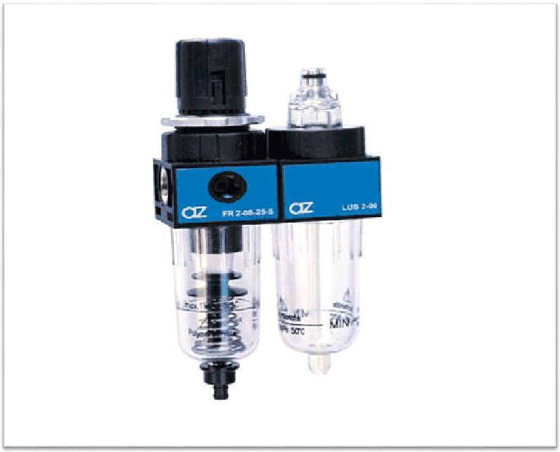
  <br>
  <b>Figura 13. Unidad de mantenimiento.</b>
</div>
<br>

Para el control del flujo, se integró una **electroválvula 3/2**. Esta válvula permite suministrar o cortar el paso de aire hacia la etapa final del sistema mediante la activación de un solenoide, el cual es comandado directamente por las salidas digitales del controlador del robot.

<br>
<div align="center">
  
  <br>
  <b>Figura 14. Electroválvula 3 a 2.</b>
</div>
<br>

A continuación, el aire a presión ingresa a un **generador de vacío**, el cual funciona bajo el principio de Venturi. Este dispositivo convierte la presión positiva suministrada por el compresor en una presión negativa (vacío) lo suficientemente fuerte para sostener los elementos de la práctica.

<br>
<div align="center">
  
  <br>
  <b>Figura 15. Generador de vacío.</b>
</div>
<br>

### 8.1. Diseño del Efector Final y Consideraciones Mecánicas
Para acoplar el sistema al manipulador, se diseñó una brida de sujeción para la ventosa que se monta directamente en el TCP del EPSON T3-401S. La ventosa fue seleccionada con un diámetro específico y un material flexible adecuado para adaptarse a la superficie curva y frágil del huevo. Esto garantiza un sello hermético suficiente para sostener el peso sin permitir deslizamientos durante los movimientos rápidos en el espacio (como la instrucción `Jump`) entre las distintas posiciones del pallet.

<br>
<div align="center">
  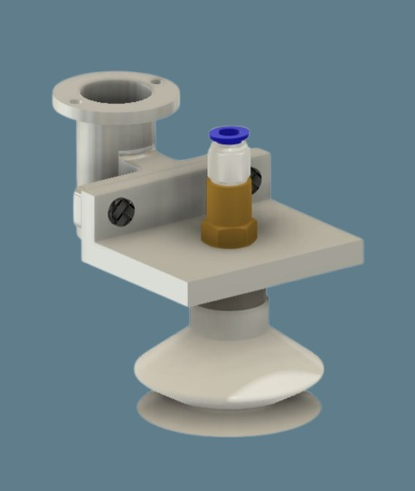
  <br>
  <b>Figura 16. Diseño CAD del ensamble de la herramienta.</b>
</div>
<br>

<br>
<div align="center">
  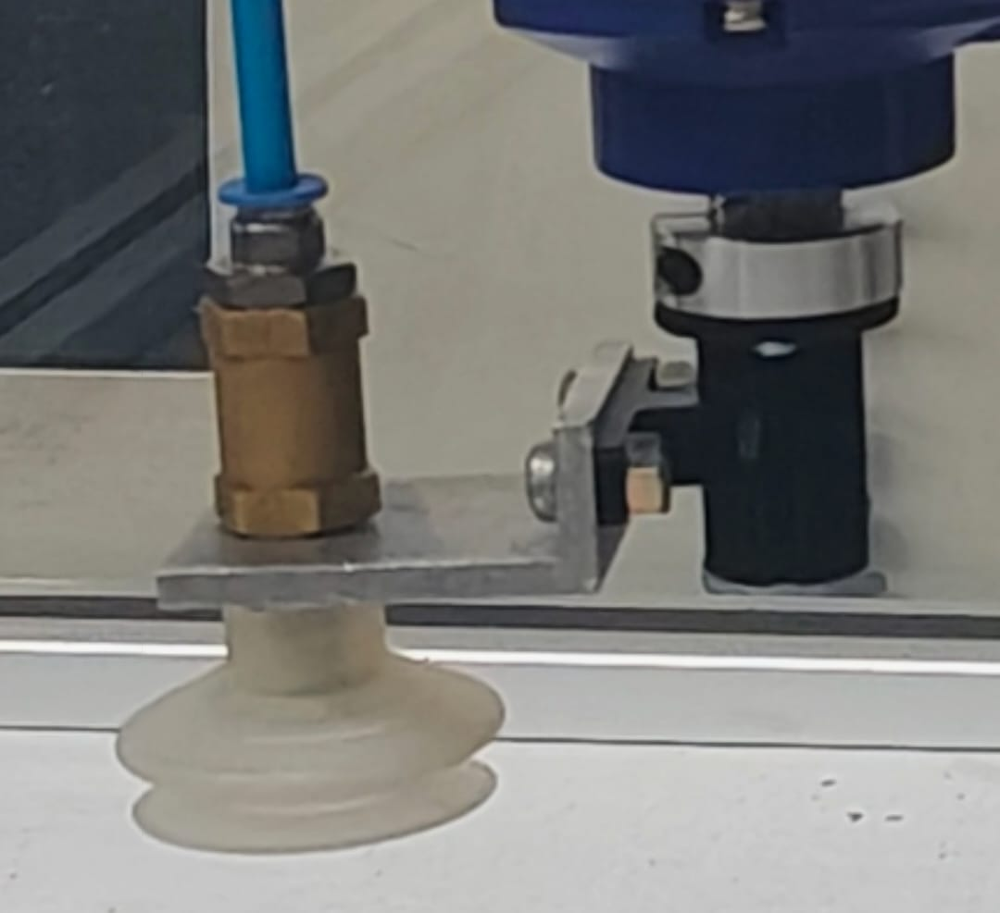
  <br>
  <b>Figura 17. Ventosa - Gripper implementado físicamente.</b>
</div>
<br>

### 8.2. Lógica de Control y Configuración de E/S Digitales
La actuación de la electroválvula se integró utilizando las interfaces de Entradas/Salidas (E/S) del controlador EPSON. Específicamente, se asignó la **salida digital número 9 (`D0_09`)** del robot para comandar la herramienta.

Debido a la configuración del circuito electroneumático ensamblado en el laboratorio, la electroválvula opera con una **lógica invertida** desde el punto de vista de la programación en SPEL+:

* **`Off 9` (Desactivar salida):** Permite el paso del aire hacia el Venturi, lo que **activa el vacío** y permite **agarrar el huevo**.
* **`On 9` (Activar salida):** Corta el flujo de aire, lo que **desactiva el vacío** y **suelta el huevo**.

## 9. Lógica de Control: Diagrama de Flujo
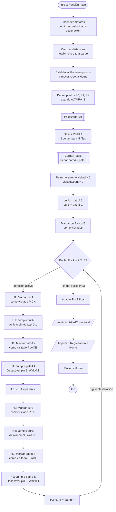

## 10. Análisis de Trayectorias y Plano de Planta

### 10.1. Comparativa de Trayectorias: EPSON RC+ vs. RoboDK y RobotStudio
En la programación de manipuladores industriales, el tipo de interpolación es fundamental. EPSON RC+ 7.0 cuenta con comandos específicos para la cinemática SCARA, los cuales presentan diferencias clave frente a entornos genéricos:

* **Go (PTP):** Movimiento articular simultáneo. Es rápido, pero la trayectoria del TCP no es necesariamente una línea recta.
* **Move (Lineal):** El TCP se desplaza en una línea recta estricta, ideal para inserciones o dispensado.
* **Jump:** Es la instrucción estrella para aplicaciones *Pick and Place*. El robot eleva el eje Z, se traslada horizontalmente a máxima velocidad y desciende en el destino.

A diferencia de EPSON RC+, entornos como **RobotStudio (RAPID)** o **RoboDK** están enfocados principalmente en robots de 6 ejes y estandarizan sus movimientos en `MoveJ` (articular) y `MoveL` (lineal). No poseen un equivalente nativo de un solo comando para el salto parabólico (`Jump`). Para replicarlo y evitar colisiones, requieren programar explícita y secuencialmente tres movimientos distintos (punto de aproximación, traslado y punto de descenso).

### 10.2. Plano de Planta y Lógica de Movimiento
**Requerimiento:** Mover dos huevos por toda la cubeta de 6×5 usando un patrón de salto tipo caballo de ajedrez (movimientos en "L").

El plano de la cubeta consiste en una matriz rectangular de **5 filas × 6 columnas** (30 posiciones en total). La numeración de las celdas avanza secuencialmente de izquierda a derecha, y al finalizar una fila, continúa en el extremo izquierdo de la fila inferior:

* **Fila 1:** 1, 2, 3, 4, 5, 6
* **Fila 2:** 7, 8, 9, 10, 11, 12
* **Fila 3:** 13, 14, 15, 16, 17, 18
* **Fila 4:** 19, 20, 21, 22, 23, 24
* **Fila 5:** 25, 26, 27, 28, 29, 30

### 10.3. Trayectoria Escogida (Patrón de Caballo)
Ambos elementos se desplazan de manera alternada utilizando un patrón equivalente al movimiento del caballo en el ajedrez: dos unidades en una dirección y una en la perpendicular. 

Como se observa en el siguiente esquema, cada celda contiene el índice de la posición fija y puede contener círculos numerados que representan a los dos huevos:
* **Huevo 1 (Círculo Amarillo):** Inicia en el índice **1** (Paso 1).
* **Huevo 2 (Círculo Azul):** Inicia en el índice **30** (Paso 1).

El número dentro de cada círculo indica **en qué paso de la secuencia temporal** el huevo respectivo visitó esa celda. Por ejemplo, si en una celda el círculo amarillo tiene un "8", significa que en el paso 8 el Huevo 1 se encontraba allí. Este diagrama permite visualizar simultáneamente la disposición espacial del *pallet* y el orden en que se visitó cada posición.

<br>
<div align="center">
  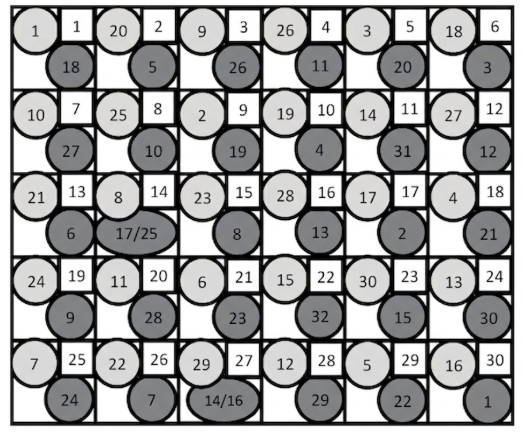
  <br>
  <b>Figura 18. Esquema temporal y espacial de la trayectoria (Patrón de Caballo).</b>
</div>
<br>

Esta trayectoria se ejecutó utilizando exclusivamente el comando `Jump` de EPSON RC+, lo que garantizó un movimiento fluido, seguro y libre de colisiones entre los elementos y los separadores de la cubeta durante las transiciones.

### 10.4. Configuración del TCP y Entorno Virtual

Para la validación de la trayectoria de paletizado, se utilizó el entorno de simulación 3D integrado en EPSON RC+ 7.0. Es importante mencionar que el modelo CAD del efector final (gripper neumático) no se importó gráficamente al entorno virtual. 

En su lugar, el centro de herramienta o TCP (*Tool Center Point*) del robot se configuró directamente a nivel de código, aplicando un desplazamiento matemático (*offset*) en el eje Z equivalente a la longitud física del acople y la ventosa (como se evidencia en la variable `ALTURA_Z = -150.0`). La siguiente figura muestra el manipulador en el simulador ejecutando la rutina programada sobre el espacio de trabajo definido.

<br>
<div align="center">
  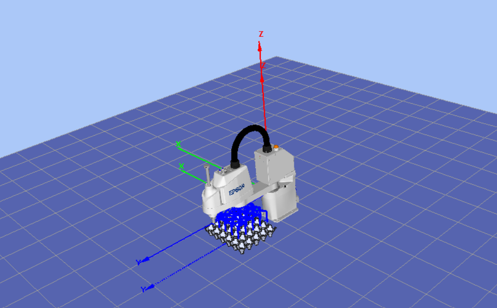
  <br>
  <b>Figura 19. Simulación de la trayectoria en EPSON RC+ (Manipulador sin efector final gráfico).</b>
</div>
<br>


## 11. Implementación del Código en SPEL+

El archivo adjunto a continuación contiene el código principal ejecutado en el controlador para realizar las trayectorias solicitadas en el laboratorio. En este script se implementa la lógica completa para garantizar el correcto movimiento tipo caballo de ajedrez de los dos huevos, asegurando que ambos elementos pasen por cada una de las posiciones de la bandeja (6x5) de manera alternada y sin colisiones.

<br>
<div align="center">
  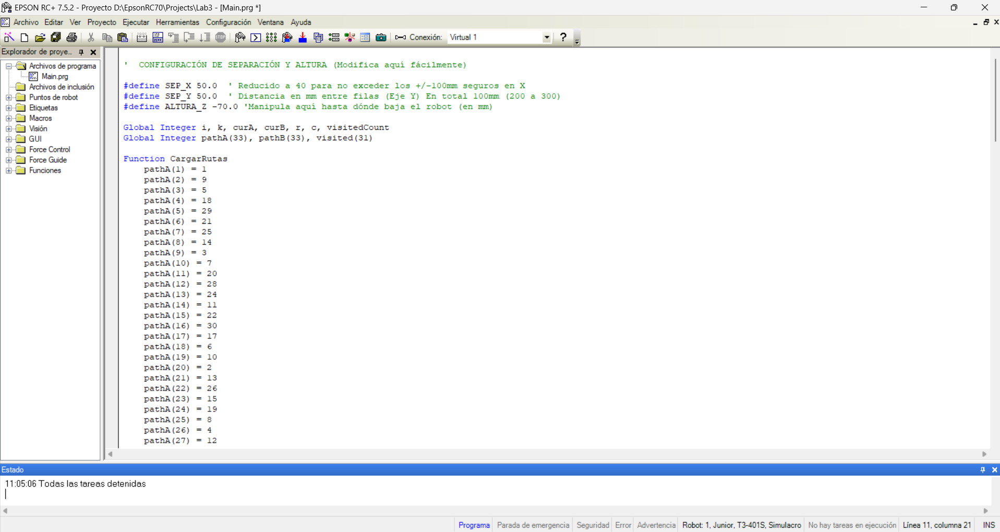
  <br>
  <b>Figura 20. Entorno de desarrollo SPEL+ mostrando el archivo principal.</b>
</div>
<br>

Para revisar la declaración de variables, el arreglo de rutas y las funciones de paletizado detalladas, puede consultar el archivo fuente directamente desde el repositorio:

📄 **Archivo SPEL+** → [Main.prg](Main.prg)


## 11. Demostración en Video: Validación de Trayectoria 


