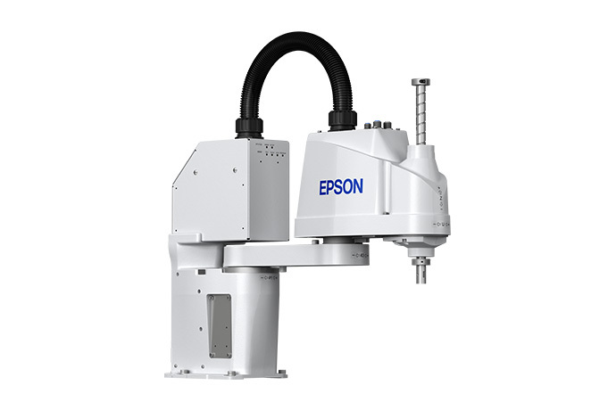
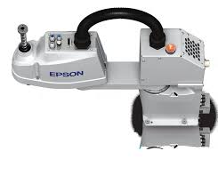
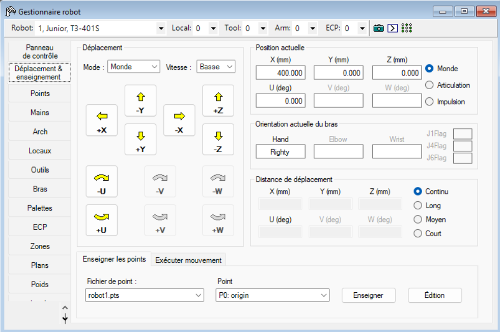
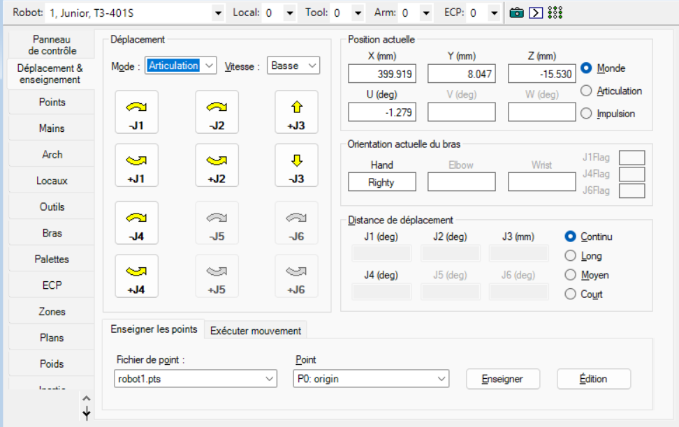
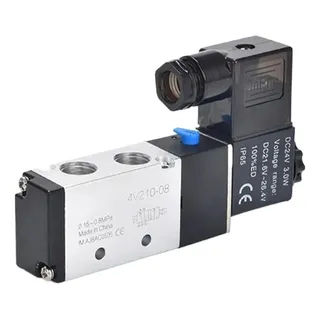
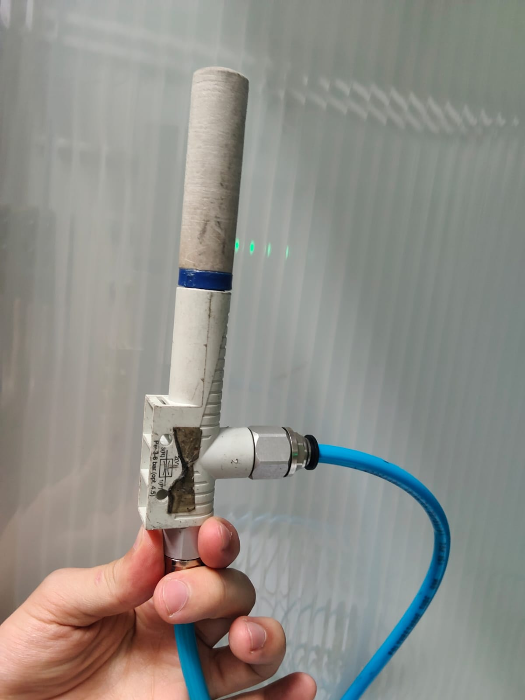
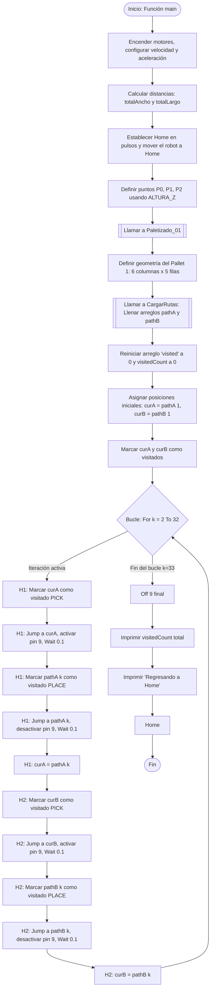

<div align="center">
<picture>
    <source srcset="https://imgur.com/5bYAzsb.png" media="(prefers-color-scheme: dark)">
    <source srcset="https://imgur.com/Os03JoE.png" media="(prefers-color-scheme: light)">
    
</picture>

<h1>Laboratorio No. 03 - Robótica Industrial - Análisis y Operación del Manipulador EPSON T3-401S.</h1>
<h2>Profesores: <br>Pedro Fabián Cárdenas Herrera <br> Manuel Felipe Carranza Montenegro</h2>

<br>
<br>
<b>Figura 1. Manipulador industrial EPSON T3-401S.</b>
</div>

---

## 1. Introducción
Los manipuladores industriales son herramientas clave en la automatización industrial. Cada modelo tiene sus propias características técnicas y configuraciones iniciales que los hacen ideales para diferentes aplicaciones. En este taller, se busca realizar una comparación técnica entre el manipulador EPSON T3-401S, el Motoman MH6 y el ABB IRB140, comprender las configuraciones iniciales del EPSON T3-401S, explorar los diferentes modos de operación manual, diseñar un gripper neumático y realizar simulaciones y ejecuciones reales de trayectorias usando EPSON RC+ 7.0.

## 2. Comparación Técnica: Motoman MH6, ABB IRB140 y EPSON T3-401S

En el desarrollo de competencias en robótica industrial, es esencial familiarizarse con diversas arquitecturas y entornos de programación. Puesto que a lo largo del curso se han utilizado los manipuladores ABB IRB140, Yaskawa Motoman MH6 y Epson T3 401S, resulta importante identificar las diferencias entre estos. Sobre todo, al incluir el último, que forma parte de la categoría de robots SCARA, se evidencian múltiples diferencias en sus características y aplicaciones, tal como se detalla a continuación en el siguiente análisis estructurado.

### 2.1 Datos Generales y Alcance

<br>
<div align="center">

| Característica | Motoman MH6 | ABB IRB140 | EPSON T3-401S |
| :--- | :--- | :--- | :--- |
| **Fabricante** | Yaskawa Motoman | ABB | EPSON |
| **Modelo Oficial** | YR-MH00006-A00 | IRB 140-6/0.8 | T3-401S |
| **Estructura** | Articulada vertical | Articulada vertical | SCARA (Horizontal) |
| **Grados de libertad** | **6 + 2 externos** | 6 | 4 |
| **Carga máxima (payload)**| 6 kg | 6 kg | 3 kg (Nominal: 1 kg) |
| **Alcance horizontal máx.**| 1.422 mm | 810 mm | 400 mm |
| **Alcance vertical máx.** | 2.486 mm | 1.243 mm (aprox.) | 150 mm (Carrera del eje Z) |
| **Repetibilidad** | ±0,08 mm | ±0,03 mm | ±0,02 mm |
| **Peso del manipulador** | ~130 kg | 98 kg | 16 kg |
| **Controlador** | DX100 | IRC5 | Integrado en la base |
| **Montajes disponibles** | Suelo, pared, techo | Suelo, invertido, cualquier ángulo | Mesa / Suelo |
| **Temperatura de operación**| 0°C a +45°C | +5°C a +45°C | +5°C a +40°C |
| **Nivel de protección** | IP54 | IP67 (todas las variantes) | IP20 (Estándar) |
| **Consumo de potencia** | 1.5 kVA (promedio) | 0.44 kW a 1000 mm/s | 0.48 kVA |
| **Software de programación**| MotoSim EG, RoboDK | RobotStudio, RoboDK | EPSON RC+ 7.0 |
| **Lenguaje de programación**| INFORM III / Python | RAPID | SPEL+ |

</div>
<br>

**Análisis:** La diferencia de escala es evidente. El EPSON T3-401S no solo posee menos articulaciones que los otros dos sino tambien tiene un alcance mucho menor, aunque tambien es el más precisión (repetibilidad de ±0.08mm/±0.03mm vs ±0.02mm) y teniendo tambien el menor peso entre los tres (16 kg) siendo este ultimo el detalle más importante.

### 2.2 Rangos de Movimiento por Eje

<br>
<div align="center">

| Eje | Motoman MH6 | ABB IRB140 | EPSON T3-401S (SCARA) |
| :--- | :--- | :--- | :--- |
| **Eje 1 (S / Giro base)** | ±170° | +180° / -180° | ±132° (Articulación 1) |
| **Eje 2 (L / Brazo inf.)** | +155° / -90° | +110° / -90° | ±141° (Articulación 2) |
| **Eje 3 (U / Brazo sup.)** | +250° / -175° | +50° / -230° | **150 mm** (Desplazamiento Z) |
| **Eje 4 (R / Rot. muñeca)**| ±180° | ±200° (por defecto) | ±360° (Giro de muñeca - U) |
| **Eje 5 (B / Pitch-Yaw)** | +225° / -45° | ±115° | *No aplica* |
| **Eje 6 (T / Giro muñeca)**| ±360° | ±400° (por defecto) | *No aplica* |

</div>
<br>

**Análisis:** aqui se puede apreciar una de las principales diferencias siendo el numero de ejes de libertad donde el EPSON cuanta directamente con dos menos, y siendo uno de estos uno prismatico a diferencia de los otros que solo cuentan con angulares, ademas de esto es curioso como ver que apesar de ser mas pequeño y compacto el EPSON cuenta con algunos ejes con mayor lobertad que los otros dos robots.

### 2.3 Velocidades Máximas por Eje

<br>
<div align="center">

| Eje | Motoman MH6 | ABB IRB140 | EPSON T3-401S |
| :--- | :--- | :--- | :--- |
| **Eje 1** | 220 °/s | 200 °/s | ~3700 mm/s (Combinada J1 + J2) |
| **Eje 2** | 200 °/s | 200 °/s | ~3700 mm/s (Combinada J1 + J2) |
| **Eje 3** | 220 °/s | 260 °/s | ~1100 mm/s (Lineal) |
| **Eje 4** | 410 °/s | 360 °/s | ~2600 °/s (Rotacional) |
| **Eje 5** | 410 °/s | 360 °/s | *No aplica* |
| **Eje 6** | 610 °/s | 450 °/s | *No aplica* |

</div>
<br>

**Análisis:** .

### 2.4 Aplicaciones Típicas

<br>
<div align="center">

| Motoman MH6 | ABB IRB140 | EPSON T3-401S |
| :--- | :--- | :--- |
| Soldadura por arco y láser | Soldadura por arco | *Pick and Place* a alta velocidad |
| Ensamble general | Ensamble de piezas | Ensamble de electrónica (PCBs) |
| Paletizado y empaque | Mecanizado ligero | Dispensado de pegamento / resinas |
| Alimentación de máquinas CNC | Manipulación de piezas | Empaque de componentes pequeños |
| Manejo de materiales | Dispensado / pegamento | Inspección óptica automatizada |
| Aplicaciones multipropósito | Sala limpia (variante *Clean Room*) | Alimentación de cintas / *Kitting* |
| — | Fundición (variante *Foundry Plus 2*) | — |

</div>
<br>

**Análisis final:** Al observar las aplicaciones ideales, el ABB IRB140 sobresale en entornos que demandan control minucioso o ambientes especializados (Clean Room, Foundry), donde su alta precisión y tamaño compacto son vitales. En contraposición, la robustez, el extenso alcance y la velocidad en la muñeca del Motoman MH6 lo consolidan como un manipulador versátil (multipropósito) ideal para operaciones a mayor escala como paletizado, empaque y soldadura láser. Por otro lado el EPSON es mas especializados en tareas sobre elementos pequeños como la electronica o rapidas con elementos de poco peso .

## 3. Descripción de las configuraciones home del EPSON T3-401S

<br>

<div align="center">
  
  <br>
  <b>Figura 2. Posicion de Home.</b>
</div>

<br>

## 4. Operación y Modos de Movimiento Manual

dentro de los robots industriales el uso de un Teachpendant suele ser la herramienta usando para poder realizar diferentes movimientos con el manipulador y aunque el EPSON T3-401S cuenta con uno en esta practica se recurrio más al uso de la interfaz que nos otorga el EPSON RC+ 7.0 de la cual tiene los modos de movimiento:

- Mundo
- Herramienta
- Local
- Articular
- ECP

En donde todos los modos a excepcion del articular manejan un sistema carteciano usando la misma interfaz que se puede ver acontinuación:

<br>

<div align="center">
  
  <br>
  <b>Figura 3. Operacion Manual.</b>
</div>

<br>

Estos modo tienen de diferencia el punto de referencia que utiliza cada uno siendo:

- **Mundo:** tiene el origen (0,0,0) en la base del robot.
- ** Herramienta:** tiene el origen (0,0,0) en el TCP del robot.
- **Local:** tiene el origen (0,0,0) en un punto personalizable definido por el usuario.
- **ECP:** tiene el origen (0,0,0) en una herramienta externa al robot.


Ademas de esto como es de costumbre tambien se cuenta con el modo articular que permite movilizar articulacion por articulacion cambiando la interfaz a:

<br>

<div align="center">
  
  <br>
  <b>Figura 4. Operacion Manual Articular.</b>
</div>

<br>


## 5. Gestión de Velocidades en Operación Manual

## 6. Entorno de Programación y Comunicación: EPSON RC+ 7.0

## 7. Análisis Comparativo de Software Robótico: RC+, RoboDK y RobotStudio

<br>
<div align="center">


| Característica | RoboDK | RobotStudio | EPSON RC+ 7.0 |
| :--- | :--- | :--- | :--- |
| **Fabricante** | RoboDK Inc. (spin-off CoRo Lab, Canadá) | ABB Robotics | EPSON |
| **Compatibilidad** | +40 fabricantes (Yaskawa, KUKA, FANUC, ABB, UR, etc.) | Exclusivo para robots ABB | Exclusivo para robots EPSON |
| **Fidelidad de simulación** | Alta (cinemática correcta), pero sin controlador virtual real | Máxima fidelidad: usa el controlador virtual ABB (VRC) idéntico al real | Muy alta para EPSON: simulador 3D integrado con cálculo exacto de tiempos de ciclo |
| **Lenguaje de robot** | Genera código nativo vía post-procesadores (no ejecuta INFORM/RAPID directamente) | Ejecuta y depura RAPID directamente | Ejecuta y depura SPEL+ directamente |
| **Multi-robot** | Sí, múltiples marcas en la misma simulación | Solo robots ABB | Sí, múltiples robots EPSON operando en la misma celda |
| **API / Programación** | Python, C#, .NET, C++ | Visual Basic, RAPID, C# | SPEL+, .NET (C#, VB.NET) vía RC+ API, LabVIEW |

</div>
<br>

## 8. Diseño e Integración del Gripper Neumático por Vacío


<br>

<div align="center">
  
  <br>
  <b>Figura 6. Unidad de mantenimiento.</b>
</div>

<br>

<br>

<div align="center">
  
  <br>
  <b>Figura 6. Valvula 3 a 2.</b>
</div>

<br>


<br>

<div align="center">
  
  <br>
  <b>Figura 4. Gnerador de vacio.</b>
</div>

<br>


## 9. Lógica de Control: Diagrama de Flujo.



## 10. Implementación del Código


**1.Iniciacion de variables:** Se crearon 3 principales variables para su facil manipulacion deonde dos son para la serpacion entre huevos tanto en X como en Y yla ultia para definal cuanto debia vajar la herramienta para poder mmanipular los elementos. Ademas de esto se crearon los path para guardar las trayectorias que debia seguir el manipulador. 

```spel

#define SEP_X 45.0  ' Reducido a 40 para no exceder los +/-100mm seguros en X
#define SEP_Y 45.0  ' Distancia en mm entre filas (Eje Y) En total 100mm (200 a 300)
#define ALTURA_Z -150.0 'Aquí hasta dónde baja el robot (en mm)


Global Integer i, k, curA, curB, r, c, visitedCount
Global Integer pathA(33), pathB(33), visited(31)
```


**2.Rutas:** Se almacena el orden en que se realizara cada ruta para que se mueva como el caballo en ajedrez.

```spel
Function CargarRutas
    pathA(1) = 1
    pathA(2) = 9
    pathA(3) = 5
    pathA(4) = 18
    pathA(5) = 29
    pathA(6) = 21
    pathA(7) = 25
    pathA(8) = 14
    pathA(9) = 3
    pathA(10) = 7
    pathA(11) = 20
    pathA(12) = 28
    pathA(13) = 24
    pathA(14) = 11
    pathA(15) = 22
    pathA(16) = 30
    pathA(17) = 17
    pathA(18) = 6
    pathA(19) = 10
    pathA(20) = 2
    pathA(21) = 13
    pathA(22) = 26
    pathA(23) = 15
    pathA(24) = 19
    pathA(25) = 8
    pathA(26) = 4
    pathA(27) = 12
    pathA(28) = 16
    pathA(29) = 27
    pathA(30) = 23
    pathA(31) = 23
    pathA(32) = 23

    pathB(1) = 30
    pathB(2) = 17
    pathB(3) = 6
    pathB(4) = 10
    pathB(5) = 2
    pathB(6) = 13
    pathB(7) = 26
    pathB(8) = 15
    pathB(9) = 19
    pathB(10) = 8
    pathB(11) = 4
    pathB(12) = 12
    pathB(13) = 16
    pathB(14) = 27
    pathB(15) = 23
    pathB(16) = 27
    pathB(17) = 14
    pathB(18) = 1
    pathB(19) = 9
    pathB(20) = 5
    pathB(21) = 18
    pathB(22) = 29
    pathB(23) = 21
    pathB(24) = 25
    pathB(25) = 14
    pathB(26) = 3
    pathB(27) = 7
    pathB(28) = 20
    pathB(29) = 28
    pathB(30) = 24
    pathB(31) = 11
    pathB(32) = 22
Fend
```
**3.Marcador de visita:** Funcion encargada de saber por donde ya paso el robot y tener un mejor control del proceso.

```spel
Function MarcarVisitado(idx As Integer)
    If visited(idx) = 0 Then
        visited(idx) = 1
        visitedCount = visitedCount + 1
    EndIf
Fend
```

**4.Impresion de posicion:** Funcion encargada mostrar al operador en que path se encuentra.

```spel
Function ImprimeIdx(prefijo$ As String, idx As Integer)
    r = (idx - 1) / 6 + 1
    c = idx - (r - 1) * 6
    Print prefijo$, " idx=", idx, " -> (col=", c, ", fila=", r, ")"
Fend
```

**5.Funcion de movimiento:** Funcion encargada realizar las rutas para los dos elementos con el orden asignado y alternando la activacion y desactivacion de la herramienta(gripper), por ultimo regresa a la posición Home.

```spel
Function Paletizado_01
    Pallet 1, P0, P1, P2, 6, 5
    Call CargarRutas
    
    For i = 1 To 30
        visited(i) = 0
    Next
    visitedCount = 0
    
    curA = pathA(1)
    curB = pathB(1)
    Call MarcarVisitado(curA)
    Call MarcarVisitado(curB)
    
    Print "Inicio cabalgado 2-huevos: matriz 6x5"
    Call ImprimeIdx("H1 inicia en", curA)
    Call ImprimeIdx("H2 inicia en", curB)
    
    For k = 2 To 32
        Call ImprimeIdx("H1: regresa a (PICK)", curA)
        Call MarcarVisitado(curA)
        Jump Pallet(1, curA)
        On 9
        Wait 0.1
        Call ImprimeIdx("H1: va a (PLACE)", pathA(k))
        Call MarcarVisitado(pathA(k))
        Jump Pallet(1, pathA(k))
        Off 9
        Wait 0.1
        curA = pathA(k)

        Call ImprimeIdx("H2: regresa a (PICK)", curB)
        Call MarcarVisitado(curB)
        Jump Pallet(1, curB)
        On 9
        Wait 0.1
        Call ImprimeIdx("H2: va a (PLACE)", pathB(k))
        Call MarcarVisitado(pathB(k))
        Jump Pallet(1, pathB(k))
        Off 9
        Wait 0.1
        curB = pathB(k)
    Next
    
    Off 9
    Print "Fin: visitados unicos totales = ", visitedCount, "/30"
    
    Print "Regresando a Home..."
    Home
Fend
```

**6.Funcion principal:** Funcion encargada de activar motores, definir velocidad y dar posicion exacta para las rutas con base a las bariables definidas al inicio, definir Home y llama a la función de paletizado.

```spel
Function main
    Real totalAncho, totalLargo

    Motor On
    Power High
    Accel 100, 100
    Speed 100
    
    ' El programa lee automáticamente los valores definidos arriba
    totalAncho = 5 * SEP_X  ' 6 columnas = 5 espacios intermedios
    totalLargo = 4 * SEP_Y  ' 5 filas = 4 espacios intermedios
    
    ' Configurar el Home en pulsos (J1 = 204800, el resto en 0)
    HomeSet 204800, 0, 0, 0
    
    ' Mover el robot físicamente al Home definido antes de iniciar
    Home
    
    ' Generación automática y centrada de los puntos del Pallet usando ALTURA_Z
    P0 = XY(-totalAncho / 2, 150, ALTURA_Z, 50)       ' Origen inferior izquierdo
    P1 = XY(totalAncho / 2, 150, ALTURA_Z, 50)        ' Esquina inferior derecha
    P2 = XY(-totalAncho / 2, 150 + totalLargo, ALTURA_Z, 50) ' Esquina superior izquierda
    
    Call Paletizado_01
Fend
```


## 11. Demostración en Video: Validación de Trayectoria Polar


