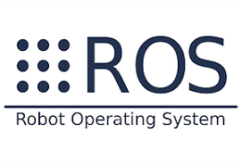

<picture>
    <source srcset="https://imgur.com/5bYAzsb.png" media="(prefers-color-scheme: dark)">
    <source srcset="https://imgur.com/Os03JoE.png" media="(prefers-color-scheme: light)">
    
</picture>

<h3>Curso de Robótica 2026-I</h3>
<h1>Laboratorio No. 04</h1>
<h2>Robótica de Desarrollo, Intro a ROS2 Jazzy Jalisco - Turtlesim</h2>
<h4>Profesores: Pedro Fabián Cárdenas Herrera · Manuel Felipe Carranza Montenegro</h4>
<h4>Estudiantes: David Felipe Cardenas Cubides · David Santiago Pirateque Suarez </h4>

  
  
  
  

 
 
<b>Figura 1. Robot Operating System.</b>

