<div align="center">
<picture>
    <source srcset="https://imgur.com/5bYAzsb.png" media="(prefers-color-scheme: dark)">
    <source srcset="https://imgur.com/Os03JoE.png" media="(prefers-color-scheme: light)">
    
</picture>

<h3>Curso de Robótica 2026-I</h3>
<h1>Laboratorio No. 04</h1>
<h2>Robótica de Desarrollo, Intro a ROS2 Jazzy Jalisco - Turtlesim</h2>
<h4>Profesores: Pedro Fabián Cárdenas Herrera · Manuel Felipe Carranza Montenegro</h4>
<h4>Estudiantes: David Felipe Cárdenas Cubides · David Santiago Pirateque Suárez </h4>

<p>
  
  
  
  
</p>

<br>
<br>
<b>Figura 1. Robot Operating System.</b>
</div>


# Laboratorio 04: Control y Arquitectura en ROS 2 Jazzy (Turtlesim)

## 1. Objetivos

### Objetivo General

Implementar un paquete de ROS 2 Jazzy Jalisco que permita controlar de una a dos tortugas del simulador de Turtlesim mediante un nodo configurado desde Python, este debe incluir funciones para control manual, trayectorias automáticas, dibujo tanto de escrituras como de letras y un sistema de líder-seguidor. 


### Objetivos específicos

- Comprender ROS 2.
- Implementar nodos.
- Controlar turtlesim.
- Implementar comunicación mediante tópicos y servicios.
- Desarrollar un sistema líder-seguidor.


## 2. Introducción

En el presente laboratorio se tuvo como objetivo desarrollar una aplicación en ROS 2 que permitiera controlar el movimiento de una tortuga dentro del simulador Turtlesim, aplicando los conceptos básicos de programación en Python de nodos y comunicación entre ellos. A lo largo del desarrollo se implementaron diferentes funciones que permitieron interactuar con el simulador tanto de forma manual como automática.

La solución fue desarrollada en Ubuntu 24.04 utilizando ROS 2 Jazzy Jalisco, Python y rclpy. Entre las principales funcionalidades implementadas se encuentran el control mediante el teclado, la generación automática de trayectorias como cuadrados y triángulos, el dibujo de letras correspondientes a las iniciales de los integrantes del grupo en este caso D F C P S, el manejo del lápiz de dibujo, el reinicio de la tortuga y un sistema líder-seguidor en el que una segunda tortuga replica el movimiento de la principal a partir de la información recibida por medio de tópicos de ROS 2.


## 3. Tecnologías usadas


<br>
<div align="center">

| Tecnología | Versión | Descripción |
| :--- | :--- | :--- |
| **Ubuntu** | 24.04 LTS | Sistema operativo donde se instaló y ejecutó el entorno de desarrollo ROS 2. |
| **ROS 2**| Jazzy Jalisco | Framework utilizado para desarrollar la aplicación robótica basada en nodos, tópicos y servicios. |
| **Python**| 3.9 | Lenguaje de programación utilizado para implementar la lógica del laboratorio. |
| **rclpy**| ROS 2 | Biblioteca de Python para creación de nodos, publicadores, suscriptores y clientes de servicios. |
| **Turtlesim** | ROS 2 | Simulador utilizado para visualizar y controlar el movimiento de las tortugas durante el laboratorio. |
| **Git** | Web | Sistema de gestión donde se almacena el repositorio. |
| **VirtualBox** | 7.2.8 | Software de máquina virtual donde se instaló Ubuntu 24.04 LTS. |

</div>
<br>

## 4. Estructura del proyecto

El desarrollo del laboratorio se realizó dentro de uno de los paquetes llamado **my_turtle_controller**, el cual se encuentra ubicado en el *workspace* de ROS 2. Esto se debe a que el paquete contiene no solo el nodo principal encargado del movimiento de la tortuga, sino también los archivos necesarios para ejecutarlo, teniendo de estructura:

```text
~/ros2_jazzy/src/
└── my_turtle_controller/
    ├── package.xml
    ├── setup.py
    ├── setup.cfg
    ├── resource/
    │   └── my_turtle_controller
    ├── my_turtle_controller/
    │   ├── __init__.py
    │   └── move_turtle.py
    └── test/
```

El archivo principal de edición es `move_turtle.py`, el cual contiene toda la lógica implementada para el desarrollo del laboratorio. En este archivo se encuentran las funcionalidades correspondientes a:

* Control manual.
* Configuración de figuras.
* Configuración de letras.
* Lógica del modo líder-seguidor.

Además de esto, se modificó el archivo `setup.py` para registrar el nodo ejecutable, añadiendo las siguientes líneas:

```python
entry_points={
    'console_scripts': [
        'move_turtle = my_turtle_controller.move_turtle:main',
    ],
},
```

Por último, se modificó el archivo `package.xml` para incluir las dependencias necesarias, como `rclpy`, `turtlesim`, entre otras. Para ello, se añadieron las siguientes líneas:

```xml
<depend>rclpy</depend>
<depend>geometry_msgs</depend>
<depend>turtlesim</depend>
<depend>std_srvs</depend>
```

## 5. Diagrama de flujo

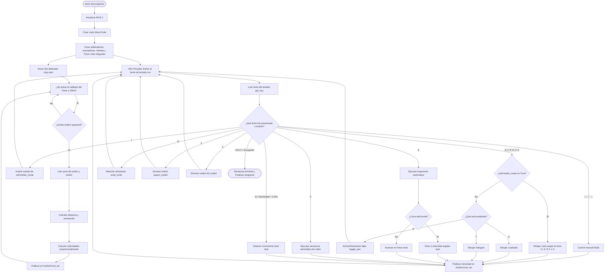

## 6. Arquitectura del paquete

El paquete `my_turtle_controller`, utilizado durante el laboratorio, está compuesto por un nodo principal denominado `move_turtle_node`, en el cual se implementa la lógica principal del sistema. Este nodo es responsable de procesar la entrada del usuario, controlar el movimiento de ambas tortugas, ejecutar las trayectorias programadas y gestionar la comunicación con el simulador Turtlesim mediante el uso de publicadores, suscriptores y servicios de ROS 2.


<br>

<div align="center">
  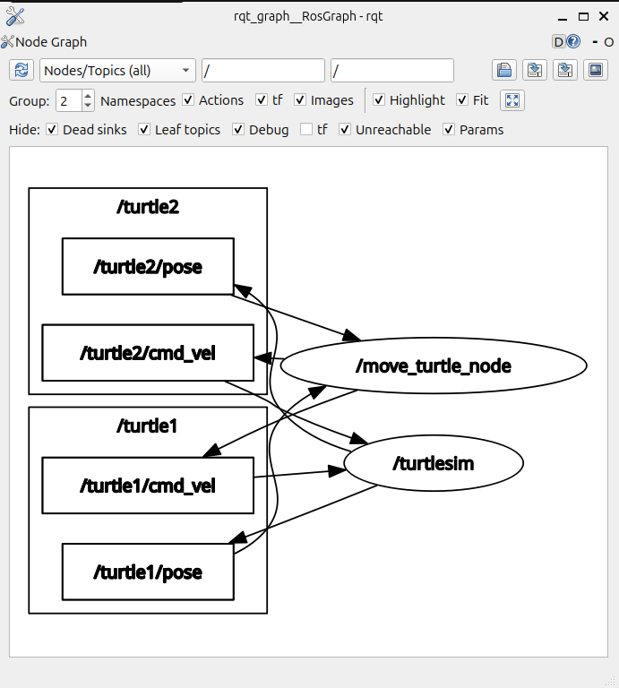
  <br>
  <b>Figura 2. Diagrama de arquitectura de programación (rqt_graph).</b>
</div>

<br>

Además del nodo que contiene la lógica, el diagrama muestra el nodo `turtlesim` que es el que proporciona ROS, siendo el encargado de:
* Dibuja las tortugas.
* Recibe comandos de movimiento.
* Actualiza la simulación.
* Calcula la posición actual.
* Publica continuamente la posición de cada tortuga.

En cuanto a los tópicos, se utilizan dos publicadores encargados de enviar los comandos de velocidad lineal y angular de cada una de las tortugas, correspondientes a `/turtle1/cmd_vel` y `/turtle2/cmd_vel`. Asimismo, se emplean dos suscriptores para recibir la información de la posición y orientación de las tortugas mediante los tópicos `/turtle1/pose` y `/turtle2/pose`.

### 6.1 Verificación de la Arquitectura ROS 2

Durante la ejecución, se procedió a inspeccionar el sistema utilizando las herramientas de terminal que provee ROS 2 para confirmar la correcta comunicación entre componentes. A continuación, se detalla la evidencia:

#### 6.1.1 `ros2 node list`
<div align="center">
  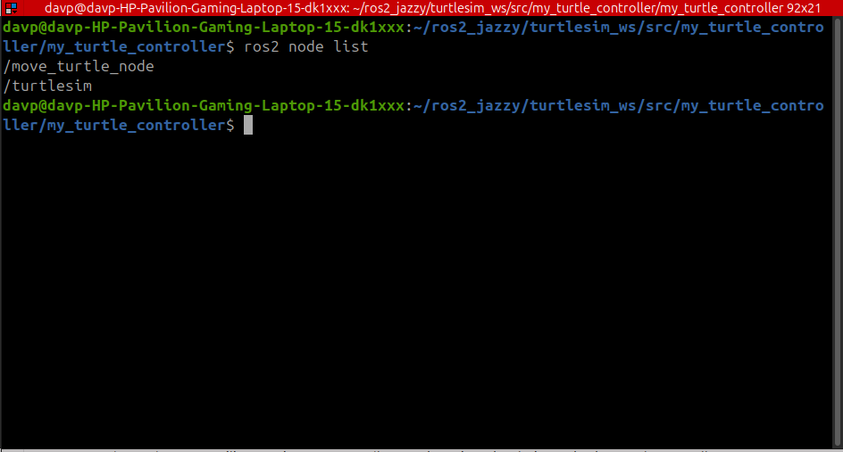
</div>

> **Análisis:** Este comando lista los nodos activos. La captura demuestra que tanto `/turtlesim` como el nodo `/move_turtle_node` están operando simultáneamente en el middleware.

#### 6.1.2 `ros2 topic list`
<div align="center">
  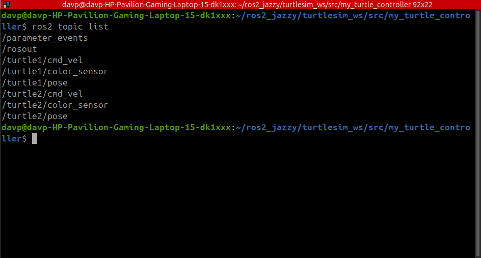
</div>

> **Análisis:** Despliega todos los canales de comunicación activos. Permite visualizar que la red cuenta con los tópicos de control cinemático y odometría para ambas tortugas (`/turtle1/cmd_vel`, `/turtle2/pose`, etc.).

#### 6.1.3 `ros2 topic echo /turtle1/pose`
<div align="center">
  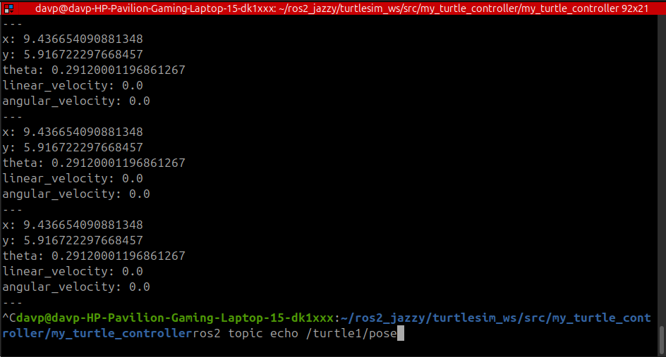
</div>

> **Análisis:** Permite monitorear el flujo de datos en tiempo real. En la captura se observa el mensaje `Pose` actualizándose con las coordenadas espaciales ($x, y, \theta$) que el código procesa en el lazo cerrado.

#### 6.1.4 `ros2 topic info /turtle1/cmd_vel`
<div align="center">
  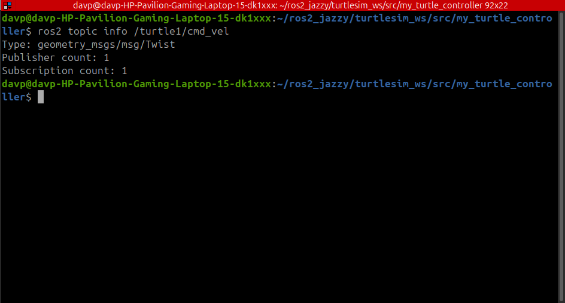
</div>

> **Análisis:** Entrega metadatos vitales del tópico. Confirma el tipo de mensaje esperado (`geometry_msgs/msg/Twist`) y valida que existe 1 *Publisher* (el script de control) y 1 *Subscriber* (el simulador).

#### 6.1.5 `ros2 service list`
<div align="center">
  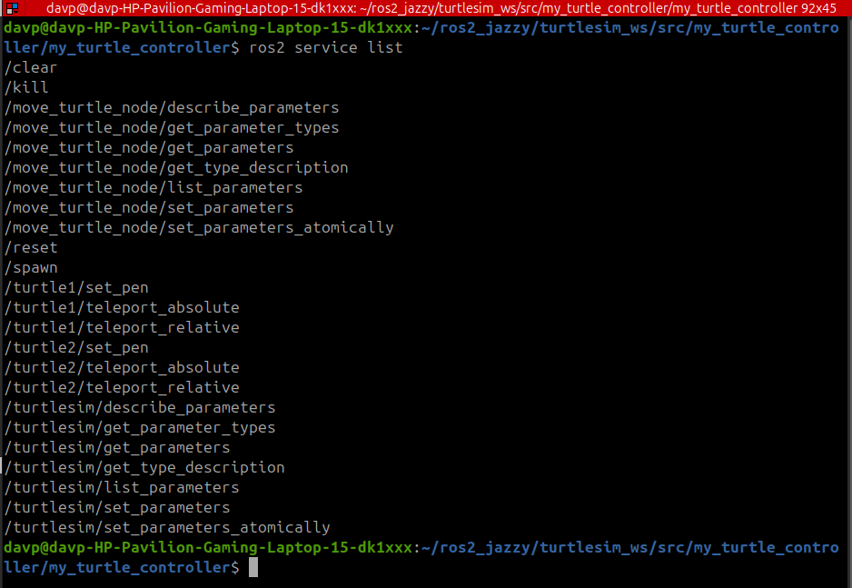
</div>

> **Análisis:** Muestra todos los servicios síncronos disponibles. Aquí se evidencian los servicios nativos invocados por el código, como `/spawn`, `/kill`, `/clear` y `/turtle1/set_pen`.
## 7. Implementación

La solución del laboratorio se desarrolló principalmente en el archivo `move_turtle.py`, donde se implementó un nodo de ROS 2 encargado de controlar el movimiento de la tortuga, ejecutar trayectorias automáticas, dibujar letras y gestionar el sistema de control líder-seguidor.

### 7.1 Creación de nodo, suscriptores y publicadores.

Para comenzar, se inicia el nodo principal de la aplicación, estableciendo así todos los componentes necesarios para el funcionamiento dentro de la red de ROS 2.

```python
class MoveTurtle(Node):

    def __init__(self):
        super().__init__('move_turtle_node')
```

Después se crean los publicadores y suscriptores. Los publicadores son los encargados de enviar los diferentes comandos de velocidad lineal y angular a las tortugas, mientras que los suscriptores reciben continuamente la posición de estas para realizar cálculos precisos.

```python
self.cmd_vel_pub = self.create_publisher(
    Twist,
    '/turtle1/cmd_vel',
    10
)

self.pose_sub = self.create_subscription(
    Pose,
    '/turtle1/pose',
    self.pose_callback,
    10
)
```

Además de esto, se instanció un segundo par de publicador y suscriptor dedicado exclusivamente al sistema líder-seguidor para monitorear y controlar a la segunda tortuga.

```python
self.cmd_vel2_pub = self.create_publisher(
    Twist,
    '/turtle2/cmd_vel',
    10
)

self.pose2_sub = self.create_subscription(
    Pose,
    '/turtle2/pose',
    self.pose2_callback,
    10
)
```

### 7.2 Creación de clientes de servicios.

Continuando con la arquitectura, se programan los distintos clientes de servicios requeridos para controlar funcionalidades integradas del simulador, permitiendo alterar el entorno mediante peticiones síncronas.

```python
self.teleport_client = self.create_client(
    TeleportAbsolute,
    '/turtle1/teleport_absolute'
)

self.set_pen_client = self.create_client(
    SetPen,
    '/turtle1/set_pen'
)

self.spawn_client = self.create_client(
    Spawn,
    '/spawn'
)

self.kill_client = self.create_client(
    Kill,
    '/kill'
)
```

### 7.3 Control manual.

Usando la función `get_key()`, se lee el teclado de forma directa a una alta frecuencia. A partir de la tecla detectada, se invocan las funciones encargadas de los movimientos espaciales. 

```python
if key == KEY_UP:
    self.move_forward()

elif key == KEY_DOWN:
    self.move_backward()

elif key == KEY_LEFT:
    self.turn_left()

elif key == KEY_RIGHT:
    self.turn_right()
```

Para asegurar un control simultáneo y fluido que permita avanzar y girar de manera concurrente sin bloqueos, se implementó un sistema de memoria de velocidades. La función publica un mensaje Twist sobre el tópico `/turtle1/cmd_vel` combinando ambas velocidades.

```python
def move_forward(self):
    self.current_v = LINEAR_SPEED
    self.publish_velocity(
        linear=self.current_v,
        angular=self.current_w
    )
```

### 7.4 Figuras automáticas.

Para el dibujo de elementos geométricos, se implementaron algoritmos basados en cinemática de lazo cerrado, leyendo constantemente la odometría para evitar los errores acumulativos típicos de las instrucciones por tiempo.

Para el triángulo, se realiza el mismo movimiento 3 veces iterando a través de desplazamientos rectos y giros matemáticos exactos (120 grados) para crear sus tres lados de la siguiente forma:

```python
    def draw_triangle(self, side_length=SHAPE_SIDE_LENGTH):
        self.get_logger().info('Dibujando triangulo...')
        for lado in range(3):
            if not self.move_by_distance(side_length): return
            if not self.turn_by_angle(2 * math.pi / 3): return
        self.get_logger().info('Triangulo completado.')
```

Obteniendo como resultado:

<br>
<div align="center">
  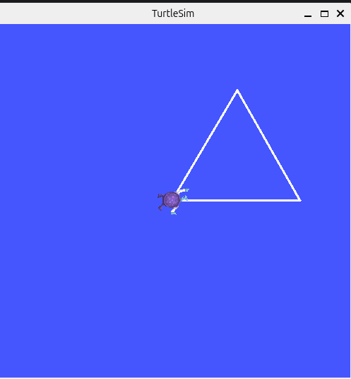
  <br>
  <b>Figura 3. Figura de triángulo.</b>
</div>
<br>

Para el rectángulo se realiza el mismo procedimiento, iterando 4 veces para crear sus lados ortogonales de la siguiente forma:

```python
    def draw_square(self, side_length=SHAPE_SIDE_LENGTH):
        self.get_logger().info('Dibujando cuadrado...')
        for lado in range(4):
            if not self.move_by_distance(side_length): return
            if not self.turn_by_angle(math.pi / 2): return
        self.get_logger().info('Cuadrado completado.')
```

Obteniendo como resultado:

<br>
<div align="center">
  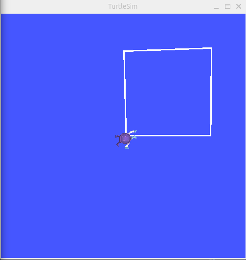
  <br>
  <b>Figura 4. Figura de rectángulo.</b>
</div>
<br>

### 7.5 Dibujo de letras.

En el caso del dibujo de letras, se programó una rutina independiente para cada una de ellas, con el fin de facilitar su construcción a partir de líneas rectas y semicircunferencias. Para garantizar que los arcos de las letras sean perfectos, se implementó un sistema de frenado dinámico que reduce la velocidad al acercarse al ángulo final, evitando que las figuras se tuerzan por la inercia. El código se estructura como se puede ver a continuación:

```python 
    def draw_D(self):
        self.get_logger().info('Dibujando letra D...')
        self._set_pen(False) 
        if not self.turn_to_angle(math.pi / 2): return       
        if not self.move_by_distance(2.0): return            
        if not self.turn_to_angle(0.0): return               
        if not self.draw_arc(-math.pi, radius=1.0): return   
        self._set_pen(True)  
        self.turn_to_angle(0.0)

    def draw_S(self):
        self.get_logger().info('Dibujando letra S...')
        self._set_pen(False) 
        if not self.turn_to_angle(math.pi / 2): return               
        if not self.draw_arc(1.5 * math.pi, radius=0.5): return    
        if not self.turn_to_angle(0.0): return           
        if not self.draw_arc(-1.5 * math.pi, radius=0.5): return   
        self._set_pen(True)  
        self.turn_to_angle(0.0) 

    def draw_P(self):
        self.get_logger().info('Dibujando letra P...')
        self._set_pen(False) 
        if not self.turn_to_angle(math.pi / 2): return       
        if not self.move_by_distance(2.0): return            
        if not self.turn_to_angle(0.0): return               
        if not self.draw_arc(-math.pi, radius=0.65): return   
        self._set_pen(True)  
        self.turn_to_angle(0.0)

    def draw_F(self):
        self.get_logger().info('Dibujando letra F...')
        self._set_pen(False) 
        if not self.turn_to_angle(math.pi / 2): return       
        if not self.move_by_distance(2.0): return            
        if not self.turn_to_angle(0.0): return               
        if not self.move_by_distance(1.0): return            
        
        self._set_pen(True)  
        if not self.turn_to_angle(math.pi): return           
        if not self.move_by_distance(1.0): return            
        if not self.turn_to_angle(-math.pi / 2): return      
        if not self.move_by_distance(1.0): return            
        if not self.turn_to_angle(0.0): return               
        
        self._set_pen(False) 
        if not self.move_by_distance(0.8): return            
        self._set_pen(True)  
        self.turn_to_angle(0.0)

    def draw_C(self):
        self.get_logger().info('Dibujando letra C...')
        self._set_pen(True)  
        if not self.turn_to_angle(math.pi / 2): return       
        if not self.move_by_distance(2.0): return
        if not self.turn_to_angle(0.0): return               
        if not self.move_by_distance(1.0): return
        if not self.turn_to_angle(math.pi): return           
        
        self._set_pen(False) 
        if not self.draw_arc(math.pi, radius=1.0): return    
        self._set_pen(True)  
        self.turn_to_angle(0.0)
```

Con esto, al presionar la tecla `V`, se ejecuta la rutina automatizada definida a partir de estos movimientos que ubica cada una de las letras de forma ordenada mediante teletransporte absoluto, generando un arreglo de tipografías sin colisiones y dando como resultado:

<br>
<div align="center">
  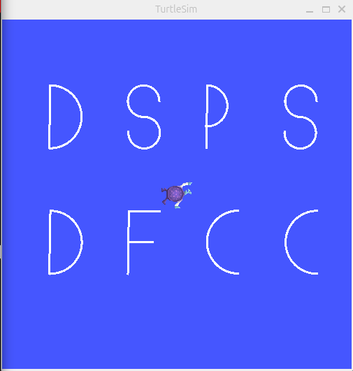
  <br>
  <b>Figura 5. Dibujo de letras.</b>
</div>
<br>

### 7.6 Sistema líder-seguidor.

El seguimiento de trayectoria funciona primero con la implementación de un temporizador de alta frecuencia (20Hz) que calcula en tiempo real la distancia euclidiana y el ángulo relativo entre las coordenadas de ambas tortugas.

```python
dx = self.current_pose.x - self.pose2.x
dy = self.current_pose.y - self.pose2.y

distance = math.hypot(dx, dy)

target_theta = math.atan2(dy, dx)
```

Ya con estos datos de error frente a la posición deseada, se calcula la velocidad proporcional aplicando ganancias predefinidas para la corrección lineal y angular.

```python
msg.linear.x = 1.5 * distance
msg.angular.z = 6.0 * error_theta
```

Finalmente, la velocidad calculada es enviada al tópico de comando correspondiente para movilizar al seguidor.

```python
self.cmd_vel2_pub.publish(msg)
```

Una vez implementadas todas estas funcionalidades, al presionar la tecla de activación del seguidor (`2`), se puede observar mediante la instanciación de un nuevo nodo la aparición de una segunda tortuga, la cual sigue activamente la trayectoria de la tortuga principal. Su recorrido se representa gráficamente con un color ligeramente más gris.

<br>
<div align="center">
  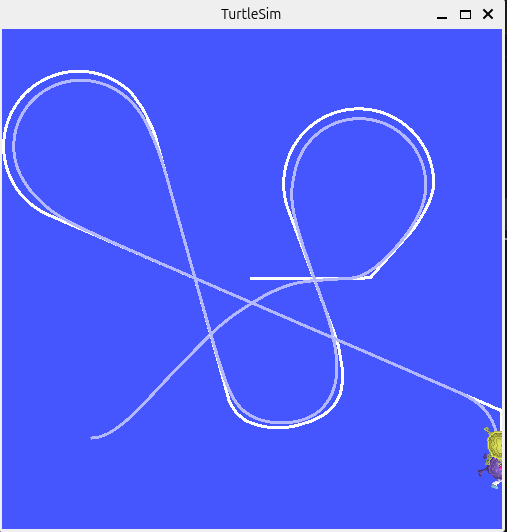
  <br>
  <b>Figura 6. Sistema Líder-seguidor.</b>
</div>
<br>

## 8. Instrucciones de Ejecución

Para iniciar la simulación y el control, asumiendo que el espacio de trabajo ya ha sido compilado, se deben abrir dos terminales independientes y ejecutar los siguientes comandos:

**Terminal A (Simulador)**
```bash
source /opt/ros/jazzy/setup.bash
ros2 run turtlesim turtlesim_node
```

**Terminal B (Controlador)**
```bash
cd ~/ros2_jazzy
colcon build --packages-select my_turtle_controller --symlink-install
source install/setup.bash
ros2 run my_turtle_controller move_turtle
```

## 9. Video Explicativo

Como evidencia final del cumplimiento de los objetivos del laboratorio, se presenta el registro audiovisual de la ejecución del sistema. Este video documenta la integración exitosa entre los nodos de ROS 2 y la operación gráfica del simulador Turtlesim en tiempo real.

En el material se puede observar la sincronización lograda mediante el entorno de desarrollo, validando que la cinemática de lazo cerrado diseñada se traslada con precisión a la tortuga principal. La demostración incluye tanto la fase de control manual concurrente sin bloqueos como la ejecución de figuras automáticas, el trazado de iniciales y el comportamiento del sistema líder-seguidor, confirmando la robustez de la comunicación vía tópicos y la correcta configuración de la arquitectura.

<br>
<div align="center">
  <a href="https://youtu.be/iTaVKp3e5hM">
    
  </a>
</div>
<br>
