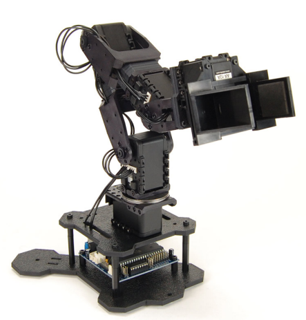
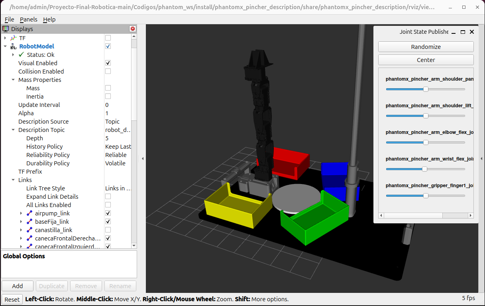
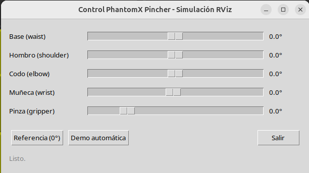
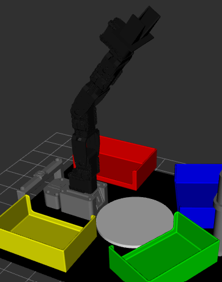
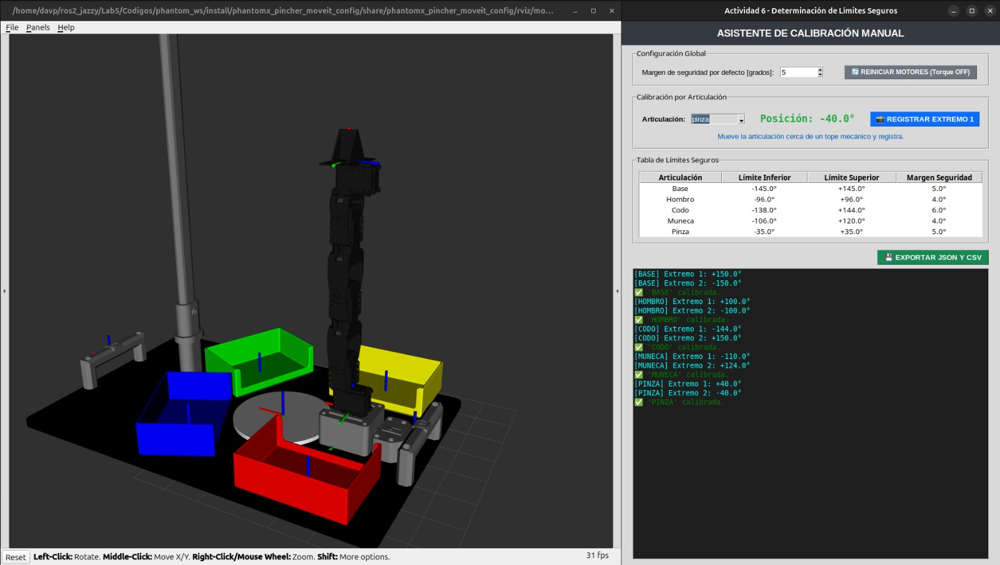

<div align="center">
<picture>
    <source srcset="https://imgur.com/5bYAzsb.png" media="(prefers-color-scheme: dark)">
    <source srcset="https://imgur.com/Os03JoE.png" media="(prefers-color-scheme: light)">
    
</picture>

<h3>Curso de Robótica 2026-I</h3>
<h1>Laboratorio No. 05</h1>
<h2>Phantom X Pincher X100 – ROS 2 Jazzy – RViz</h2>
<h4>Profesores: Pedro Fabián Cárdenas Herrera · Manuel Felipe Carranza Montenegro</h4>
<h4>Estudiantes: David Felipe Cárdenas Cubides · David Santiago Pirateque Suárez </h4>

<p>
  
  
  
  
  
</p>

<br>
<br>
<b>Figura 1. Robot Phantom X Pincher X100.</b>
</div>


# Laboratorio No. 05: Phantom X Pincher X100 – ROS 2 Jazzy – RViz.

## 1. Objetivos

- Controlar las articulaciones del modelo simulado del Phantom X Pincher X100 en ROS 2 Jazzy.
- Medir y modelar la geometría del manipulador.
- Implementar movimientos individuales, simultáneos, secuenciales e interpolados sobre el modelo en RViz.
- Aplicar cinemática directa e inversa validando contra la pose observada en RViz.
- Programar trayectorias, repetición de poses y una tarea artística (trazado) y una coreografía, todo en simulación.


## 2. Estructura del repositorio


```
├── README.md                     <- este documento
├──phantom_ws/
│   ├── src/
│   │   ├── phantomx_pincher/                 # Metapaquete: launch de alto nivel
│   │   │   └── launch/
│   │   │       ├── fake.launch.py            # MoveIt2 + ros2_control FAKE (RViz)  ← usado en este laboratorio
│   │   │       └── gz.launch.py              # MoveIt2 + Gazebo (no usado aquí)
│   │   │
│   │   ├── phantomx_pincher_description/     # URDF/xacro + mallas STL/DAE del robot
│   │   │   ├── urdf/phantomx_pincher.urdf.xacro
│   │   │   ├── meshes/STL/ ...               # Mallas para medición (Actividad 3)
│   │   │   ├── launch/display.launch.py      # RViz + robot_state_publisher standalone
│   │   │   └── scripts/                      # Conversión xacro → URDF/SDF
│   │   │       ├── xacro2urdf.bash
│   │   │       ├── xacro2sdf.bash
│   │   │       └── xacro2sdf_direct.bash
│   │   │
│   │   ├── phantomx_pincher_bringup/         # Lanzamiento integrado sim/real
│   │   │   └── launch/phantomx_pincher.launch.py   # arg use_real_robot (true/false)
│   │   │
│   │   ├── phantomx_pincher_moveit_config/   # Configuración de MoveIt 2
│   │   │   ├── config/
│   │   │   │   ├── joint_limits.yaml
│   │   │   │   ├── kinematics.yaml
│   │   │   │   ├── controllers_position.yaml
│   │   │   │   ├── phantomx_pincher.srdf
│   │   │   │   └── ompl_planning.yaml
│   │   │   └── scripts/                      # Conversión xacro → SRDF
│   │   │       └── xacro2srdf.bash
│   │   │
│   │   ├── phantomx_pincher_interfaces/      # Mensajes propios
│   │   │   └── msg/PoseCommand.msg           # x, y, z, roll, pitch, yaw, cartesian_path
│   │   │
│   │   ├── phantomx_pincher_commander_cpp/   # Wrapper en C++ de MoveGroupInterface
│   │   │   └── src/ (commander, test_moveit) # Traduce PoseCommand → movimientos de MoveIt
│   │   │
│   │   ├── phantomx_pincher_demos/           # Ejemplos oficiales del kit (base para varias actividades)
│   │   │   └── (ex_joint_goal.py, ex_pose_goal.py, ex_gripper.py, ex_servo.py,
│   │   │        ex_collision_primitive.py, ex_collision_mesh.py,
│   │   │        demo_pick_and_place.py, demo_observe_scene.py)
│   │   │
│   │   ├── pincher_control/                  # Paquete propio: control articular + cinemática
│   │   │   ├── control_servo.py              # Clase PincherController (DH + IK con roboticstoolbox,
│   │   │   │                                 #   GUI Tkinter, publica /joint_states)
│   │   │   └── follow_joint_trajectory_node.py # Puente MoveIt ↔ Dynamixel (solo robot real)
│   │   │
│   │   └── pincher_cproyect/                 # Paquete propio: tarea de aplicación
│   │       └── pincher_cproyect/mover.py     # Nodo "mover": recibe comandos por tópico /Bring
│   │                                         #   (colores) o teclado, publica PoseCommand,
│   │                                         #   controla pinza y ventosa (Arduino)
│   │
│   └── scripts/                              # Scripts sueltos (no empaquetados) por actividad,
│       │                                     #   ejecutados directamente con `python3`, 100% simulación
│       │                                     #   (publican /joint_states, sin Dynamixel real)
│       ├── joint_selector_act4.py            # Clase JointSelector base (API: habilitar_torque,
│       │                                     #   mover_articulacion, mover_simultaneo, leer_todas...)
│       ├── joint_selector_act4_gui.py        # Misma API + GUI Tkinter con sliders por articulación
│       ├── joint_seletor_act4.py             # (duplicado/variante con GUI; nombre con typo)
│       ├── act4.py                           # Actividad 4 – movimiento individual (control directo AX-12)
│       ├── act7.py                           # Actividad 7 – movimiento simultáneo (usa joint_selector_act4)
│       ├── act8.py                           # Actividad 8 – movimiento secuencial (usa joint_selector_act4_gui)
│       ├── act9.py                           # Actividad 9 – interpolación lineal/cúbica + gráficas (matplotlib)
│       ├── act13.py                          # Actividad 13 – enseñanza y repetición de poses (Tkinter + YAML)
│       ├── act14_draw_shape_phantomx.py      # Actividad 14 – trazado de figura (IK + Marker en RViz)
│       ├── act15.py                          # Actividad 15 – coreografía (secuencia J1-J4+pinza con timestamps)
│       └── calibrar_geometria.py             # Diagnóstico de geometría real vía TF (calibración L1-L4)
└── Images/  

```


---

## 3. Puesta en marcha 

Ya teniendo configurado el entorno con los archivos correspondientes para ejecutar los comandos de movimiento, es necesario iniciar el entorno de trabajo cargando la descripción del robot en ROS 2. Esto permite el reconocimiento de los diferentes componentes del manipulador, así como su visualización e interacción en RViz.

Para ello, se deben ejecutar los siguientes comandos en una terminal:

* **Acceder al espacio de trabajo.**

```bash
cd /home/davp/ros2_jazzy/Proyecto-Final-Robotica-main/Codigos/phantom_ws
```

* **Compilar el paquete de descripción.**

```bash
colcon build --packages-select phantomx_pincher_description
```

* **Cargar el entorno de trabajo.**

```bash
source install/setup.bash
```

* **Inicializar la simulación.**

```bash
ros2 launch phantomx_pincher_description view.launch.py
```

La ejecución de estos comandos permite:

* Calcular y publicar las transformaciones entre los diferentes eslabones del robot.
* Generar una interfaz gráfica para modificar manualmente los valores de las articulaciones.
* Abrir la herramienta de visualización RViz, la cual representa el modelo tridimensional del robot y permite verificar que la configuración del manipulador sea correcta.

Como resultado, se obtiene la siguiente ventana de visualización y control:

<br>

<div align="center">
  
  <br>
  <b>Figura 2. Ventana de visualización y control en RViz.</b>
</div>

<br>


## 4. Actividad 1 – Preparación del robot 


## 5. Actividad 2 – Identificación de motores y articulaciones 


<br>

<div align="center">

| Articulación (URDF) | ID Dynamixel | Signo aplicado | Función |
|---|---|---|---|
| `phantomx_pincher_arm_shoulder_pan_joint` (Base) | 1 | +1 | Rotación de la base |
| `phantomx_pincher_arm_shoulder_lift_joint` (Hombro) | 2 | −1 | Eleva/baja el brazo |
| `phantomx_pincher_arm_elbow_flex_joint` (Codo) | 3 | −1 | Flexión del codo |
| `phantomx_pincher_arm_wrist_flex_joint` (Muñeca) | 4 | −1 | Orientación de la pinza |
| `phantomx_pincher_gripper_finger1_joint` (Pinza) | 5 | +1 | Apertura/cierre (dedo 2 es *mimic*) |

</div>

<br>


## 6. Actividad 3 – Medición del robot
Se tomaron las medidas de los diferentes eslabones del manipulador utilizando principalmente las dimensiones obtenidas de las mallas STL del modelo 3D. A partir de estas mediciones se determinaron los parámetros geométricos empleados en el desarrollo de la cinemática del robot, obteniéndose los siguientes valores:

Dando como resultado:

<br>

<div align="center">

| Parámetro                                  |                                Valor |
| ------------------------------------------ | -----------------------------------: |
| L1 (altura de la base al hombro)           |                              44.0 mm |
| L2 (hombro al codo)                        |                             107.5 mm |
| L3 (codo a la muñeca)                      |                             107.5 mm |
| L4 (muñeca al TCP)                         |                              75.3 mm |
| Alcance radial máximo (`PLANAR_REACH_MAX`) |          L2 + L3 + L4 = **290.3 mm** |
| Alcance radial mínimo (`PLANAR_REACH_MIN`) |                            **40 mm** |
| Alcance vertical (`Z_MIN`–`Z_MAX`)         | 0 – (L1 + L2 + L3 + L4) = **334.3 mm**  |

</div>

<br>

Estos parámetros representan las dimensiones geométricas del manipulador y constituyen la base para el cálculo de la cinemática directa e inversa, así como para la definición de los límites del espacio de trabajo utilizados durante la planificación de trayectorias.


## 7. Actividad 4 – Movimiento individual de articulaciones

Para esta actividad se desarrolló un programa en Python capaz de interactuar con el modelo del robot en RViz, generando una interfaz gráfica que permite configurar las posiciones de las articulaciones de forma manual o ejecutar una secuencia de movimiento automática.

Para ejecutar este programa, primero se debe cerrar la interfaz de **Joint State Publisher** iniciada anteriormente y, posteriormente, ejecutar los siguientes comandos en una nueva terminal:

```bash
source /opt/ros/jazzy/setup.bash
cd ~/phantom_ws/scripts
python3 actividad4.py
```

Al ejecutar el programa, se abrirá la siguiente ventana de control:

<br>

<div align="center">
  
  <br>
  <b>Figura 3. Ventana de control.</b>
</div>

<br>

La interfaz permite controlar cada una de las articulaciones del manipulador mediante controles deslizantes (*sliders*), de forma similar a la ventana del **Joint State Publisher**. Sin embargo, incorpora funcionalidades adicionales, como el botón **`Demo automática`**, el cual ejecuta una secuencia de movimientos predefinida.

Durante esta demostración, cada articulación se mueve de manera independiente, recorriendo cinco posiciones diferentes dentro de su rango de operación. Una vez finaliza la secuencia de un eje, este regresa a su posición inicial (0°) antes de continuar con el siguiente, lo que facilita la verificación individual del movimiento de cada articulación y la correcta configuración del modelo.

<br>

<div align="center">
  
  <br>
  <b>Figura 4. Movimiento del robot eje por eje.</b>
</div>

<br>


## 8. Actividad 5 – Calibración de cero y error articular


## 9. Actividad 6 – Límites seguros

para esta actividad se ejecuta el codigo correspondiente que abre una ventana nueva que permite calibrar de forma manual estos limites 


<br>

<div align="center">
  
  <br>
  <b>Figura 4. Limites por eje.</b>
</div>

<br>

<br>

<div align="center">

| Articulación | Límite inferior | Límite superior | Margen de seguridad |
| :--- | :---: | :---: | :---: |
| **Base** | -145.0° | 145.0° | 5.0° |
| **Hombro** | -96.0° | 96.0° | 4.0° |
| **Codo** | -138.0° | 144.0° | 6.0° |
| **Muñeca** | -106.0° | 124.0° | 4.0° |
| **Pinza** | -35.0° | 35.0°  | 5.0° |

</div>

<br>

## 10. Actividad 7 – Movimiento simultáneo

Para esta actividad se desarrolló un programa en Python cuyo objetivo es ejecutar una secuencia de movimientos simultáneos de todas las articulaciones del manipulador.

La secuencia de movimiento está compuesta por cinco configuraciones articulares, las cuales se ejecutan de forma consecutiva. Cada configuración define los ángulos objetivo de las articulaciones de la base, hombro, codo, muñeca y pinza, como se muestra a continuación:

<br>

<div align="center">


| Configuración | Base | Hombro | Codo | Muñeca | Pinza |
| ------------: | ---: | -----: | ---: | -----: | ----: |
|       Inicial |   0° |     0° |   0° |     0° |    0° |
|             1 |  25° |    25° |  20° |   -20° |    0° |
|             2 | -35° |    35° |  30° |    30° |    0° |
|             3 |  85° |   -20° |  55° |    25° |    0° |
|             4 |  80° |    35° |  55° |   -45° |    0° |


</div>

<br>


## 11. Actividad 8 – Movimiento secuencial

## 12. Actividad 9 – Interpolación de trayectorias

## 13. Actividad 10 – Trayectoria sinusoidal

## 14. Actividad 11 – Cinemática directa

## 15. Actividad 12 – Cinemática inversa

## 16. Actividad 13 – Enseñanza y repetición de poses

## 17. Actividad 14 – Trazado de una figura

## 18. Actividad 15 – Reto final: coreografía robótica


## 19. Video Explicativo


## 20. Conclusiones Individuales


### Conclusiones de [Nombre del Integrante 1]
* *(Escribe aquí tus conclusiones sobre ROS 2, la cinemática, las dificultades, etc.)*
* ...

### Conclusiones de [Nombre del Integrante 2]
* *(Escribe aquí tus conclusiones sobre ROS 2, la cinemática, las dificultades, etc.)*
* ...
