<div align="center">
<picture>
    <source srcset="https://imgur.com/5bYAzsb.png" media="(prefers-color-scheme: dark)">
    <source srcset="https://imgur.com/Os03JoE.png" media="(prefers-color-scheme: light)">
    
</picture>

<h3>Curso de Robótica 2026-I</h3>
<h1>Laboratorio No. 05</h1>
<h2>Phantom X Pincher X100 – ROS 2 Jazzy – RViz</h2>
<h4>Profesores: Pedro Fabián Cárdenas Herrera · Manuel Felipe Carranza Montenegro</h4>
<h4>Estudiantes: David Felipe Cárdenas Cubides · David Santiago Pirateque Suárez </h4>

<p>
  
  
  
  
  
</p>

<br>
<br>
<b>Figura 1. Robot Phantom X Pincher X100.</b>
</div>


# Laboratorio No. 05: Phantom X Pincher X100 – ROS 2 Jazzy – RViz.

## 1. Objetivos

- Controlar las articulaciones del modelo simulado del Phantom X Pincher X100 en ROS 2 Jazzy.
- Medir y modelar la geometría del manipulador.
- Implementar movimientos individuales, simultáneos, secuenciales e interpolados sobre el modelo en RViz.
- Aplicar cinemática directa e inversa validando contra la pose observada en RViz.
- Programar trayectorias, repetición de poses y una tarea artística (trazado) y una coreografía, todo en simulación.

> **Nota sobre el alcance de la entrega:** por restricciones de tiempo, el docente autorizó entregar este laboratorio trabajando únicamente sobre el modelo simulado en RViz. Lo logrado adicionalmente sobre el robot físico se documenta como bonus en la sección **[Bonus] Trabajo con el robot físico**, al final de este documento.

## 2. Estructura del repositorio y Diagrama de flujo

### 2.1. Estructura del repositorio

```
Laboratorio No. 05 - Robótica de Desarrollo ROS Jazzy y Phantom Pincher X100/
├── README.MD                              # Documento principal de entrega
├── Images/                                # Capturas de cada interfaz/actividad (usadas en el README)
│   ├── pincher.png, Rviz.png
│   ├── Interfaz_Act4.png ... Interfaz_Act15.png
│   ├── act4.1.png, act4.png, act6.png
│   ├── Interpolacion_Graficas_Act9.png
│   └── Interfaz_Act14_Circulo.png / _Cuadrado.png / _Iniciales.png / _Triangulo.png
│
└── phantom_ws/
    ├── mis_actividades/                   # Scripts sueltos por actividad
    │   ├── joint_selector.py              # Clase base (control articular + cinemática, simulación)
    │   ├── actividad4.py                  # Act. 4 – movimiento individual
    │   ├── actividad5.py                  # Act. 5 – calibración de cero y error articular
    │   ├── actividad6.py                  # Act. 6 – límites seguros (calibración manual con torque OFF)
    │   ├── actividad7.py                  # Act. 7 – movimiento simultáneo
    │   ├── actividad8.py                  # Act. 8 – movimiento secuencial
    │   ├── actividad9.py                  # Act. 9 – interpolación lineal/cúbica + gráficas
    │   ├── actividad10.py                 # Act. 10 – trayectoria sinusoidal
    │   ├── actividad11.py                 # Act. 11 – cinemática directa (DH)
    │   ├── actividad12.py                 # Act. 12 – cinemática inversa (codo arriba/abajo)
    │   ├── actividad13.py                 # Act. 13 – enseñanza y repetición de poses (Teach & Play)
    │   ├── actividad14.py                 # Act. 14 – trazado de figuras (triángulo/cuadrado/círculo/iniciales)
    │   ├── actividad15.py                 # Act. 15 – coreografía sincronizada con audio
    │   ├── analizador_audio.py            # Extrae energía/frecuencia/pulsos de las canciones (librosa)
    │   ├── dubidubidu.mp3 / pedro.mp3     # Audios de las coreografías
    │   ├── datos_dubidubidu.csv / datos_pedro.csv   # Parámetros musicales ya procesados
    │   ├── dubidubidu.png / pedro.png     # Imágenes de referencia de cada canción
    │   ├── grafica_act9_todas_articulaciones.png
    │   ├── trayectorias_act9.csv          # Datos exportados de la Actividad 9
    │   ├── graficas_act5/                 # Gráficas q_deseado vs q_medido por articulación
    │   │   ├── grafica_error_base.png
    │   │   ├── grafica_error_hombro.png
    │   │   ├── grafica_error_codo.png
    │   │   ├── grafica_error_muneca.png
    │   │   └── grafica_error_pinza.png
    │   ├── limites_act6/                  # Salida de la Actividad 6
    │   │   ├── limites_seguros.json
    │   │   └── limites_seguros.csv
    │   ├── yamls/
    │   │   └── poses_act13.yaml           # Poses guardadas (Teach & Play)
    │   └── README_Actividad4.md ... README_Actividad15.md / README_JointSelector.md
    │
    └── src/
        ├── phantomx_pincher/               # Metapaquete: launch de alto nivel
        │   ├── CMakeLists.txt
        │   ├── README.md
        │   ├── package.xml
        │   └── launch/ (fake.launch.py, gz.launch.py)
        │
        ├── phantomx_pincher_bringup/        # Lanzamiento integrado sim/real
        │   ├── CMakeLists.txt
        │   ├── package.xml
        │   ├── config/ (controllers_position.yaml, controllers_effort.yaml)
        │   └── launch/ (phantomx_pincher.launch.py, readme.md)
        │
        ├── phantomx_pincher_commander_cpp/  # Commander en C++ (control cartesiano vía MoveIt)
        │   ├── CMakeLists.txt
        │   ├── package.xml
        │   └── src/ (commander_template.cpp, test_moveit.cpp, readme.md)
        │
        ├── phantomx_pincher_description/    # URDF/xacro + mallas STL/DAE/collision/visual
        │   ├── urdf/ (phantomx_pincher.urdf.xacro, *.xacro, *.ros2_control, *.gazebo)
        │   ├── meshes/ (STL/, DAE/, collision/, visual/)
        │   ├── hooks/ (phantomx_pincher_description.dsv.in, .sh.in)
        │   ├── launch/ (display.launch.py, view.launch.py, view_gz.launch.py)
        │   ├── config/initial_joint_positions.yaml
        │   ├── rviz/view.rviz
        │   └── phantomx_pincher/ (model.sdf, model.config, meshes/, thumbnails/)  # export para Gazebo
        │
        ├── phantomx_pincher_interfaces/     # Mensaje personalizado
        │   ├── CMakeLists.txt
        │   ├── package.xml
        │   └── msg/PoseCommand.msg
        │
        ├── phantomx_pincher_moveit_config/  # Configuración de MoveIt 2
        │   ├── CMakeLists.txt
        │   ├── README.md
        │   ├── package.xml
        │   ├── config/ (joint_limits.yaml, kinematics.yaml, ompl_planning.yaml,
        │   │            phantomx_pincher.srdf, servo.yaml, servo_real.yaml,
        │   │            controllers_position.yaml, controllers_effort.yaml,
        │   │            moveit_controller_manager_gripper_command.yaml,
        │   │            moveit_controller_manager_gripper_trajectory.yaml)
        │   ├── srdf/ (phantomx_pincher.srdf.xacro, phantomx_pincher.xacro, phantomx_pincher.srdf)
        │   ├── launch/ (move_group.launch.py, move_group_external_control.launch.py)
        │   ├── scripts/xacro2srdf.bash
        │   └── rviz/moveit.rviz
        │
        ├── pincher_control/                 # Nodo de control real del brazo (Dynamixel + trayectorias)
        │   ├── package.xml, setup.py, setup.cfg
        │   ├── pincher_control/ (control_servo.py, follow_joint_trajectory_node.py,
        │   │                     template_control_servo.py, readme.md, __init__.py)
        │   ├── resource/pincher_control
        │   └── test/ (test_copyright.py, test_flake8.py, test_pep257.py)
        │
        └── ros2                             # (archivo vacío, 0 bytes — no es un paquete)                         

```


### 2.2. Diagrama de flujo
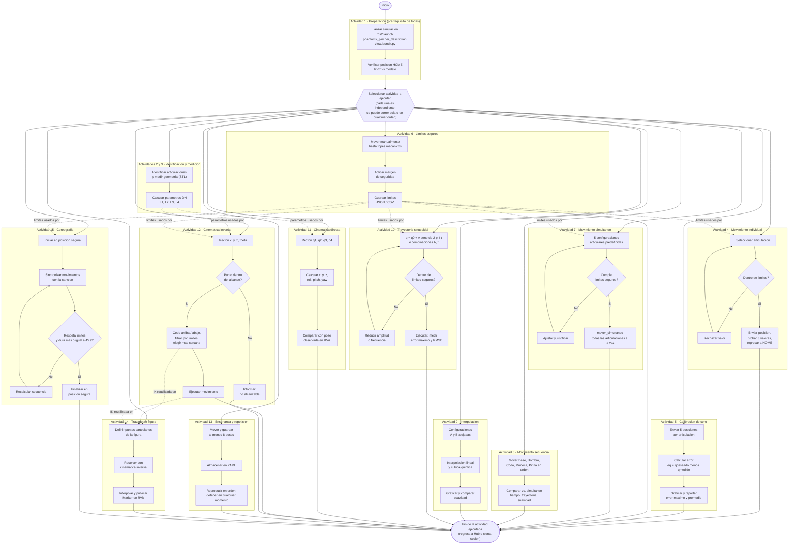


## 3. Puesta en marcha 

Ya teniendo configurado el entorno con los archivos correspondientes para ejecutar los comandos de movimiento, es necesario iniciar el entorno de trabajo cargando la descripción del robot en ROS 2. Esto permite el reconocimiento de los diferentes componentes del manipulador, así como su visualización e interacción en RViz.

Para ello, se deben ejecutar los siguientes comandos en una terminal:

* **Acceder al espacio de trabajo.**

```bash
cd ~/phantom_ws
```

* **Instalación de Dependencias del Sistema.**

```bash
sudo apt update
sudo apt install python3-tk python3-numpy python3-matplotlib python3-yaml python3-venv ros-jazzy-visualization-msgs
```


* **Compilar el paquete de descripción.**

```bash
# Carga de la instalación base de ROS 2
source /opt/ros/jazzy/setup.bash

# Compilación del proyecto
colcon build
```


* ** Creación del Entorno Virtual**

```bash
# Creación del entorno virtual
python3 -m venv mi_entorno

# Activación del entorno virtual
source mi_entorno/bin/activate

# Instalación de dependencias de audio e interfaz gráfica
pip install librosa pandas pygame pillow
```

* **Cargar el entorno de trabajo.**

```bash
source install/setup.bash
```

* **Inicializar la simulación.**

```bash
ros2 launch phantomx_pincher_description view.launch.py
```

La ejecución de estos comandos permite:

* Calcular y publicar las transformaciones entre los diferentes eslabones del robot.
* Generar una interfaz gráfica para modificar manualmente los valores de las articulaciones.
* Abrir la herramienta de visualización RViz, la cual representa el modelo tridimensional del robot y permite verificar que la configuración del manipulador sea correcta.


## 4. Actividad 1 – Preparación del robot

*(Trabajo realizado en simulación — ver nota sobre el alcance de la entrega en la sección 1.)*

Como preparación del laboratorio, se cargó la descripción URDF/xacro del Phantom X Pincher X100 (paquete `phantomx_pincher_description`) mediante:

```bash
ros2 launch phantomx_pincher_description view.launch.py
```

Este comando:

- Publica las transformaciones (`tf`) entre los cinco eslabones del manipulador (base, hombro, codo, muñeca, pinza) a partir del URDF.
- Levanta el **Joint State Publisher GUI**, que permite mover manualmente cada articulación dentro de sus límites definidos en el xacro.
- Abre **RViz**, cargando el modelo tridimensional completo del robot (mallas STL/DAE) para verificación visual.

Como resultado, se obtuvo la siguiente ventana de visualización y control:

<br>
<div align="center">
  
  <br>
  <b>Figura 2. Ventana de visualización y control en RViz.</b>
</div>
<br>

Se verificó lo siguiente antes de continuar con el resto de actividades:

- El modelo carga en la posición **HOME** (0°, 0°, 0°, 0°, 0°), una configuración segura y libre de colisiones entre eslabones.
- Los cinco elementos del ensamble (base, hombro, codo, muñeca, pinza) corresponden geométricamente al Phantom X Pincher X100 real, según las mallas del paquete `phantomx_pincher_description`.
- Los *sliders* del Joint State Publisher desplazan cada articulación de forma independiente y respetan los límites definidos en `phantomx_pincher.urdf.xacro`, confirmando que el modelo queda correctamente parametrizado para las actividades siguientes.

## 5. Actividad 2 – Identificación de motores y articulaciones 

Los IDs Dynamixel y el mapeo de signo están definidos en `pincher_control/control_servo.py` (`self.dxl_ids`, `self.joint_sign`) y se reutilizan en `follow_joint_trajectory_node.py` para el robot real:

<br>

<div align="center">

| Articulación (URDF) | ID Dynamixel | Signo aplicado | Función |
|---|---|---|---|
| `phantomx_pincher_arm_shoulder_pan_joint` (Base) | 1 | +1 | Rotación de la base |
| `phantomx_pincher_arm_shoulder_lift_joint` (Hombro) | 2 | −1 | Eleva/baja el brazo |
| `phantomx_pincher_arm_elbow_flex_joint` (Codo) | 3 | −1 | Flexión del codo |
| `phantomx_pincher_arm_wrist_flex_joint` (Muñeca) | 4 | −1 | Orientación de la pinza |
| `phantomx_pincher_gripper_finger1_joint` (Pinza) | 5 | +1 | Apertura/cierre (dedo 2 es *mimic*) |

</div>

<br>


## 6. Actividad 3 – Medición del robot

Las dimensiones del manipulador se obtuvieron a partir de los archivos STL/URDF del paquete `phantomx_pincher_description` (repositorio base de modelos tridimensionales) y se validaron con mediciones directas sobre el ensamble del brazo en Autodesk Inventor.

<br>

<div align="center">
  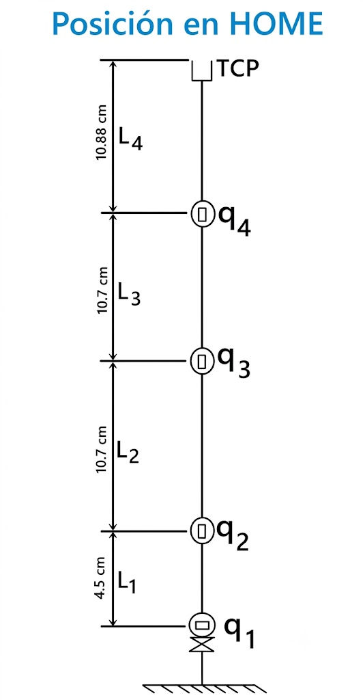
  <br>
  <b>Figura 3. Diagrama geométrico del manipulador en posición HOME, con los parámetros L1-L4 y los ejes articulares q1-q4 utilizados en la convención Denavit-Hartenberg (Actividades 11 y 12).</b>
</div>

<br>

| Parámetro | Valor |
| --- | ---: |
| L1 (altura de la base al hombro) | 45.0 mm |
| L2 (hombro al codo) | 107.0 mm |
| L3 (codo a la muñeca) | 107.0 mm |
| L4 (muñeca al TCP) | 108.8 mm |
| Alcance radial máximo (`PLANAR_REACH_MAX` = L2+L3+L4) | **322.8 mm** |
| Alcance radial mínimo (práctico) | ~40 mm* |
| Alcance vertical (`Z_MIN`–`Z_MAX`) | 0 – (L1+L2+L3+L4) = **367.8 mm** |

<br>

*Estos valores son los mismos utilizados como constantes `L1, L2, L3, L4` en `actividad11.py` y `actividad12.py`, garantizando consistencia entre la medición geométrica y el cálculo de cinemática directa/inversa.*

\*El alcance radial mínimo no se deriva de una constante en el código: `actividad12.py` descarta una solución cuando `D < |L2 − L3|`, que con L2 = L3 da un mínimo teórico de 0 mm (codo totalmente plegado). El valor práctico de 40 mm refleja la limitación real por colisión mecánica entre los eslabones, no un cálculo de la cinemática.

### Verificación dimensional en CAD

<br>

<div align="center">
  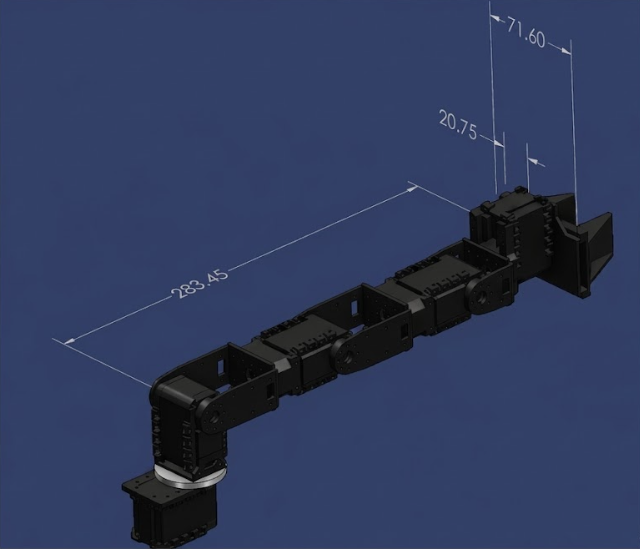
  <br>
  <b>Figura 4. Verificación dimensional del ensamble en Autodesk Inventor: distancia hombro–muñeca (283.45 mm) y ancho de la pinza (71.60 mm).</b>
</div>

<br>

La medición directa en Inventor entre los ejes de hombro y muñeca (283.45 mm) es mayor que la suma L2+L3 del modelo DH (214.0 mm), ya que corresponde a la distancia real sobre el ensamble en una pose no alineada con el plano del modelo simplificado, e incluye el ancho de las carcasas de los servomotores intermedios que la convención DH no contabiliza por separado. Se documenta como dato de verificación física, complementario al modelo cinemático de la Figura 3.

### Dimensiones de la pinza

| Parámetro | Valor | Fuente |
| --- | ---: | --- |
| Ancho total de la pinza | 71.60 mm | Medición CAD (Inventor) |
| Separación entre centros de los dedos | 23.0 mm | URDF (`phantomx_pincher_gripper_finger1/2_joint`) |
| Recorrido articular por dedo (prismático) | 1.0 – 15.8 mm | URDF (límites del joint) |
| Bounding box de cada dedo | ≈ 24.0 × 23.0 × 37.0 mm | Malla de colisión `finger.stl` |


## 7. Actividad 4 – Movimiento individual de articulaciones

Para esta actividad se desarrolló un programa en Python capaz de interactuar con el modelo del robot en RViz, generando una interfaz gráfica que permite configurar las posiciones de las articulaciones de forma manual o ejecutar una secuencia de movimiento automática.

Para ejecutar este programa, primero se debe cerrar la interfaz de **Joint State Publisher** iniciada anteriormente y, posteriormente, ejecutar los siguientes comandos en una nueva terminal:

```bash
source /opt/ros/jazzy/setup.bash
cd ~/phantom_ws/scripts
python3 actividad4.py
```

Al ejecutar el programa, se abrirá la siguiente ventana de control:

<br>

<div align="center">
  
  <br>
  <b>Figura 3. Interfaz de control actividad 4.</b>
</div>

<br>

La interfaz permite controlar cada una de las articulaciones del manipulador mediante controles deslizantes (*sliders*), de forma similar a la ventana del **Joint State Publisher**. Sin embargo, incorpora funcionalidades adicionales, como el botón **`Demo automática`**, el cual ejecuta una secuencia de movimientos predefinida o un slider de control de velocidad. Ademas de incorporar las funciones de activación y desactivación del torque.

Durante esta demostración, cada articulación se mueve de manera independiente, recorriendo cinco posiciones diferentes dentro de su rango de operación. Una vez finaliza la secuencia de un eje, este regresa a su posición inicial (0°) antes de continuar con el siguiente, lo que facilita la verificación individual del movimiento de cada articulación y la correcta configuración del modelo.

<br>

<div align="center">
  
  <br>
  <b>Figura 4. Movimiento del robot eje por eje.</b>
</div>

<br>


## 8. Actividad 5 – Calibración de cero y error articular

La Actividad 5 consiste en el desarrollo de un asistente gráfico para calibrar el cero mecánico y evaluar el error de posicionamiento de cada articulación del robot **Phantom X Pincher X100**. La aplicación fue desarrollada en **Python**, utilizando **Tkinter** para la interfaz gráfica, **ROS 2** para la comunicación con el robot, y **Matplotlib** junto con **NumPy** para el análisis y la generación de gráficas.

La interfaz permite seleccionar la articulación que se desea evaluar, visualizar su posición en tiempo real y ejecutar una rutina automática de calibración basada en cinco posiciones de referencia previamente definidas para cada articulación.<div align="center">
  
  <br>
  <b>Figura 5. Interfaz gráfica de la Actividad 5.</b></div><br>

Durante la prueba, el robot recorre automáticamente cinco posiciones de referencia. En cada una se mide el ángulo real y se calcula el error articular utilizando la expresión:

$$e_q = q_{deseado} - q_{medido}$$

Finalizada la rutina, el robot regresa automáticamente a la posición **Home (0°)** y el sistema calcula el **error máximo**, el **error promedio** y el **desplazamiento del cero**, mostrando estos resultados en la interfaz. 

> **Nota sobre la simulación:** Es importante destacar que, al ejecutar esta actividad en un entorno puramente simulado (RViz), el error articular calculado es virtualmente nulo ($e_q = 0$). Esto se debe a que el modelo cinemático ideal alcanza la posición comandada de forma instantánea y con precisión matemática. Si esta misma rutina se implementara sobre el robot físico, las gráficas evidenciarían un error real y medible derivado de la resolución de los *encoders* internos de los servomotores (Dynamixel AX-12A), la holgura mecánica de los engranajes y la dinámica propia del sistema.

### Gráficas de calibración
A continuación se presentan las gráficas generadas automáticamente que comparan la posición deseada vs. la medida para cada articulación, evidenciando el comportamiento ideal descrito (error nulo en simulación):<div align="center">
  <!-- Reemplaza los SRC si las rutas de tus imágenes son distintas -->
  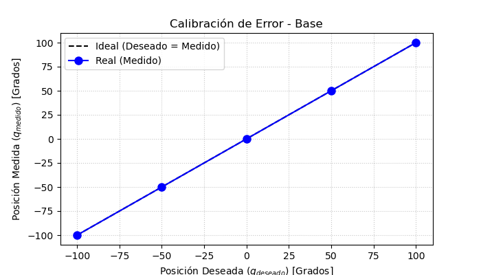
  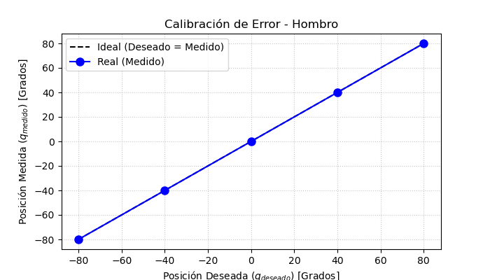
  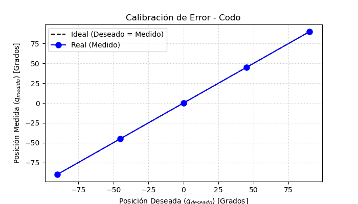
  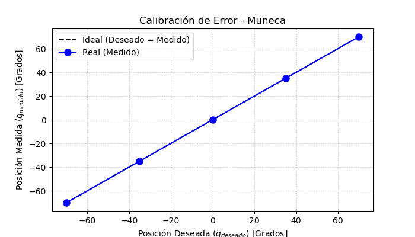
  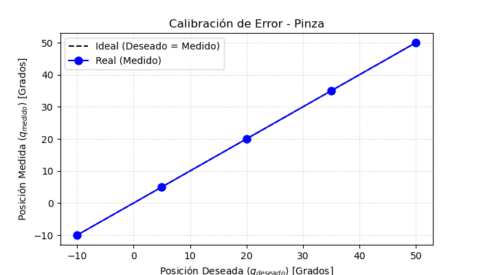</div>

---
## 9. Actividad 6 – Límites seguros

La Actividad 6 tiene como objetivo determinar los límites seguros de operación de cada articulación del robot **Phantom X Pincher X100** mediante un procedimiento de calibración manual. La aplicación fue desarrollada en **Python** utilizando **Tkinter** para la interfaz gráfica y **ROS 2** para la comunicación con el robot a través de la clase `JointSelector`.

A diferencia de la actividad anterior, en esta práctica el **torque de los motores se desactiva automáticamente**, permitiendo que el usuario pueda mover manualmente cada articulación hasta sus topes mecánicos. Posteriormente, el sistema registra ambos extremos y calcula un rango seguro de operación aplicando un margen de seguridad configurable.

<br>

<div align="center">
  
  <br>
  <b>Figura 6. Interfaz de calibración actividad 6.</b>
</div>

<br>

La interfaz se organiza en cuatro secciones principales:

- **Configuración global**, donde se define el margen de seguridad que será aplicado a todas las articulaciones.
- **Panel de calibración**, desde el cual se selecciona la articulación, se observa su posición en tiempo real y se registran los dos extremos de movimiento.
- **Tabla de resultados**, donde se muestran los límites seguros calculados para cada articulación.
- **Consola**, utilizada para informar el progreso del proceso y las acciones realizadas por el usuario.

Durante la calibración, el usuario mueve manualmente cada articulación hasta sus dos topes mecánicos y registra ambas posiciones. El sistema calcula automáticamente el límite inferior y el límite superior seguros aplicando el margen configurado, almacenando posteriormente toda la información en archivos **JSON** y **CSV** para ser utilizada en actividades posteriores.

Los límites seguros obtenidos para el robot fueron los siguientes:

<br>

<div align="center">

| Articulación | Límite inferior | Límite superior | Margen de seguridad |
| :--- | :---: | :---: | :---: |
| **Base** | -145.0° | 145.0° | 5.0° |
| **Hombro** | -96.0° | 96.0° | 4.0° |
| **Codo** | -138.0° | 144.0° | 6.0° |
| **Muñeca** | -106.0° | 124.0° | 4.0° |
| **Pinza** | -35.0° | 35.0° | 5.0° |

</div>

<br>

Estos valores constituyen el rango de operación seguro del manipulador y son utilizados como restricciones durante el desarrollo de las actividades posteriores, evitando que el robot alcance posiciones cercanas a los topes mecánicos y reduciendo el riesgo de daños en los servomotores o en la estructura del manipulador.

## 10. Actividad 7 – Movimiento simultáneo

Para esta actividad se desarrolló un programa en Python cuyo objetivo es ejecutar una secuencia de movimientos simultáneos de todas las articulaciones del manipulador.

La secuencia de movimiento está compuesta por cinco configuraciones articulares, las cuales se ejecutan de forma consecutiva. Cada configuración define los ángulos objetivo de las articulaciones de la base, hombro, codo, muñeca y pinza, como se muestra a continuación:

<br>

<div align="center">

| Configuración | Base | Hombro | Codo | Muñeca | Pinza |
|------------:|---:|---:|---:|---:|---:|
| 1 | 0° | 0° | 0° | 0° | 0° |
| 2 | 25° | 25° | 20° | -20° | 0° |
| 3 | -35° | 35° | -30° | 30° | 0° |
| 4 | 85° | -20° | 55° | 25° | 0° |
| 5 | 80° | -35° | 55° | -45° | 0° |

</div>

<br>

En cada etapa, todas las articulaciones se desplazan simultáneamente hasta alcanzar la configuración objetivo mediante la función `mover_simultaneo()`. Una vez alcanzada la posición, el programa realiza una pausa de tres segundos para facilitar la observación de la postura antes de continuar con la siguiente configuración.

Al finalizar la secuencia, el manipulador regresa automáticamente a la posición HOME (0°, 0°, 0°, 0°, 0°), deshabilita el torque de los servomotores y cierra el nodo de ROS 2 de forma segura.

<br>

<div align="center">
  
  <br>
  <b>Figura 7. Interfaz de Movimiento simultaneo actividad 7.</b>
</div>

<br>

### Interfaz gráfica con validación automática (versión actual del script)

> El script se amplió posteriormente a una interfaz gráfica completa con sistema de validación de límites. Esta es la versión vigente de `actividad7.py`.

A diferencia de una secuencia automática simple, el programa incorpora un **sistema de validación previo** a cada envío: antes de mover el robot, compara cada valor articular solicitado contra los límites seguros determinados en la Actividad 6 (cargados automáticamente desde `limites_act6/limites_seguros.json`). Si algún valor excede su límite, el programa lo trunca automáticamente al límite más cercano y despliega en la consola gráfica una justificación técnica del motivo (colisión mecánica inminente o riesgo de sobreesfuerzo del servomotor) antes de ejecutar el movimiento ya corregido.

Para el conjunto de límites calibrados de este equipo, **ninguna de las cinco configuraciones de la guía requirió truncamiento**: los cinco vectores articulares caen dentro del rango seguro definido en la Actividad 6.

El flujo de uso es el siguiente: se selecciona una configuración desde el menú desplegable ("Configuraciones del Laboratorio") y se presiona **▶ EJECUTAR CONFIGURACIÓN**. El movimiento se ejecuta mediante `mover_simultaneo()`, con un tiempo de interpolación ajustable entre 5.0 s (velocidad mínima) y 0.2 s (velocidad máxima) mediante un control deslizante de velocidad (rango 1–1023, valor por defecto 150). Al finalizar cada movimiento, la consola despliega un reporte comparando, articulación por articulación, la posición deseada frente a la posición real leída de los servomotores.

La interfaz incluye además parada de emergencia (corta el torque de inmediato), botones independientes de **Torque ON/OFF**, y un botón de retorno a **HOME** (0°, 0°, 0°, 0°, 0°) para dejar el manipulador en posición segura al finalizar.

## 11. Actividad 8 – Movimiento secuencial

Para esta actividad se desarrolló un programa en Python cuyo objetivo es ejecutar un **movimiento secuencial** de las articulaciones del manipulador. A diferencia de la actividad anterior, donde todas las articulaciones se desplazaban simultáneamente hasta alcanzar una configuración determinada, en esta práctica cada articulación se mueve de forma independiente siguiendo un orden preestablecido.

Inicialmente, el robot es llevado a la posición **HOME** (0°, 0°, 0°, 0°, 0°) mediante un movimiento simultáneo, garantizando que todas las articulaciones comiencen desde una misma referencia. Posteriormente, se define una configuración objetivo:

```python
config = {
    "base": 85.0,
    "hombro": -20.0,
    "codo": 55.0,
    "muneca": 25.0,
    "pinza": 0.0
}
```

La secuencia de movimiento se establece mediante la lista:

```python
orden = ["base", "hombro", "codo", "muneca", "pinza"]
```

De esta forma, las articulaciones se desplazan una a una en el siguiente orden:

1. Base → 85°
2. Hombro → -20°
3. Codo → 55°
4. Muñeca → 25°
5. Pinza → 0°

Cada movimiento se realiza mediante la función `mover_articulacion()`, esperando **1,5 segundos** antes de continuar con la siguiente articulación. Durante la ejecución, el programa muestra en la terminal la articulación que se está moviendo y el ángulo objetivo correspondiente, además de medir el tiempo total empleado para completar la secuencia.

Una vez alcanzada la configuración final, el robot permanece unos segundos en dicha posición para facilitar la observación del resultado. Posteriormente, el manipulador regresa a la posición HOME siguiendo el **orden inverso**, definido en el código como:

```python
orden_inverso = ["pinza", "muneca", "codo", "hombro", "base"]
```

Por lo tanto, el retorno se realiza con la siguiente secuencia:

1. Pinza → 0°
2. Muñeca → 0°
3. Codo → 0°
4. Hombro → 0°
5. Base → 0°

Finalmente, se ejecuta un movimiento simultáneo para asegurar que todas las articulaciones hayan regresado correctamente a la posición HOME, tras lo cual se deshabilita el torque de los servomotores y se finaliza la ejecución del nodo de ROS 2.

<br>

<div align="center">
  
  <br>
  <b>Figura 8.Interfaz de Movimiento secuencial actividad 8.</b>
</div>

<br>

### Interfaz gráfica con validación automática (versión actual del script)

> El script se amplió posteriormente a una interfaz gráfica completa, reutilizando las mismas 5 configuraciones de la Actividad 7. Esta es la versión vigente de `actividad8.py`.

La interfaz permite seleccionar una de las 5 configuraciones desde un menú desplegable y ejecutar el movimiento secuencial en el orden Base→Hombro→Codo→Muñeca→Pinza mediante el botón **▶ EJECUTAR SECUENCIAL**. El tiempo asignado a cada articulación ya no es fijo: se ajusta con un spinbox "Tiempo por articulación (s)" (rango 0.3–5.0 s, valor por defecto 1.5 s), lo que permite variar la duración total de la secuencia para el análisis comparativo contra el movimiento simultáneo de la Actividad 7.

Al igual que en la Actividad 7, el sistema valida cada configuración contra los límites seguros de la Actividad 6 antes de ejecutarla, truncando y justificando en consola cualquier valor fuera de rango (para este equipo, ninguna de las 5 configuraciones lo requirió). Al finalizar la secuencia, la consola reporta el tiempo total exacto de ejecución (juntas × tiempo por articulación) y compara, articulación por articulación, la posición deseada frente a la real leída de los servomotores — el dato empírico que la guía pide para comparar tiempo de ejecución, trayectoria del TCP y suavidad frente al movimiento simultáneo.

La interfaz incluye también parada de emergencia, control de velocidad (1–1023), botones de Torque ON/OFF y retorno a HOME.

## 12. Actividad 9 – Interpolación de trayectorias

El objetivo de esta actividad es comparar el comportamiento de dos métodos de interpolación de trayectorias, **lineal** y **cúbica**, para el movimiento de las cinco articulaciones del robot. La aplicación permite definir las configuraciones inicial y final, ejecutar ambos movimientos y analizar las diferencias mediante gráficas de posición angular respecto al tiempo.

<br>

<div align="center">
  
  <br>
  <b>Figura 9. Interfaz de interpolación de trayectoria de la actividad 9.</b>
</div>

<br>

La interfaz está dividida en cuatro secciones principales. La primera permite configurar la **Pose A** y la **Pose B** para cada una de las cinco articulaciones mediante controles numéricos. La segunda contiene los parámetros de ejecución, donde se establece el tiempo total del movimiento y el paso de integración (`dt`), además de los controles para habilitar o deshabilitar el torque y regresar el robot a la posición **Home**. La tercera corresponde al botón principal de ejecución, encargado de calcular las trayectorias y realizar el movimiento del robot. Finalmente, la parte inferior incorpora una consola donde se muestra el estado de la ejecución y los mensajes del proceso, junto con un botón de **Parada de Emergencia** disponible durante toda la operación.

El funcionamiento interno del programa comienza calculando las trayectorias mediante la función `calcular_trayectorias_multiples()`, la cual genera los puntos correspondientes a las interpolaciones lineal y cúbica para cada articulación. Posteriormente, la rutina `_rutina_completa()` ejecuta ambos movimientos sobre el robot, exporta los datos obtenidos al archivo `trayectorias_act9.csv` y, una vez finalizada la ejecución, llama a `_dibujar_graficas_finales()` para generar las gráficas comparativas de posición angular en función del tiempo.

<br>

<div align="center">
  
  <br>
  <b>Figura 10. Gráficas de posición angular en función del tiempo para las interpolaciones lineal y cúbica.</b>
</div>

<br>

Las gráficas muestran la evolución de la posición de cada articulación durante el movimiento. En ellas se observa que la interpolación lineal genera una variación uniforme de la posición, mientras que la interpolación cúbica produce una transición más suave al inicio y al final de la trayectoria, reduciendo los cambios bruscos de velocidad y proporcionando un movimiento más continuo.


## 13. Actividad 10 – Trayectoria sinusoidal

Para esta actividad se desarrolló una interfaz gráfica en Python que comanda una trayectoria sinusoidal sobre una articulación seleccionada, según:

$$q(t) = q_0 + A \sin(2\pi f t)$$

donde $q_0$ es la posición central, $A$ la amplitud, $f$ la frecuencia en Hz y $t$ el tiempo transcurrido.

Antes de ejecutar la prueba, el programa restringe automáticamente los parámetros a los límites seguros de la Actividad 6: al fijar $q_0$, calcula en tiempo real la **amplitud máxima permisible** como la menor distancia entre $q_0$ y cualquiera de los dos límites de la articulación, e impide seleccionar una amplitud mayor. Así es matemáticamente imposible comandar una posición fuera de rango.

Al finalizar cada prueba, el sistema calcula dos índices de desempeño sobre el error instantáneo $e_i = q_{deseado,i} - q_{medido,i}$:

$$E_{max} = \max(|e_i|) \qquad\qquad MSE = \frac{1}{N}\sum_{i=1}^{N}(e_i)^2$$

y genera automáticamente una gráfica comparando posición deseada vs. medida, guardándola como `grafica_act10_{articulación}_q0_{q0}_A_{A}_f_{f}.png`.

La interfaz incluye además parada de emergencia (aborta el bucle e inhabilita el torque de inmediato), control manual de Torque ON/OFF y retorno a HOME.

### Pruebas realizadas (articulación: Codo, $q_0=0°$, $t=8$ s)

| Prueba | Amplitud | Frecuencia | Error Máximo | MSE |
|---|---:|---:|---:|---:|
| 1 | 30° | 0.25 Hz | 0.29° | 0.02 |
| 2 | 30° | 1.0 Hz | 1.17° | 0.41 |
| 3 | 90° | 0.25 Hz | 0.86° | 0.22 |
| 4 | 90° | 1.0 Hz | 3.51° | 3.64 |

<br>

<div align="center">
  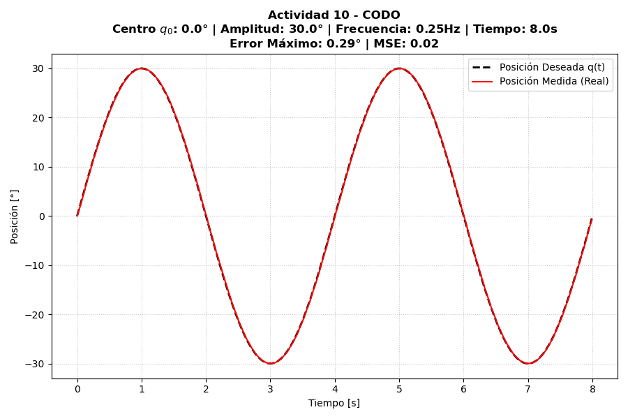
  
  <br>
  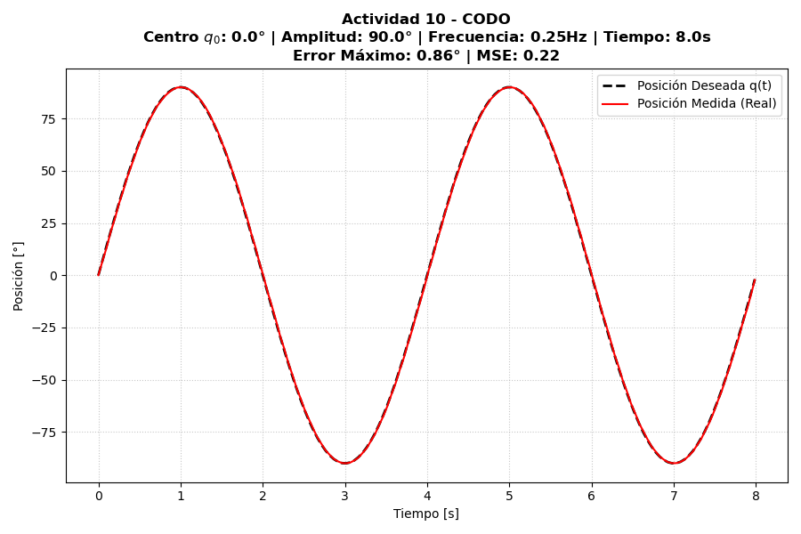
  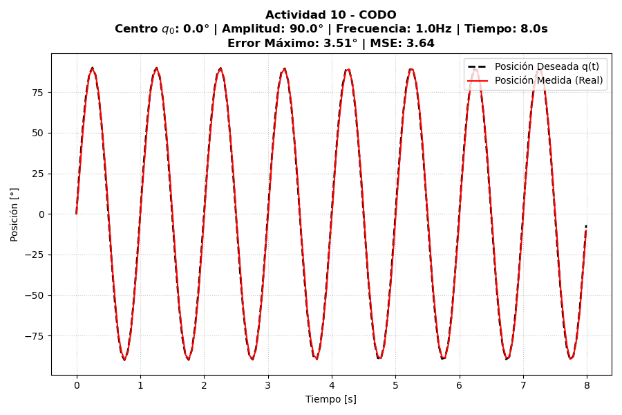
  <br>
  <b>Figura 10. Trayectoria sinusoidal en el codo para las cuatro combinaciones de amplitud y frecuencia evaluadas.</b>
</div>

<br>

El error de seguimiento crece principalmente con la **frecuencia**: al pasar de 0.25 Hz a 1.0 Hz (misma amplitud) el error máximo se multiplica por ~4, mientras que al triplicar la amplitud (misma frecuencia) el error solo se triplica aproximadamente. Esto es consistente con que el error está dominado por la velocidad angular máxima exigida al servomotor ($v_{max}=2\pi f A$), que crece linealmente con ambos parámetros pero de forma más agresiva cuando se combinan (prueba 4, la más exigente, concentra el mayor error de las cuatro).


## 14. Actividad 11 – Cinemática directa

Se implementó la cinemática directa del Phantom X Pincher X100 mediante la convención estándar de Denavit-Hartenberg (DH). El programa recibe los valores articulares de los cuatro eslabones principales ($q_1, q_2, q_3, q_4$) y calcula la posición cartesiana y orientación de la herramienta ($x, y, z$, *roll*, *pitch*, *yaw*).

<br>

<div align="center">
  
  <br>
  <b>Figura 11. Interfaz de cinemática directa actividad 11.</b>
</div>

<br>

### Parámetros DH

A partir de las longitudes de eslabón obtenidas en la Actividad 3 ($L_1$–$L_4$), se construyó la siguiente tabla de parámetros DH:

<div align="center">

| Articulación ($i$) | $\theta_i$ | $d_i$ | $a_i$ | $\alpha_i$ |
| :---: | :---: | :---: | :---: | :---: |
| **1 (Base)** | $\theta_1$ | $L_1$ | $0$ | $-\pi/2$ |
| **2 (Hombro)** | $\theta_2$ | $0$ | $L_2$ | $0$ |
| **3 (Codo)** | $\theta_3$ | $0$ | $L_3$ | $0$ |
| **4 (Muñeca)** | $\theta_4$ | $0$ | $L_4$ | $0$ |

</div>

Con $L_1 = 44.0$ mm, $L_2 = 107.5$ mm, $L_3 = 107.5$ mm y $L_4 = 75.3$ mm (Actividad 3).

**Matriz de transformación homogénea general** entre eslabones consecutivos:

$$
^{i-1}T_i =
\begin{bmatrix}
\cos\theta_i & -\sin\theta_i\cos\alpha_i & \sin\theta_i\sin\alpha_i & a_i\cos\theta_i \\
\sin\theta_i & \cos\theta_i\cos\alpha_i & -\cos\theta_i\sin\alpha_i & a_i\sin\theta_i \\
0 & \sin\alpha_i & \cos\alpha_i & d_i \\
0 & 0 & 0 & 1
\end{bmatrix}
$$

La pose de la herramienta respecto a la base se obtiene mediante el producto matricial encadenado:

$$
{}^{0}T_4 = {}^{0}T_1 \cdot {}^{1}T_2 \cdot {}^{2}T_3 \cdot {}^{3}T_4
$$

de donde $x, y, z$ se extraen de la columna de traslación y *roll/pitch/yaw* de la submatriz de rotación $3\times3$.

**Offset geométrico del hombro:** mecánicamente, $0°$ en la articulación del hombro ($\theta_2$) corresponde al eslabón en posición vertical, pero la convención DH sitúa el $0°$ perpendicular al eje $X_1$. Para conciliar el modelo con el hardware físico, se introduce una compensación de fase de $-\pi/2$ rad sobre $\theta_2$.

### Funcionamiento de la interfaz

La interfaz permite cargar automáticamente cualquiera de las 5 configuraciones predefinidas de la Actividad 7, o ingresar manualmente $q_1$–$q_4$ mediante selectores numéricos restringidos a los límites seguros de la Actividad 6. Al presionar **▶ MOVER Y CALCULAR CINEMÁTICA**, el programa ejecuta el producto matricial de transformaciones homogéneas (`matriz_dh()` → `_calcular_dh()`) y simultáneamente envía la configuración al robot/simulador. La función `extraer_xyz_rpy()` obtiene la posición y orientación final y las muestra en el panel de "Resultados Teóricos".

### Validación contra RViz

Se evaluó la cinemática directa para la **Configuración 2** de la Actividad 7 ($25°, 25°, 20°, -20°, 0°$), comparando el resultado teórico del modelo DH con la pose observada mediante `tf echo` en RViz:

<div align="center">

| | X (mm) | Y (mm) | Z (mm) | Roll | Pitch | Yaw |
|---|---:|---:|---:|---:|---:|---:|
| **Teórico (DH)** | 151.23 | 70.52 | 316.24 | −90.00° | −65.00° | 25.00° |
| **RViz (`tf echo`)** | 134.00 | 62.00 | 290.00 | 0.00° | −25.00° | −155.00° |

</div>|

### Análisis de la diferencia observada

La comparación se realizó entre los frames `phantomx_pincher_arm_base_link` y `phantomx_pincher_end_effector` mediante `ros2 run tf2_ros tf2_echo`. La diferencia entre el resultado teórico (modelo DH, limitado a las 4 articulaciones activas) y la pose observada en RViz se debe a que el frame `phantomx_pincher_end_effector` del URDF incluye una transformación fija adicional respecto al último eslabón de la cadena DH: una traslación de 19 mm (offset del centro de la pinza) y una rotación fija de (90°, −90°, 90°) en RPY, definida para alinear los ejes del frame de herramienta con una convención más intuitiva. Esta transformación no está incluida en el modelo DH implementado (que solo contempla los cuatro eslabones activos), lo cual explica tanto el desplazamiento en posición (del orden de los 19 mm adicionales) como la aparente gran diferencia en los ángulos de Euler, que en realidad corresponde a una reorientación fija y conocida del frame de referencia, no a un error del modelo cinemático.


## 15. Actividad 12 – Cinemática inversa

Se implementó la cinemática inversa del Phantom X Pincher X100 mediante el método de **desacople cinemático**, que reduce el problema espacial 3D a un análisis trigonométrico planar 2D. El programa recibe una coordenada cartesiana objetivo del TCP ($x, y, z$) y un ángulo de ataque *pitch* ($\Theta$), y calcula una configuración articular válida ($q_1$–$q_4$) que alcanza dicha pose.

<br>

<div align="center">
  
  <br>
  <b>Figura 13. Interfaz de cinemática inversa actividad 12.</b>
</div>

<br>

### Fundamento matemático (desacople cinemático)

**1. Rotación de la base ($q_1$):** gobierna la rotación en el plano XY, obtenida por proyección polar de las coordenadas cartesianas:

$$q_1 = \text{atan2}(y, x)$$

**2. Centro de muñeca (*wrist center*):** conocido $\Theta$ y la longitud del eslabón de la pinza ($L_4$), se retrocede geométricamente sobre el plano radial ($r$) y vertical ($z$):

$$r = \sqrt{x^2 + y^2} \qquad r_w = r - L_4\cos(\Theta) \qquad z_w = z - L_1 - L_4\sin(\Theta)$$

**3. Solución del codo ($q_3$):** mediante la ley de los cosenos sobre el triángulo formado por $L_2$ y $L_3$:

$$\cos(q_3) = \frac{r_w^2 + z_w^2 - L_2^2 - L_3^2}{2L_2 L_3} \qquad q_3 = \pm\arccos(\cos(q_3))$$

El signo positivo/negativo de la raíz define, respectivamente, la postura **codo abajo** o **codo arriba**.

**4. Solución del hombro ($q_2$):**

$$q_2 = \text{atan2}(z_w, r_w) - \text{atan2}\big(L_3\sin(q_3),\; L_2 + L_3\cos(q_3)\big)$$

**5. Solución de la muñeca ($q_4$):** dado que la orientación final es la suma de los ángulos del plano vertical:

$$q_4 = \Theta - (q_2 + q_3)$$

### Selección de postura y verificación de seguridad

Para cada coordenada objetivo, el algoritmo calcula ambas soluciones (codo arriba / codo abajo) y las contrasta contra los límites seguros de la Actividad 6, descartando cualquiera que exceda un límite articular. Si el punto solicitado queda fuera del alcance del manipulador (por ejemplo, $|\cos(q_3)| > 1$), el sistema lo reporta como no alcanzable en la consola de diagnóstico en lugar de forzar un movimiento inválido.

Cuando ambas soluciones son físicamente válidas, se selecciona la de menor costo de desplazamiento articular respecto a la configuración actual ($q_{actual}$), medido como distancia euclidiana en el espacio articular:

$$\Delta Q_k = \sqrt{\sum_{i=1}^{4} (q_{k,i} - q_{actual,i})^2}$$

y se ejecuta automáticamente la solución con menor $\Delta Q_k$, minimizando el desplazamiento y el estrés dinámico sobre los actuadores.

### Funcionamiento de la interfaz

La interfaz permite cargar automáticamente alguno de los **5 perfiles cartesianos de prueba predefinidos** (posturas de agarre vertical, horizontal y reposo alto, entre otras) o ingresar manualmente coordenadas $X, Y, Z, \Theta$. Al presionar **▶ CALCULAR INVERSA Y MOVER**, la consola expone ambas posturas calculadas, indica cuáles son válidas y cuáles se descartan por límite articular, y confirma la selección final por menor distancia euclidiana. Incluye además parada de emergencia, liberación de torque y retorno a HOME.

### Validación con cinco posiciones cartesianas

Conforme a lo exigido en la guía, se evaluó el algoritmo con al menos cinco posiciones cartesianas diferentes. Partiendo siempre desde la posición HOME (0,0,0,0) para garantizar consistencia en el cálculo, se obtuvieron los siguientes resultados:

<div align="center">

| # | Perfil | X, Y, Z (mm) | θ (°) | Codo Abajo ($q_1, q_2, q_3, q_4$) | Codo Arriba ($q_1, q_2, q_3, q_4$) | Postura Seleccionada |
|:---:|:---|:---:|:---:|:---|:---|:---|
| **1** | Agarre Frontal | 200, 0, 50 | 0° | ❌ Descartada ($q_2=151.6^\circ$ excede límite) | 0.0°, 22.1°, 129.5°, -61.6° (✅) | **Codo Arriba** |
| **2** | Agarre Suelo | 150, 0, 10 | -90° | ❌ Descartada ($q_4=-149.0^\circ$ excede límite) | 0.0°, 59.04°, -87.29°, -61.75° (✅) | **Codo Arriba** |
| **3** | Reposo Alto | 120, 0, 250 | 45° | 0.0°, 27.23°, 78.32°, -60.56° (✅) | ❌ Descartada ($q_2=105.6^\circ$ excede límite) | **Codo Abajo** |
| **4** | Lateral Derecha | 100, -150, 100 | 0° | ❌ Descartada ($q_2=117.5^\circ$ excede límite) | -56.3°, -12.7°, 130.1°, -27.5° (✅) | **Codo Arriba** |
| **5** | Lateral Izquierda | 100, 150, 100 | 0° | ❌ Descartada ($q_2=117.5^\circ$ excede límite) | 56.3°, -12.7°, 130.1°, -27.5° (✅) | **Codo Arriba** |

</div>

> **Nota de seguridad:** Durante las pruebas cartesianas en los bordes del espacio de trabajo, el algoritmo demostró efectividad forzando una única solución segura. En las pruebas 1, 4 y 5, la configuración de *Codo Abajo* obligaba al servomotor del hombro a rotar entre 117° y 151°, superando el límite mecánico calibrado. El sistema descartó autónomamente el riesgo y ejecutó con éxito la configuración de *Codo Arriba*.

<div align="center">
  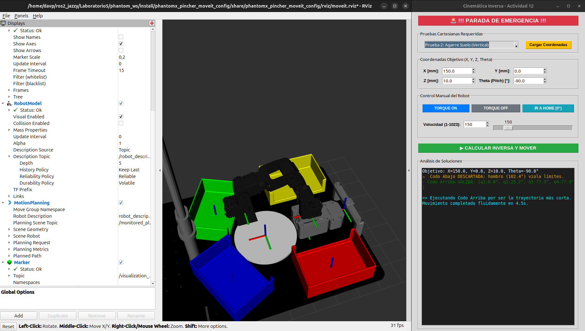
  <br>
  <b>Figura 14. Validación de cinemática inversa mostrando el descarte automático de la postura Codo Abajo por violar límites articulares.</b>
</div>


## 16. Actividad 13 – Enseñanza y repetición de poses

El objetivo de esta actividad es implementar un sistema de **Teach & Play**, que permita registrar manualmente diferentes configuraciones articulares del robot, almacenarlas en una secuencia y reproducirlas posteriormente de manera automática. Además, se incorporan funciones de control como ajuste de velocidad, activación y desactivación del torque, retorno a la posición HOME, parada de emergencia y almacenamiento permanente de las secuencias mediante archivos YAML.

<br>

<div align="center">
  
  <br>
  <b>Figura XX. Interfaz de enseñanza y repetición de poses de la actividad 13.</b>
</div>

<br>

### Descripción de la interfaz

La interfaz se divide en las siguientes secciones:

- **Control manual de articulaciones:** permite mover individualmente cada articulación mediante un *slider* y un *Spinbox*, respetando los límites mecánicos definidos para el robot.

- **Configuración de velocidad:** incorpora un control deslizante y un campo numérico para modificar en tiempo real la velocidad de movimiento de los servomotores.

- **Controles del robot:** incluye los botones **Torque ON**, **Torque OFF** e **Ir a HOME**, facilitando la preparación del robot para la enseñanza o la ejecución de movimientos.

- **Registro de poses (Teach):** permite asignar un nombre a la configuración actual y almacenarla dentro de la secuencia de trabajo.

- **Secuencia de poses:** muestra todas las poses registradas y ofrece herramientas para eliminar, limpiar, guardar o cargar secuencias mediante archivos YAML.

- **Reproducción (Playback):** permite definir el tiempo de transición entre poses y ejecutar automáticamente toda la secuencia registrada.

- **Consola de diagnóstico:** informa continuamente el estado del sistema, las operaciones realizadas y posibles mensajes de error.

### Funcionamiento interno del código

El programa está desarrollado sobre **ROS 2** y utiliza la clase `JointSelector` para controlar tanto el robot físico como la simulación.

Su funcionamiento se resume en los siguientes pasos:

- Controla manualmente las articulaciones mediante *sliders* y *Spinbox*, enviando comandos en tiempo real al robot.
- Permite capturar la posición actual leyendo directamente los valores reales de las articulaciones desde ROS 2.
- Almacena cada pose junto con un nombre dentro de una lista de secuencias.
- Guarda y carga dichas secuencias utilizando archivos **YAML**, permitiendo reutilizarlas posteriormente.
- Reproduce automáticamente todas las poses registradas, realizando transiciones suaves mediante `mover_simultaneo()`.
- Sincroniza la interfaz con el estado del robot durante la reproducción y permite detener el proceso mediante una parada de emergencia que desactiva inmediatamente el torque.


## 17. Actividad 14 – Trazado de una figura.

El objetivo de esta actividad es implementar un sistema capaz de generar trayectorias cartesianas para que el robot trace figuras geométricas e iniciales sobre un plano de trabajo. Para ello se emplea la cinemática inversa para convertir cada punto del recorrido en posiciones articulares, mientras que RViz permite visualizar el trazado en tiempo real mediante marcadores.

<br>

<div align="center">
  
  <br>
  <b>Figura 14. Interfaz y trazado de un círculo en la actividad 14.</b>
</div>

<br>

<div align="center">
  
  <br>
  <b>Figura 15. Interfaz y trazado de iniciales en la actividad 14.</b>
</div>

<br>

<div align="center">
  
  <br>
  <b>Figura 16. Interfaz y trazado de un triángulo en la actividad 14.</b>
</div>

<br>

### Descripción de la interfaz

La interfaz está organizada en las siguientes secciones:

- **Botones de seguridad:** incluyen parada de emergencia, detención del trazado y retorno a la posición HOME.
- **Configuración del trazado:** permite definir el tiempo de muestreo (*dt*) utilizado durante la interpolación de la trayectoria.
- **Dibujo geométrico:** incorpora botones para generar automáticamente un triángulo, un cuadrado o un círculo.
- **Trazado de iniciales:** permite ingresar hasta cinco letras para que el robot las dibuje de forma secuencial.
- **Consola de trazado:** muestra el progreso del recorrido, los puntos generados y los mensajes de estado del sistema.
- **Limpiar lienzo:** elimina todos los marcadores publicados en RViz para iniciar un nuevo dibujo.

### Funcionamiento interno del código

El programa utiliza **ROS 2**, **RViz** y la clase `JointSelector` para controlar el robot y visualizar el recorrido.

Su funcionamiento se resume en los siguientes pasos:

- Genera automáticamente los puntos que describen la figura geométrica o las letras seleccionadas.
- Interpola cada segmento del recorrido para obtener un movimiento continuo y suave.
- Calcula la cinemática inversa de cada punto cartesiano para obtener los ángulos articulares correspondientes.
- Envía las posiciones al robot mediante `mover_simultaneo()`, sincronizando el movimiento físico o simulado.
- Publica marcadores tipo **SPHERE** sobre el tópico `/visualization_marker`, permitiendo observar el trazado en tiempo real dentro de RViz.
- Implementa levantamiento del "lápiz" entre letras o trayectorias independientes, además de controles de parada, emergencia y retorno automático a HOME.

## 18. Actividad 15 – Reto final: coreografía robótica

La Actividad 15 desarrolla un sistema de control para ejecutar coreografías sincronizadas con música en el robot Phantom X Pincher. La aplicación incorpora una interfaz gráfica construida con Tkinter, reproducción de audio mediante Pygame y un motor de generación de movimientos basado en información extraída previamente de archivos CSV.

para esto se creo los archivos de `datos_pedro.csv` y `datos_dubidubidu.csv` donde se almacenan los diferentes parametros musicales como energía, frecuencia y detección de pulsos, que luegos seran cargados el programa. posteriormente transforma los parametros en posiciones para el robot generando el movimiento sincronizado con la musica con algoritmos como:

```python
b = 40.0 * onda_base * (0.5 + energia)
h = -30.0 + (freq * 120.0)
c = 30.0 - (freq * 120.0)
```

Los cuales va refrescando los valores con una frecuencia de **10 Hz** todo esto dentro de la función  `_hilo_coreografia()`.

Ademas, todo esto es controlado desde la siguiente interfaz grafica:


<br>

<div align="center">
  
  <br>
  <b>Figura 14.Interfaz de coreografia actividad 14.</b>
</div>

<br>

La interfaz está organizada en las siguientes secciones:

- **Línea de tiempo:** incorpora controles independientes para la música y el robot, permitiendo desplazarse manualmente a cualquier instante de la coreografía.
- **Configuración de ejecución:** permite seleccionar entre el modo de simulación en RViz o el modo de robot físico, además de ajustar el desfase temporal entre el audio y el movimiento.
- **Control de velocidad:** permite modificar la velocidad de los servomotores Dynamixel durante la ejecución de la rutina.
- **Botones de seguridad:** incluyen parada de emergencia, pausa y reanudación, detención completa de la coreografía y retorno automático a la posición HOME.
- **Selección de canciones:** presenta dos coreografías predefinidas, **Dubidubidu** y **Pedro (Mapache)**, cada una con su respectiva imagen de referencia.
- **Monitor cinemático:** muestra en tiempo real las posiciones articulares objetivo (Set) y las posiciones reales del robot (Read), permitiendo supervisar el seguimiento del movimiento.
- **Consola de eventos:** registra el avance de la coreografía, la letra de la canción, cambios de estado y mensajes de sincronización.


## 19. Videos Demostrativos

Conforme a los lineamientos de la guía del laboratorio, los videos correspondientes a las actividades evaluables inician con la introducción oficial de LabSIR. A continuación se presentan los enlaces de sustentación:

### 19.1. Validación Técnica
Recopilación del movimiento individual, movimiento simultáneo y secuencial, enseñanza y repetición de poses, y el trazado de figuras.

<br>
<div align="center">
  <a href="https://youtu.be/A48t1KLzZDM?si=LCfVQ4xWSsECllgt" target="_blank">
    
  </a>
</div>
<br>

### 19.2. Coreografía Robótica
Ejecución completa, continua y sin cortes de la rutina musical sincronizada (superando el tiempo mínimo de 45 segundos).

<br>
<div align="center">
  <a href="https://youtu.be/o6iyQebOjjw?si=7CmAMvReRMZWVVGg" target="_blank">
    
  </a>
</div>
<br>

---

## 20. [Bonus] Trabajo con el robot físico

Debido a las restricciones de tiempo, el alcance evaluable de este laboratorio se centró en el entorno de simulación (RViz). Sin embargo, en esta sección se documenta el trabajo adicional y la transferencia de código realizada sobre el hardware real del **Phantom X Pincher X100**. 

Para evidenciar el comportamiento de los nodos de ROS 2 comunicándose directamente con los servomotores Dynamixel físicos, se estructuró un único **Video Bonus**. Este clip recopila de forma dinámica y con música de fondo las pruebas físicas exitosas que complementan el análisis virtual desarrollado en las actividades anteriores.

<br>
<div align="center">
  <a href="[Insertar_link_de_YouTube_aquí]" target="_blank">
    
  </a>
</div>
<br>

---

## 21. Conclusiones individuales

**David Felipe Cárdenas Cubides:**
> * **Análisis de trayectorias:** La implementación de diferentes perfiles de movimiento demostró que la interpolación cúbica simultánea es fundamental para preservar la vida útil de los actuadores físicos, ya que mitiga las vibraciones mecánicas y los picos de aceleración que sí se presentan durante las rutinas secuenciales y de interpolación lineal.
> * **Diseño de interfaces e integración:** El desarrollo de las GUI interactuando directamente con los nodos de ROS 2 facilitó enormemente la abstracción del control robótico. Sistemas como el *Teach & Play* basado en el registro continuo de archivos YAML comprobaron que una buena interfaz agiliza sustancialmente la programación de tareas repetitivas de paletizado o posicionamiento.
> * **Sincronización de señales en tiempo real:** La resolución del reto final de coreografía evidenció la flexibilidad estructural de ROS 2 para acoplar librerías de análisis externo (como el procesamiento de energía y frecuencias de audio) con comandos de posición articular, logrando un control dinámico y sostenido a una frecuencia estable de 10 Hz sin desfasar el sistema.

**David Santiago Pirateque Suárez:**
> * **Modelado cinemático y marcos de referencia:** El cálculo matemático mediante la convención de Denavit-Hartenberg y el desacople cinemático resultó altamente preciso. Sin embargo, el contraste analítico contra RViz subrayó la necesidad imperativa de contemplar los *offsets* geométricos y las transformaciones espaciales fijas declaradas en el URDF del manipulador para empalmar correctamente el modelo teórico con el efector final real.
> * **Gestión de límites y seguridad mecatrónica:** La programación de validaciones restrictivas previas a la ejecución del movimiento resultó ser el componente de seguridad más crítico del laboratorio. Descartar algorítmicamente posturas matemáticamente válidas pero mecánicamente inviables (como forzar el hombro en configuraciones de *codo abajo* extremas) previno colisiones inminentes y garantizó la integridad de los servomotores Dynamixel.
> * **Simulación como gemelo digital:** Operar el entorno de desarrollo y visualización sobre Ubuntu 24.04 aislando la lógica de control en RViz permitió depurar errores de código sin arriesgar el hardware. Esta metodología demostró que un nodo de ROS 2 estructurado correctamente en simulación funciona como un gemelo digital efectivo, permitiendo una migración casi directa y confiable hacia las pruebas con el robot físico.
