<div align="center">
<picture>
    <source srcset="https://imgur.com/5bYAzsb.png" media="(prefers-color-scheme: dark)">
    <source srcset="https://imgur.com/Os03JoE.png" media="(prefers-color-scheme: light)">
    
</picture>

<h3>Curso de Robótica 2026-I</h3>
<h1>Laboratorio No. 05</h1>
<h2>Phantom X Pincher X100 – ROS 2 Jazzy – RViz</h2>
<h4>Profesores: Pedro Fabián Cárdenas Herrera · Manuel Felipe Carranza Montenegro</h4>
<h4>Estudiantes: David Felipe Cárdenas Cubides · David Santiago Pirateque Suárez </h4>

<p>
  
  
  
  
  
</p>

<br>
<br>
<b>Figura 1. Robot Phantom X Pincher X100.</b>
</div>


# Laboratorio No. 05: Phantom X Pincher X100 – ROS 2 Jazzy – RViz.

## 1. Objetivos

- Controlar las articulaciones del modelo simulado del Phantom X Pincher X100 en ROS 2 Jazzy.
- Medir y modelar la geometría del manipulador.
- Implementar movimientos individuales, simultáneos, secuenciales e interpolados sobre el modelo en RViz.
- Aplicar cinemática directa e inversa validando contra la pose observada en RViz.
- Programar trayectorias, repetición de poses y una tarea artística (trazado) y una coreografía, todo en simulación.


## 2. Estructura del repositorio


```
├── README.md                     <- este documento
├──phantom_ws/
│   ├── src/
│   │   ├── phantomx_pincher/                 # Metapaquete: launch de alto nivel
│   │   │   └── launch/
│   │   │       ├── fake.launch.py            # MoveIt2 + ros2_control FAKE (RViz)  ← usado en este laboratorio
│   │   │       └── gz.launch.py              # MoveIt2 + Gazebo (no usado aquí)
│   │   │
│   │   ├── phantomx_pincher_description/     # URDF/xacro + mallas STL/DAE del robot
│   │   │   ├── urdf/phantomx_pincher.urdf.xacro
│   │   │   ├── meshes/STL/ ...               # Mallas para medición (Actividad 3)
│   │   │   ├── launch/display.launch.py      # RViz + robot_state_publisher standalone
│   │   │   └── scripts/                      # Conversión xacro → URDF/SDF
│   │   │       ├── xacro2urdf.bash
│   │   │       ├── xacro2sdf.bash
│   │   │       └── xacro2sdf_direct.bash
│   │   │
│   │   ├── phantomx_pincher_bringup/         # Lanzamiento integrado sim/real
│   │   │   └── launch/phantomx_pincher.launch.py   # arg use_real_robot (true/false)
│   │   │
│   │   ├── phantomx_pincher_moveit_config/   # Configuración de MoveIt 2
│   │   │   ├── config/
│   │   │   │   ├── joint_limits.yaml
│   │   │   │   ├── kinematics.yaml
│   │   │   │   ├── controllers_position.yaml
│   │   │   │   ├── phantomx_pincher.srdf
│   │   │   │   └── ompl_planning.yaml
│   │   │   └── scripts/                      # Conversión xacro → SRDF
│   │   │       └── xacro2srdf.bash
│   │   │
│   │   ├── phantomx_pincher_interfaces/      # Mensajes propios
│   │   │   └── msg/PoseCommand.msg           # x, y, z, roll, pitch, yaw, cartesian_path
│   │   │
│   │   ├── phantomx_pincher_commander_cpp/   # Wrapper en C++ de MoveGroupInterface
│   │   │   └── src/ (commander, test_moveit) # Traduce PoseCommand → movimientos de MoveIt
│   │   │
│   │   ├── phantomx_pincher_demos/           # Ejemplos oficiales del kit (base para varias actividades)
│   │   │   └── (ex_joint_goal.py, ex_pose_goal.py, ex_gripper.py, ex_servo.py,
│   │   │        ex_collision_primitive.py, ex_collision_mesh.py,
│   │   │        demo_pick_and_place.py, demo_observe_scene.py)
│   │   │
│   │   ├── pincher_control/                  # Paquete propio: control articular + cinemática
│   │   │   ├── control_servo.py              # Clase PincherController (DH + IK con roboticstoolbox,
│   │   │   │                                 #   GUI Tkinter, publica /joint_states)
│   │   │   └── follow_joint_trajectory_node.py # Puente MoveIt ↔ Dynamixel (solo robot real)
│   │   │
│   │   └── pincher_cproyect/                 # Paquete propio: tarea de aplicación
│   │       └── pincher_cproyect/mover.py     # Nodo "mover": recibe comandos por tópico /Bring
│   │                                         #   (colores) o teclado, publica PoseCommand,
│   │                                         #   controla pinza y ventosa (Arduino)
│   │
│   └── scripts/                              # Scripts sueltos (no empaquetados) por actividad,
│       │                                     #   ejecutados directamente con `python3`, 100% simulación
│       │                                     #   (publican /joint_states, sin Dynamixel real)
│       ├── joint_selector_act4.py            # Clase JointSelector base (API: habilitar_torque,
│       │                                     #   mover_articulacion, mover_simultaneo, leer_todas...)
│       ├── joint_selector_act4_gui.py        # Misma API + GUI Tkinter con sliders por articulación
│       ├── joint_seletor_act4.py             # (duplicado/variante con GUI; nombre con typo)
│       ├── act4.py                           # Actividad 4 – movimiento individual (control directo AX-12)
│       ├── act7.py                           # Actividad 7 – movimiento simultáneo (usa joint_selector_act4)
│       ├── act8.py                           # Actividad 8 – movimiento secuencial (usa joint_selector_act4_gui)
│       ├── act9.py                           # Actividad 9 – interpolación lineal/cúbica + gráficas (matplotlib)
│       ├── act13.py                          # Actividad 13 – enseñanza y repetición de poses (Tkinter + YAML)
│       ├── act14_draw_shape_phantomx.py      # Actividad 14 – trazado de figura (IK + Marker en RViz)
│       ├── act15.py                          # Actividad 15 – coreografía (secuencia J1-J4+pinza con timestamps)
│       └── calibrar_geometria.py             # Diagnóstico de geometría real vía TF (calibración L1-L4)
└── Images/  

```


---

## 3. Puesta en marcha 

Ya teniendo configurado el entorno con los archivos correspondientes para ejecutar los comandos de movimiento, es necesario iniciar el entorno de trabajo cargando la descripción del robot en ROS 2. Esto permite el reconocimiento de los diferentes componentes del manipulador, así como su visualización e interacción en RViz.

Para ello, se deben ejecutar los siguientes comandos en una terminal:

* **Acceder al espacio de trabajo.**

```bash
cd ~/phantom_ws
```

* **Instalación de Dependencias del Sistema.**

```bash
sudo apt update
sudo apt install python3-tk python3-numpy python3-matplotlib python3-yaml python3-venv ros-jazzy-visualization-msgs
```


* **Compilar el paquete de descripción.**

```bash
# Carga de la instalación base de ROS 2
source /opt/ros/jazzy/setup.bash

# Compilación del proyecto
colcon build
```


* ** Creación del Entorno Virtual**

```bash
# Creación del entorno virtual
python3 -m venv mi_entorno

# Activación del entorno virtual
source mi_entorno/bin/activate

# Instalación de dependencias de audio e interfaz gráfica
pip install librosa pandas pygame pillow
```

* **Cargar el entorno de trabajo.**

```bash
source install/setup.bash
```

* **Inicializar la simulación.**

```bash
ros2 launch phantomx_pincher_description view.launch.py
```

La ejecución de estos comandos permite:

* Calcular y publicar las transformaciones entre los diferentes eslabones del robot.
* Generar una interfaz gráfica para modificar manualmente los valores de las articulaciones.
* Abrir la herramienta de visualización RViz, la cual representa el modelo tridimensional del robot y permite verificar que la configuración del manipulador sea correcta.


## 4. Actividad 1 – Preparación del robot 

Como resultado de la anterior ejecucion de comandos, se obtiene la siguiente ventana de visualización y control:

<br>

<div align="center">
  
  <br>
  <b>Figura 2. Ventana de visualización y control en RViz.</b>
</div>

<br>

donde se tienen los diferentes elementos del ensamble y el robot en su posición home.

## 5. Actividad 2 – Identificación de motores y articulaciones 


<br>

<div align="center">

| Articulación (URDF) | ID Dynamixel | Signo aplicado | Función |
|---|---|---|---|
| `phantomx_pincher_arm_shoulder_pan_joint` (Base) | 1 | +1 | Rotación de la base |
| `phantomx_pincher_arm_shoulder_lift_joint` (Hombro) | 2 | −1 | Eleva/baja el brazo |
| `phantomx_pincher_arm_elbow_flex_joint` (Codo) | 3 | −1 | Flexión del codo |
| `phantomx_pincher_arm_wrist_flex_joint` (Muñeca) | 4 | −1 | Orientación de la pinza |
| `phantomx_pincher_gripper_finger1_joint` (Pinza) | 5 | +1 | Apertura/cierre (dedo 2 es *mimic*) |

</div>

<br>


## 6. Actividad 3 – Medición del robot
Se tomaron las medidas de los diferentes eslabones del manipulador utilizando principalmente las dimensiones obtenidas de las mallas STL del modelo 3D. A partir de estas mediciones se determinaron los parámetros geométricos empleados en el desarrollo de la cinemática del robot, obteniéndose los siguientes valores:

Dando como resultado:

<br>

<div align="center">

| Parámetro                                  |                                Valor |
| ------------------------------------------ | -----------------------------------: |
| L1 (altura de la base al hombro)           |                              44.0 mm |
| L2 (hombro al codo)                        |                             107.5 mm |
| L3 (codo a la muñeca)                      |                             107.5 mm |
| L4 (muñeca al TCP)                         |                              75.3 mm |
| Alcance radial máximo (`PLANAR_REACH_MAX`) |          L2 + L3 + L4 = **290.3 mm** |
| Alcance radial mínimo (`PLANAR_REACH_MIN`) |                            **40 mm** |
| Alcance vertical (`Z_MIN`–`Z_MAX`)         | 0 – (L1 + L2 + L3 + L4) = **334.3 mm**  |

</div>

<br>

Estos parámetros representan las dimensiones geométricas del manipulador y constituyen la base para el cálculo de la cinemática directa e inversa, así como para la definición de los límites del espacio de trabajo utilizados durante la planificación de trayectorias.


## 7. Actividad 4 – Movimiento individual de articulaciones

Para esta actividad se desarrolló un programa en Python capaz de interactuar con el modelo del robot en RViz, generando una interfaz gráfica que permite configurar las posiciones de las articulaciones de forma manual o ejecutar una secuencia de movimiento automática.

Para ejecutar este programa, primero se debe cerrar la interfaz de **Joint State Publisher** iniciada anteriormente y, posteriormente, ejecutar los siguientes comandos en una nueva terminal:

```bash
source /opt/ros/jazzy/setup.bash
cd ~/phantom_ws/scripts
python3 actividad4.py
```

Al ejecutar el programa, se abrirá la siguiente ventana de control:

<br>

<div align="center">
  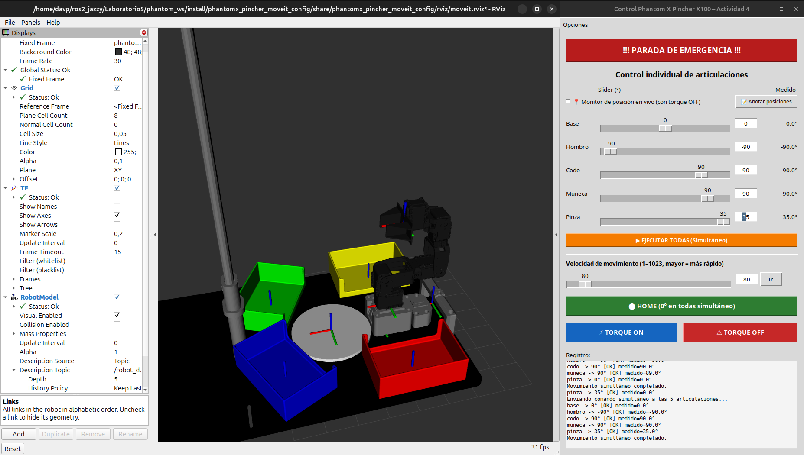
  <br>
  <b>Figura 3. Interfaz de control actividad 4.</b>
</div>

<br>

La interfaz permite controlar cada una de las articulaciones del manipulador mediante controles deslizantes (*sliders*), de forma similar a la ventana del **Joint State Publisher**. Sin embargo, incorpora funcionalidades adicionales, como el botón **`Demo automática`**, el cual ejecuta una secuencia de movimientos predefinida o un slider de control de velocidad. Ademas de incorporar las funciones de activación y desactivación del torque.

Durante esta demostración, cada articulación se mueve de manera independiente, recorriendo cinco posiciones diferentes dentro de su rango de operación. Una vez finaliza la secuencia de un eje, este regresa a su posición inicial (0°) antes de continuar con el siguiente, lo que facilita la verificación individual del movimiento de cada articulación y la correcta configuración del modelo.

<br>

<div align="center">
  
  <br>
  <b>Figura 4. Movimiento del robot eje por eje.</b>
</div>

<br>


## 8. Actividad 5 – Calibración de cero y error articular

La Actividad 5 consiste en el desarrollo de un asistente gráfico para calibrar el cero mecánico y evaluar el error de posicionamiento de cada articulación del robot **Phantom X Pincher X100**. La aplicación fue desarrollada en **Python**, utilizando **Tkinter** para la interfaz gráfica, **ROS 2** para la comunicación con el robot y **Matplotlib** junto con **NumPy** para el análisis y la generación de gráficas.

La interfaz permite seleccionar la articulación que se desea evaluar, visualizar su posición en tiempo real y ejecutar una rutina automática de calibración basada en cinco posiciones de referencia previamente definidas para cada articulación.

<div align="center">
  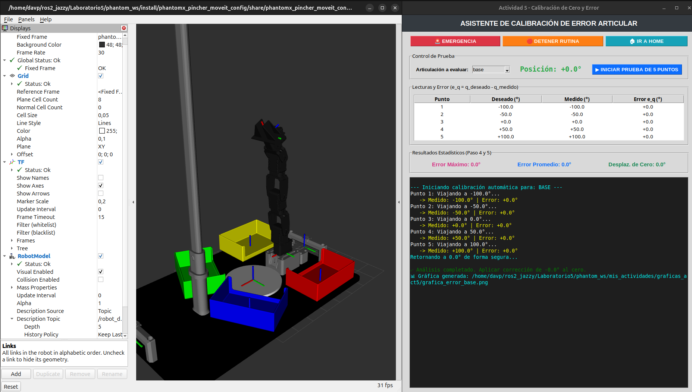
  <br>
  <b>Figura 5. Interfaz gráfica de la Actividad 5.</b>
</div>

<br>

La interfaz está organizada en cinco secciones principales:

- **Panel de seguridad**, con los botones de **Emergencia**, **Detener rutina** e **Ir a Home**.
- **Panel de control**, donde se selecciona la articulación, se visualiza su posición actual y se inicia la prueba automática.
- **Tabla de resultados**, que registra la posición deseada, la posición medida y el error obtenido en cada punto.
- **Panel estadístico**, que muestra el error máximo, el error promedio y el desplazamiento del cero.
- **Consola**, donde se informa el avance de la calibración.

Durante la prueba, el robot recorre automáticamente cinco posiciones de referencia. En cada una se mide el ángulo real mediante el método `leer_posicion()` y se calcula el error articular utilizando la expresión:

\[
e_q=q_{deseado}-q_{medido}
\]

Finalizada la rutina, el robot regresa automáticamente a la posición **Home (0°)** y el sistema calcula el **error máximo**, el **error promedio** y el **desplazamiento del cero**, mostrando estos resultados en la interfaz. Además, se genera una gráfica comparando las posiciones deseadas con las posiciones medidas, la cual se almacena automáticamente en la carpeta `graficas_act5` para documentar el proceso de calibración.


## 9. Actividad 6 – Límites seguros

La Actividad 6 tiene como objetivo determinar los límites seguros de operación de cada articulación del robot **Phantom X Pincher X100** mediante un procedimiento de calibración manual. La aplicación fue desarrollada en **Python** utilizando **Tkinter** para la interfaz gráfica y **ROS 2** para la comunicación con el robot a través de la clase `JointSelector`.

A diferencia de la actividad anterior, en esta práctica el **torque de los motores se desactiva automáticamente**, permitiendo que el usuario pueda mover manualmente cada articulación hasta sus topes mecánicos. Posteriormente, el sistema registra ambos extremos y calcula un rango seguro de operación aplicando un margen de seguridad configurable.

<br>

<div align="center">
  
  <br>
  <b>Figura 6. Interfaz de calibración actividad 6.</b>
</div>

<br>

La interfaz se organiza en cuatro secciones principales:

- **Configuración global**, donde se define el margen de seguridad que será aplicado a todas las articulaciones.
- **Panel de calibración**, desde el cual se selecciona la articulación, se observa su posición en tiempo real y se registran los dos extremos de movimiento.
- **Tabla de resultados**, donde se muestran los límites seguros calculados para cada articulación.
- **Consola**, utilizada para informar el progreso del proceso y las acciones realizadas por el usuario.

Durante la calibración, el usuario mueve manualmente cada articulación hasta sus dos topes mecánicos y registra ambas posiciones. El sistema calcula automáticamente el límite inferior y el límite superior seguros aplicando el margen configurado, almacenando posteriormente toda la información en archivos **JSON** y **CSV** para ser utilizada en actividades posteriores.

Los límites seguros obtenidos para el robot fueron los siguientes:

<br>

<div align="center">

| Articulación | Límite inferior | Límite superior | Margen de seguridad |
| :--- | :---: | :---: | :---: |
| **Base** | -145.0° | 145.0° | 5.0° |
| **Hombro** | -96.0° | 96.0° | 4.0° |
| **Codo** | -138.0° | 144.0° | 6.0° |
| **Muñeca** | -106.0° | 124.0° | 4.0° |
| **Pinza** | -35.0° | 35.0° | 5.0° |

</div>

<br>

Estos valores constituyen el rango de operación seguro del manipulador y son utilizados como restricciones durante el desarrollo de las actividades posteriores, evitando que el robot alcance posiciones cercanas a los topes mecánicos y reduciendo el riesgo de daños en los servomotores o en la estructura del manipulador.
## 10. Actividad 7 – Movimiento simultáneo

Para esta actividad se desarrolló un programa en Python cuyo objetivo es ejecutar una secuencia de movimientos simultáneos de todas las articulaciones del manipulador.

La secuencia de movimiento está compuesta por cinco configuraciones articulares, las cuales se ejecutan de forma consecutiva. Cada configuración define los ángulos objetivo de las articulaciones de la base, hombro, codo, muñeca y pinza, como se muestra a continuación:

<br>

<div align="center">

| Configuración | Base | Hombro | Codo | Muñeca | Pinza |
|------------:|---:|---:|---:|---:|---:|
| 1 | 0° | 0° | 0° | 0° | 0° |
| 2 | 25° | 25° | 20° | -20° | 0° |
| 3 | -35° | 35° | -30° | 30° | 0° |
| 4 | 85° | -20° | 55° | 25° | 0° |
| 5 | 80° | -35° | 55° | -45° | 0° |

</div>

<br>

En cada etapa, todas las articulaciones se desplazan simultáneamente hasta alcanzar la configuración objetivo mediante la función `mover_simultaneo()`. Una vez alcanzada la posición, el programa realiza una pausa de tres segundos para facilitar la observación de la postura antes de continuar con la siguiente configuración.

Al finalizar la secuencia, el manipulador regresa automáticamente a la posición HOME (0°, 0°, 0°, 0°, 0°), deshabilita el torque de los servomotores y cierra el nodo de ROS 2 de forma segura.


<br>

<div align="center">
  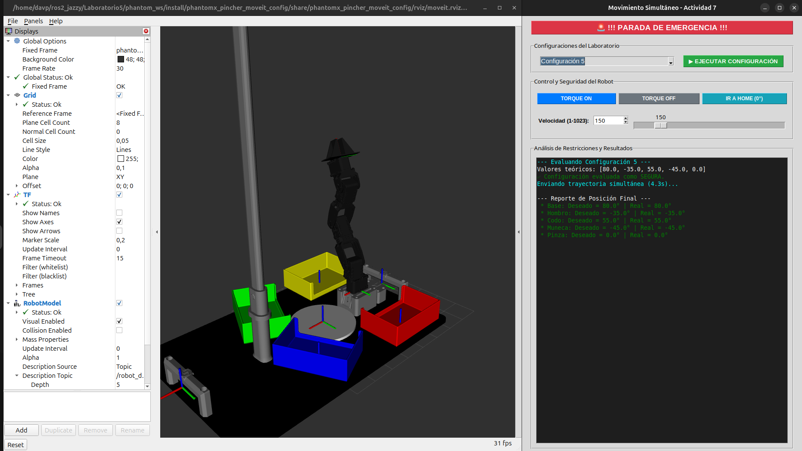
  <br>
  <b>Figura 7. Interfaz de Movimiento simultaneo actividad 7.</b>
</div>

<br>

## 11. Actividad 8 – Movimiento secuencial

Para esta actividad se desarrolló un programa en Python cuyo objetivo es ejecutar un **movimiento secuencial** de las articulaciones del manipulador. A diferencia de la actividad anterior, donde todas las articulaciones se desplazaban simultáneamente hasta alcanzar una configuración determinada, en esta práctica cada articulación se mueve de forma independiente siguiendo un orden preestablecido.

Inicialmente, el robot es llevado a la posición **HOME** (0°, 0°, 0°, 0°, 0°) mediante un movimiento simultáneo, garantizando que todas las articulaciones comiencen desde una misma referencia. Posteriormente, se define una configuración objetivo:

```python
config = {
    "base": 85.0,
    "hombro": -20.0,
    "codo": 55.0,
    "muneca": 25.0,
    "pinza": 0.0
}
```

La secuencia de movimiento se establece mediante la lista:

```python
orden = ["base", "hombro", "codo", "muneca", "pinza"]
```

De esta forma, las articulaciones se desplazan una a una en el siguiente orden:

1. Base → 85°
2. Hombro → -20°
3. Codo → 55°
4. Muñeca → 25°
5. Pinza → 0°

Cada movimiento se realiza mediante la función `mover_articulacion()`, esperando **1,5 segundos** antes de continuar con la siguiente articulación. Durante la ejecución, el programa muestra en la terminal la articulación que se está moviendo y el ángulo objetivo correspondiente, además de medir el tiempo total empleado para completar la secuencia.

Una vez alcanzada la configuración final, el robot permanece unos segundos en dicha posición para facilitar la observación del resultado. Posteriormente, el manipulador regresa a la posición HOME siguiendo el **orden inverso**, definido en el código como:

```python
orden_inverso = ["pinza", "muneca", "codo", "hombro", "base"]
```

Por lo tanto, el retorno se realiza con la siguiente secuencia:

1. Pinza → 0°
2. Muñeca → 0°
3. Codo → 0°
4. Hombro → 0°
5. Base → 0°

Finalmente, se ejecuta un movimiento simultáneo para asegurar que todas las articulaciones hayan regresado correctamente a la posición HOME, tras lo cual se deshabilita el torque de los servomotores y se finaliza la ejecución del nodo de ROS 2.

<br>

<div align="center">
  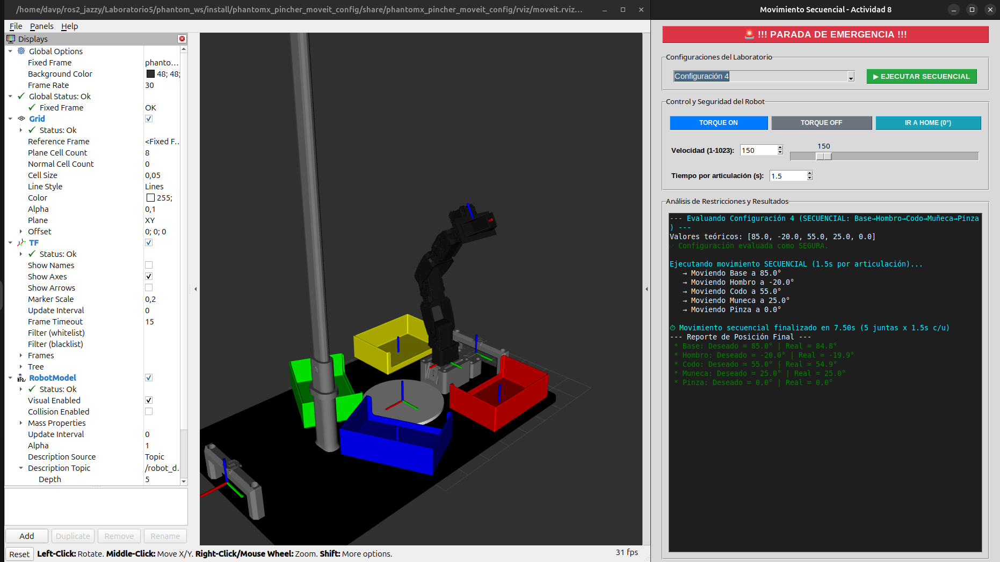
  <br>
  <b>Figura 8.Interfaz de Movimiento secuencial actividad 8.</b>
</div>

<br>

## 12. Actividad 9 – Interpolación de trayectorias

El objetivo de esta actividad es comparar el comportamiento de dos métodos de interpolación de trayectorias, **lineal** y **cúbica**, para el movimiento de las cinco articulaciones del robot. La aplicación permite definir las configuraciones inicial y final, ejecutar ambos movimientos y analizar las diferencias mediante gráficas de posición angular respecto al tiempo.

<br>

<div align="center">
  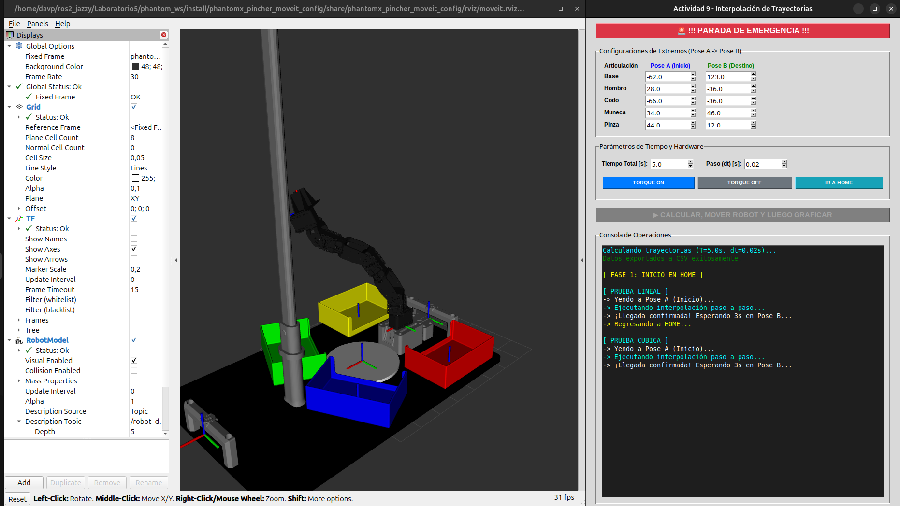
  <br>
  <b>Figura 9. Interfaz de interpolación de trayectoria de la actividad 9.</b>
</div>

<br>

La interfaz está dividida en cuatro secciones principales. La primera permite configurar la **Pose A** y la **Pose B** para cada una de las cinco articulaciones mediante controles numéricos. La segunda contiene los parámetros de ejecución, donde se establece el tiempo total del movimiento y el paso de integración (`dt`), además de los controles para habilitar o deshabilitar el torque y regresar el robot a la posición **Home**. La tercera corresponde al botón principal de ejecución, encargado de calcular las trayectorias y realizar el movimiento del robot. Finalmente, la parte inferior incorpora una consola donde se muestra el estado de la ejecución y los mensajes del proceso, junto con un botón de **Parada de Emergencia** disponible durante toda la operación.

El funcionamiento interno del programa comienza calculando las trayectorias mediante la función `calcular_trayectorias_multiples()`, la cual genera los puntos correspondientes a las interpolaciones lineal y cúbica para cada articulación. Posteriormente, la rutina `_rutina_completa()` ejecuta ambos movimientos sobre el robot, exporta los datos obtenidos al archivo `trayectorias_act9.csv` y, una vez finalizada la ejecución, llama a `_dibujar_graficas_finales()` para generar las gráficas comparativas de posición angular en función del tiempo.

<br>

<div align="center">
  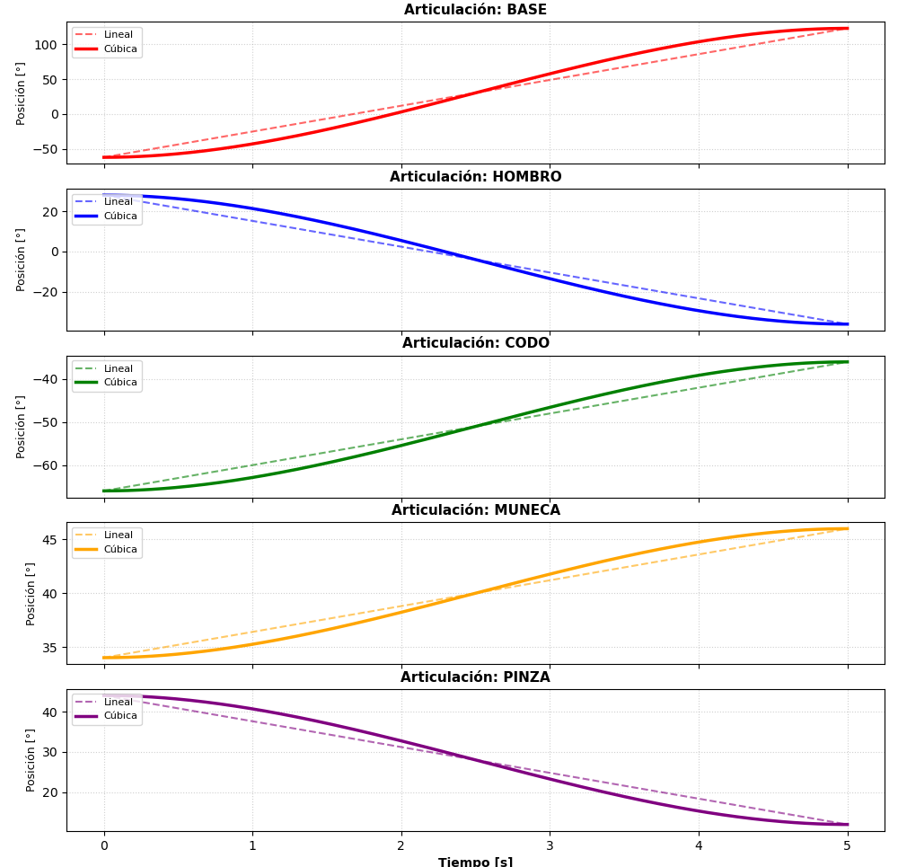
  <br>
  <b>Figura 10. Gráficas de posición angular en función del tiempo para las interpolaciones lineal y cúbica.</b>
</div>

<br>

Las gráficas muestran la evolución de la posición de cada articulación durante el movimiento. En ellas se observa que la interpolación lineal genera una variación uniforme de la posición, mientras que la interpolación cúbica produce una transición más suave al inicio y al final de la trayectoria, reduciendo los cambios bruscos de velocidad y proporcionando un movimiento más continuo.


## 13. Actividad 10 – Trayectoria sinusoidal

Para esta actividad se desarrolló un programa en Python que implementa una **interfaz gráfica de usuario (GUI)** para generar trayectorias sinusoidales en cualquiera de las articulaciones del manipulador. La interfaz permite seleccionar la articulación, definir la posición central ((q_0)), la amplitud, la frecuencia y el tiempo de ejecución de la trayectoria.

<br>

<div align="center">
  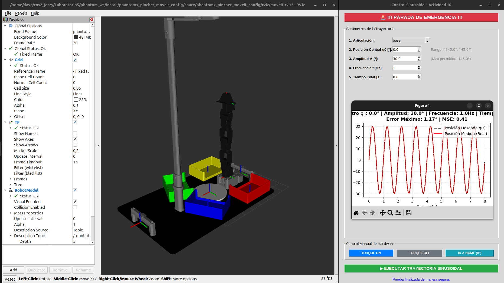
  <br>
  <b>Figura 10.Interfaz de control sinusoidal actividad 10.</b>
</div>

<br>

El movimiento de la articulación se calcula mediante la ecuación:

```text
q(t)=q_0+A\cdot\sin(2\pi ft)
```

Durante la ejecución, el programa registra la posición deseada y la posición real de la articulación para generar una gráfica comparativa al finalizar la prueba, en la cual también se calculan el **error máximo** y el **error cuadrático medio (MSE)**.

Adicionalmente, la interfaz incorpora funciones de seguridad y control, como los botones **Torque ON**, **Torque OFF**, **Ir a HOME** y **Parada de Emergencia**, además de verificar automáticamente que la posición central y la amplitud seleccionadas permanezcan dentro de los límites de operación del manipulador antes de ejecutar la trayectoria.


## 14. Actividad 11 – Cinemática directa


El objetivo de esta actividad es calcular la **cinemática directa** del manipulador empleando la convención de **Denavit-Hartenberg (DH)**. A partir de los valores articulares ingresados por el usuario, el programa determina la posición del efector final (**X, Y y Z**) y su orientación mediante los ángulos de **Roll, Pitch y Yaw**, además de ejecutar el movimiento correspondiente en el robot o en la simulación.

<br>

<div align="center">
  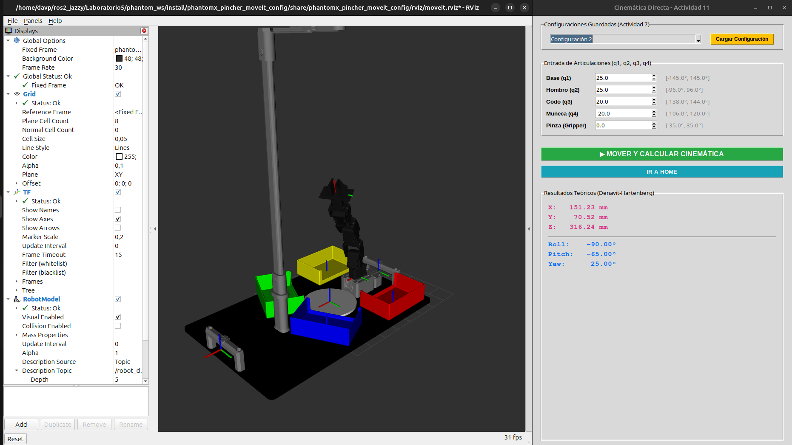
  <br>
  <b>Figura 11.Interfaz de cinemática directa actividad 11.</b>
</div>

<br>

La interfaz está organizada en cuatro secciones principales. La primera permite seleccionar alguna de las configuraciones previamente almacenadas durante la **Actividad 7** para cargarlas automáticamente. La segunda contiene los controles numéricos para ingresar manualmente los valores articulares de la base, hombro, codo, muñeca y pinza, respetando los límites seguros definidos previamente. La tercera incorpora los botones para ejecutar el cálculo de la cinemática directa y regresar el robot a la posición **Home**. Finalmente, la parte inferior muestra los resultados calculados, incluyendo la posición del efector final en **X, Y y Z** y su orientación mediante los ángulos **Roll, Pitch y Yaw**.

El funcionamiento interno del programa comienza obteniendo los valores articulares ingresados por el usuario. Posteriormente, la función `matriz_dh()` construye las matrices homogéneas correspondientes a cada eslabón utilizando los parámetros de Denavit-Hartenberg, mientras que `_calcular_dh()` realiza la multiplicación secuencial de dichas matrices para obtener la transformación homogénea del efector final. Finalmente, la función `extraer_xyz_rpy()` calcula la posición y la orientación del efector final, mostrando los resultados en la interfaz y ejecutando simultáneamente el movimiento del robot mediante la función `_ejecutar_cinematica()`.


## 15. Actividad 12 – Cinemática inversa

La **Actividad 12** implementa la cinemática inversa del robot **Phantom X Pincher X100**, permitiendo calcular los ángulos articulares necesarios para alcanzar una posición cartesiana definida por **X, Y, Z** y la orientación **θ (pitch)**. Además, valida las soluciones obtenidas y ejecuta el movimiento del robot en simulación o en el sistema físico.

<br>

<div align="center">
  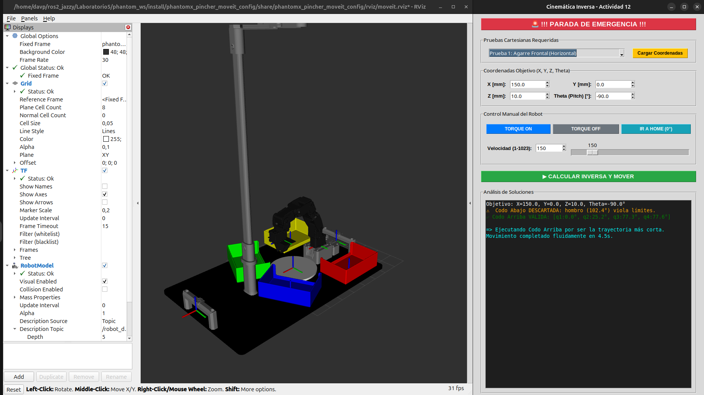
  <br>
  <b>Figura 12. Interfaz de cinemática inversa actividad 12.</b>
</div>

<br>

La interfaz está organizada en las siguientes secciones:

- **Parada de emergencia:** desactiva inmediatamente el torque de los motores.
- **Pruebas cartesianas:** permite cargar posiciones de prueba predefinidas.
- **Coordenadas objetivo:** ingreso manual de los valores **X, Y, Z** y **θ**.
- **Control del robot:** botones para activar/desactivar el torque, regresar a **Home** y ajustar la velocidad mediante un deslizador y un cuadro numérico.
- **Consola:** muestra las soluciones calculadas, las descartadas por límites de seguridad y el estado de la ejecución.

El algoritmo convierte las coordenadas cartesianas al modelo del robot y calcula las posibles soluciones de **codo arriba** y **codo abajo** utilizando relaciones trigonométricas y el teorema del coseno. Posteriormente verifica que cada solución cumpla los límites seguros definidos en la Actividad 6, selecciona la trayectoria válida que requiere el menor desplazamiento desde la posición actual y envía el movimiento al robot mediante ROS 2.

## 16. Actividad 13 – Enseñanza y repetición de poses

El objetivo de esta actividad es implementar un sistema de **Teach & Play**, que permita registrar manualmente diferentes configuraciones articulares del robot, almacenarlas en una secuencia y reproducirlas posteriormente de manera automática. Además, se incorporan funciones de control como ajuste de velocidad, activación y desactivación del torque, retorno a la posición HOME, parada de emergencia y almacenamiento permanente de las secuencias mediante archivos YAML.

<br>

<div align="center">
  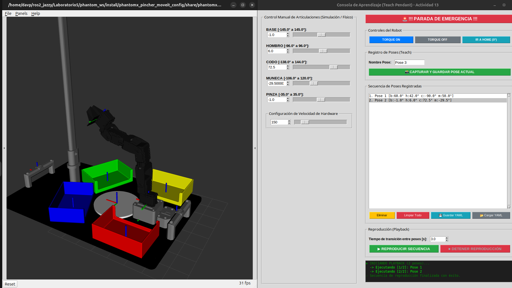
  <br>
  <b>Figura XX. Interfaz de enseñanza y repetición de poses de la actividad 13.</b>
</div>

<br>

### Descripción de la interfaz

La interfaz se divide en las siguientes secciones:

- **Control manual de articulaciones:** permite mover individualmente cada articulación mediante un *slider* y un *Spinbox*, respetando los límites mecánicos definidos para el robot.

- **Configuración de velocidad:** incorpora un control deslizante y un campo numérico para modificar en tiempo real la velocidad de movimiento de los servomotores.

- **Controles del robot:** incluye los botones **Torque ON**, **Torque OFF** e **Ir a HOME**, facilitando la preparación del robot para la enseñanza o la ejecución de movimientos.

- **Registro de poses (Teach):** permite asignar un nombre a la configuración actual y almacenarla dentro de la secuencia de trabajo.

- **Secuencia de poses:** muestra todas las poses registradas y ofrece herramientas para eliminar, limpiar, guardar o cargar secuencias mediante archivos YAML.

- **Reproducción (Playback):** permite definir el tiempo de transición entre poses y ejecutar automáticamente toda la secuencia registrada.

- **Consola de diagnóstico:** informa continuamente el estado del sistema, las operaciones realizadas y posibles mensajes de error.

### Funcionamiento interno del código

El programa está desarrollado sobre **ROS 2** y utiliza la clase `JointSelector` para controlar tanto el robot físico como la simulación.

Su funcionamiento se resume en los siguientes pasos:

- Controla manualmente las articulaciones mediante *sliders* y *Spinbox*, enviando comandos en tiempo real al robot.
- Permite capturar la posición actual leyendo directamente los valores reales de las articulaciones desde ROS 2.
- Almacena cada pose junto con un nombre dentro de una lista de secuencias.
- Guarda y carga dichas secuencias utilizando archivos **YAML**, permitiendo reutilizarlas posteriormente.
- Reproduce automáticamente todas las poses registradas, realizando transiciones suaves mediante `mover_simultaneo()`.
- Sincroniza la interfaz con el estado del robot durante la reproducción y permite detener el proceso mediante una parada de emergencia que desactiva inmediatamente el torque.


## 17. Actividad 14 – Trazado de una figura.

El objetivo de esta actividad es implementar un sistema capaz de generar trayectorias cartesianas para que el robot trace figuras geométricas e iniciales sobre un plano de trabajo. Para ello se emplea la cinemática inversa para convertir cada punto del recorrido en posiciones articulares, mientras que RViz permite visualizar el trazado en tiempo real mediante marcadores.

<br>

<div align="center">
  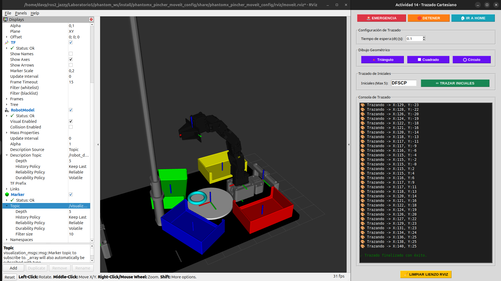
  <br>
  <b>Figura 14. Interfaz y trazado de un círculo en la actividad 14.</b>
</div>

<br>

<div align="center">
  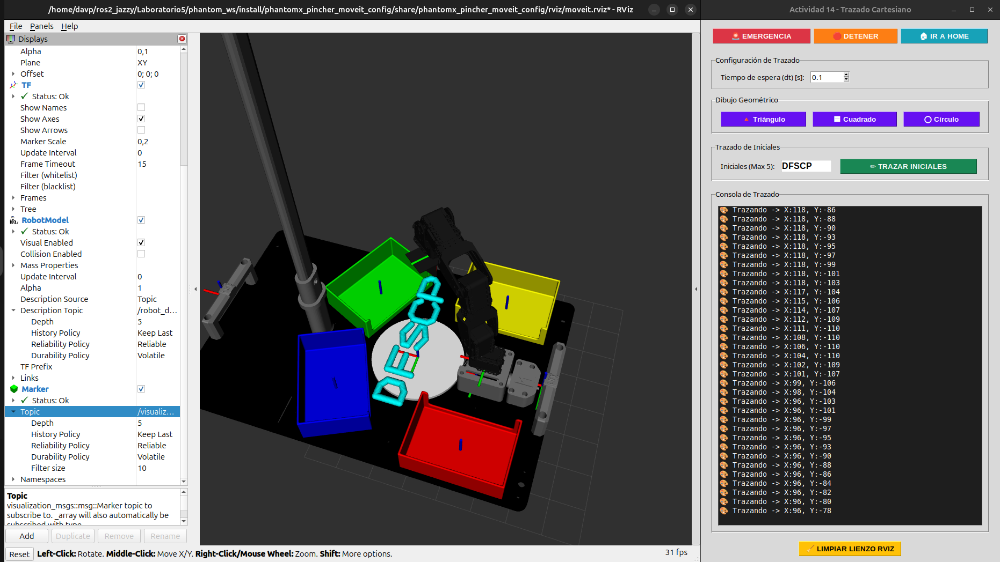
  <br>
  <b>Figura 15. Interfaz y trazado de iniciales en la actividad 14.</b>
</div>

<br>

<div align="center">
  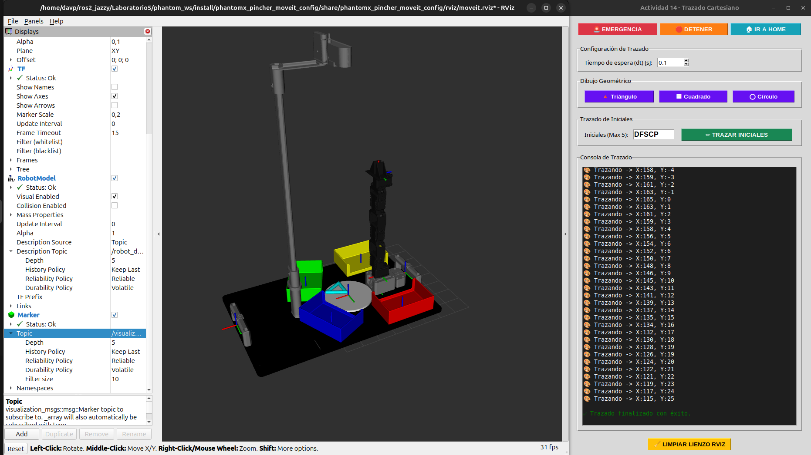
  <br>
  <b>Figura 16. Interfaz y trazado de un triángulo en la actividad 14.</b>
</div>

<br>

### Descripción de la interfaz

La interfaz está organizada en las siguientes secciones:

- **Botones de seguridad:** incluyen parada de emergencia, detención del trazado y retorno a la posición HOME.
- **Configuración del trazado:** permite definir el tiempo de muestreo (*dt*) utilizado durante la interpolación de la trayectoria.
- **Dibujo geométrico:** incorpora botones para generar automáticamente un triángulo, un cuadrado o un círculo.
- **Trazado de iniciales:** permite ingresar hasta cinco letras para que el robot las dibuje de forma secuencial.
- **Consola de trazado:** muestra el progreso del recorrido, los puntos generados y los mensajes de estado del sistema.
- **Limpiar lienzo:** elimina todos los marcadores publicados en RViz para iniciar un nuevo dibujo.

### Funcionamiento interno del código

El programa utiliza **ROS 2**, **RViz** y la clase `JointSelector` para controlar el robot y visualizar el recorrido.

Su funcionamiento se resume en los siguientes pasos:

- Genera automáticamente los puntos que describen la figura geométrica o las letras seleccionadas.
- Interpola cada segmento del recorrido para obtener un movimiento continuo y suave.
- Calcula la cinemática inversa de cada punto cartesiano para obtener los ángulos articulares correspondientes.
- Envía las posiciones al robot mediante `mover_simultaneo()`, sincronizando el movimiento físico o simulado.
- Publica marcadores tipo **SPHERE** sobre el tópico `/visualization_marker`, permitiendo observar el trazado en tiempo real dentro de RViz.
- Implementa levantamiento del "lápiz" entre letras o trayectorias independientes, además de controles de parada, emergencia y retorno automático a HOME.

## 18. Actividad 15 – Reto final: coreografía robótica

La Actividad 15 desarrolla un sistema de control para ejecutar coreografías sincronizadas con música en el robot Phantom X Pincher. La aplicación incorpora una interfaz gráfica construida con Tkinter, reproducción de audio mediante Pygame y un motor de generación de movimientos basado en información extraída previamente de archivos CSV.

para esto se creo los archivos de `datos_pedro.csv` y `datos_dubidubidu.csv` donde se almacenan los diferentes parametros musicales como energía, frecuencia y detección de pulsos, que luegos seran cargados el programa. posteriormente transforma los parametros en posiciones para el robot generando el movimiento sincronizado con la musica con algoritmos como:

```python
b = 40.0 * onda_base * (0.5 + energia)
h = -30.0 + (freq * 120.0)
c = 30.0 - (freq * 120.0)
```

Los cuales va refrescando los valores con una frecuencia de **10 Hz** todo esto dentro de la función  `_hilo_coreografia()`.

Ademas todo esto es controlado desde la siguiente interfaz grafica:


<br>

<div align="center">
  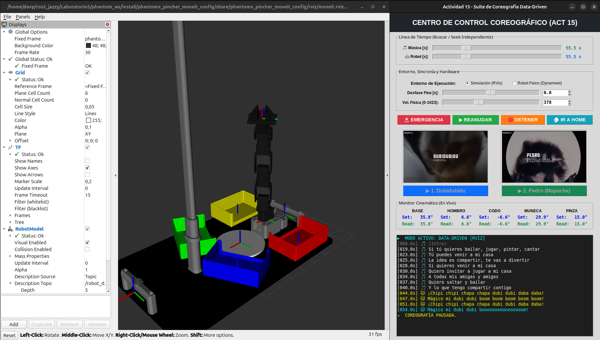
  <br>
  <b>Figura 14.Interfaz de coreografia actividad 14.</b>
</div>

<br>

La interfaz está organizada en las siguientes secciones:

- **Línea de tiempo:** incorpora controles independientes para la música y el robot, permitiendo desplazarse manualmente a cualquier instante de la coreografía.
- **Configuración de ejecución:** permite seleccionar entre el modo de simulación en RViz o el modo de robot físico, además de ajustar el desfase temporal entre el audio y el movimiento.
- **Control de velocidad:** permite modificar la velocidad de los servomotores Dynamixel durante la ejecución de la rutina.
- **Botones de seguridad:** incluyen parada de emergencia, pausa y reanudación, detención completa de la coreografía y retorno automático a la posición HOME.
- **Selección de canciones:** presenta dos coreografías predefinidas, **Dubidubidu** y **Pedro (Mapache)**, cada una con su respectiva imagen de referencia.
- **Monitor cinemático:** muestra en tiempo real las posiciones articulares objetivo (Set) y las posiciones reales del robot (Read), permitiendo supervisar el seguimiento del movimiento.
- **Consola de eventos:** registra el avance de la coreografía, la letra de la canción, cambios de estado y mensajes de sincronización.


## 19. Video Explicativo


## 20. Conclusiones Individuales


### Conclusiones de [Nombre del Integrante 1]
* *(Escribe aquí tus conclusiones sobre ROS 2, la cinemática, las dificultades, etc.)*
* ...

### Conclusiones de [Nombre del Integrante 2]
* *(Escribe aquí tus conclusiones sobre ROS 2, la cinemática, las dificultades, etc.)*
* ...
