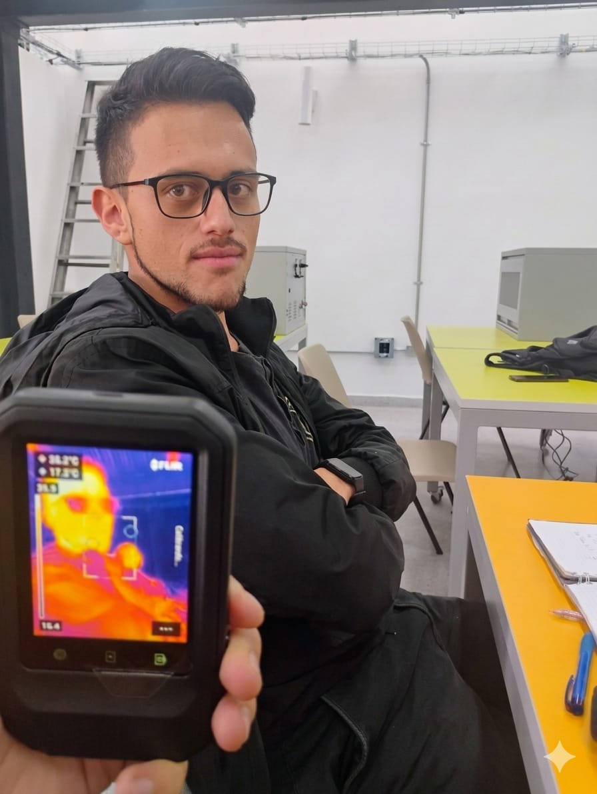

<picture>
    <source srcset="https://imgur.com/5bYAzsb.png" media="(prefers-color-scheme: dark)">
    <source srcset="https://imgur.com/Os03JoE.png" media="(prefers-color-scheme: light)">
    
</picture>

<h3>Curso de Robótica 2026-I</h3>

<h1>Compilado de Informes de Laboratorio de Robótica</h1>

<h2>Profesores:  Pedro Fabián Cárdenas Herrera   Manuel Felipe Carranza Montenegro</h2>

<h4>David Santiago Pirateque Suarez 
     Jose Daniel Suarez Vasques 
     David Felipe Cardenas Cubides</h4>

  
  
  
  
  
  
  
  
  
  
  
  
  

---

## Descripción

Este repositorio corresponde al desarrollo de las actividades del curso de **Robótica 2026-I**.  
Aquí se documentan los laboratorios, avances, resultados y la presentación de los integrantes del equipo.

---

## Objetivos del repositorio

- Organizar el desarrollo de los laboratorios del curso.
- Documentar procedimientos, resultados y evidencias.
- Presentar formalmente a los integrantes del equipo.
- Mantener una estructura clara y ordenada para la evaluación.

---

## Integrantes del equipo

### Integrante 1

   

- **Nombre completo:** David Santiago Pirateque Suarez
- **Carrera:** Ingeniería Mecatrónica
- **Correo institucional:** dpirateque@unal.edu.co
- **Usuario de GitHub:** [DavidPirateque](https://github.com/DavidPirateque)
- **Rol en el equipo:** Programación, organización de actividades y documentación técnica.
- **Intereses:** Automatización industrial, robótica movil e industrial, IA, gemelos digitales.
- **Descripción breve:**
  Estudiante de Ingeniería Mecatrónica con formación práctica en instrumentación, diseño mecánico y eletrónico, y automatización de procesos. Experiencia en el desarrollo de hardware con microcontroladores, programación de PLCs y uso de entornos de simulación industrial. Conocimientos aplicados en la implementación y sintonía de estrategias de control clásico para plantas físicas. Conocimientos complementarios en procesos de fabricación, soldadura, ensayos no destructivos (END) y manufactura aditiva. Orientado a las areas de automatización industrial, sistemas de control de movimiento preciso y su integración con inteligencia artificial y robótica movil e industrial.

---

### Integrante 2

   

- **Nombre completo:** Nombre Apellido
- **Carrera:** Ingeniería Mecatrónica
- **Correo institucional:** nombre@unal.edu.co
- **Usuario de GitHub:** [usuariogithub](https://github.com/usuariogithub)
- **Rol en el equipo:** Ej. Modelado, programación, control
- **Intereses:** Manipulación, ROS 2, control de robots
- **Descripción breve:**  
  Escribe aquí una breve presentación personal y académica del integrante.

---

### Integrante 3

   

- **Nombre completo:** David Felipe Cardenas Cubides
- **Carrera:** Ingeniería Mecatrónica
- **Correo institucional:** dcardenascu@unal.edu.co
- **Usuario de GitHub:** [dcardenascu](https://github.com/dcardenascu)
- **Rol en el equipo:** Ej. Documentación, pruebas
- **Intereses:** Robótica industrial, microcontroladores, IA, control, automatizacion de procesos
- **Descripción breve:**  
  Estudiante de Ingeniería Mecatrónica con sólida formación en automatización, electrónica y desarrollo de software. Experiencia práctica en el diseño y control de máquinas CNC, programación de PLC y manejo de servomotores industriales. Capaz de integrar soluciones de hardware y software utilizando estructuras de datos y algoritmos de Machine Learning.

